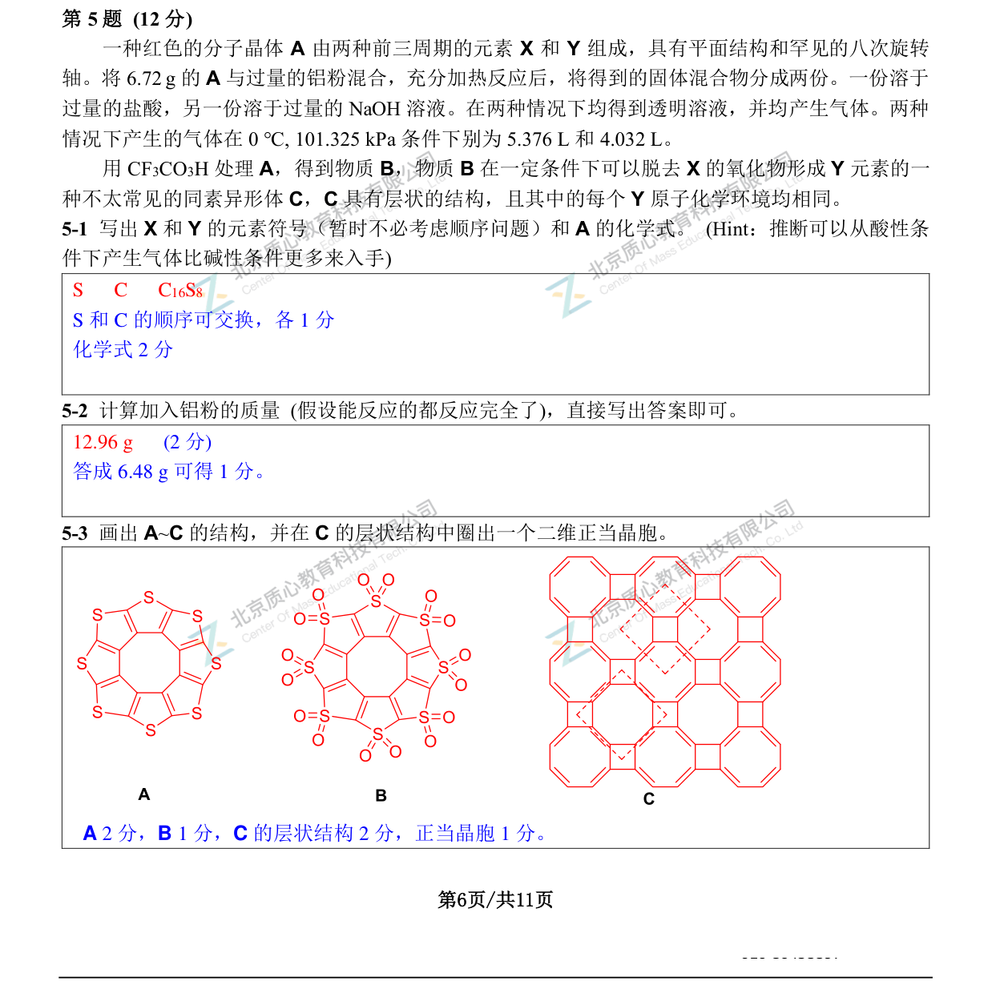

# 题-GChO-47-05-一种红色的分子晶体A由两种前

## 题目

### 第 5 题 (12分)

一种红色的分子晶体 A 由两种前三周期的元素 X 和 Y 组成，具有平面结构和罕见的八次旋转轴。将 6.72 g 的 A 与过量的铝粉混合，充分加热反应后，将得到的固体混合物分成两份。一份溶于过量的盐酸，另一份溶于过量的 NaOH 溶液。在两种情况下均得到透明溶液，并均产生气体。两种情况下产生的气体在 0 °C, 101.325 kPa 条件下别为 5.376 L 和 4.032 L。

用 $\mathrm{CF}_3\mathrm{CO}_3\mathrm{H}$ 处理A，得到物质B，物质B在一定条件下可以脱去X的氧化物形成Y元素的一种不太常见的同素异形体C，C具有层状的结构，且其中的每个Y原子化学环境均相同。

5-1 写出 X 和 Y 的元素符号（暂时不必考虑顺序问题）和 A 的化学式。(Hint: 推断可以从酸性条件下产生气体比碱性条件更多来入手)

5-2 计算加入铝粉的质量 (假设能反应的都反应完全了)，直接写出答案即可。

5-3 画出 A\~C 的结构，并在 C 的层状结构中圈出一个二维正当晶胞。

## 参考答案

> 第5题完整解答（自源卷答案 PDF 高清渲染）

## 知识点映射

- （待人工校准）

> ⚠️ **自动拆卡标记**：`subject_module`/`difficulty` 为关键词粗判，答案数值与单位**尚未经人工复核**（OCR 原文逐字转录，可能保留原卷笔误）。