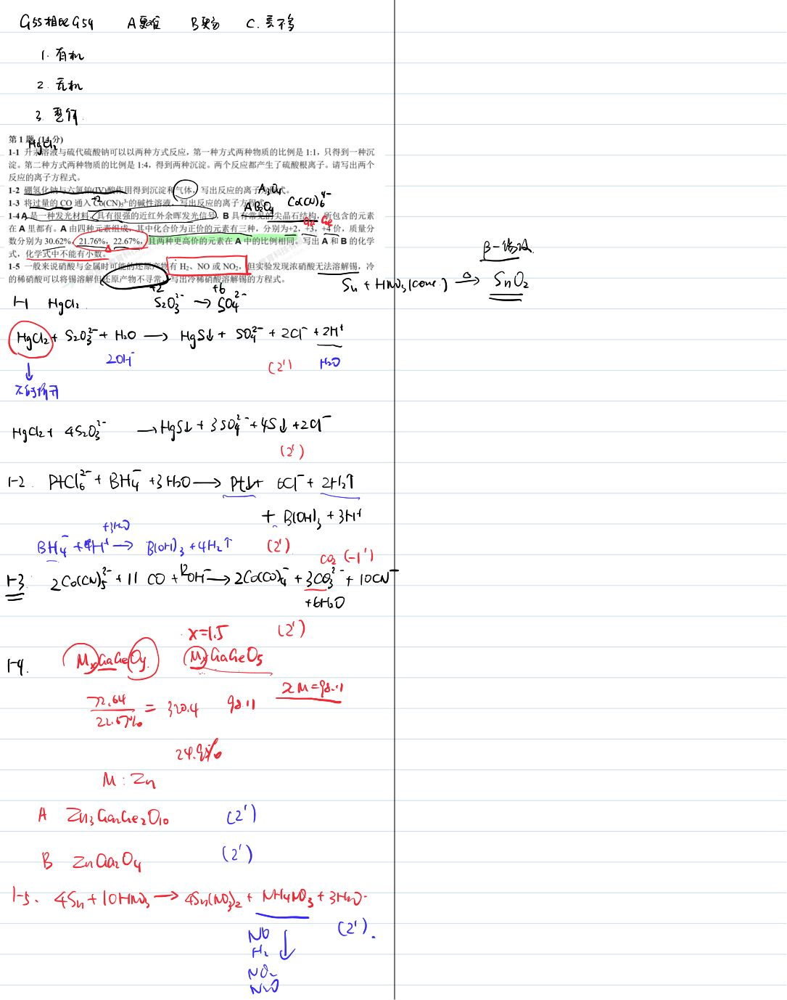
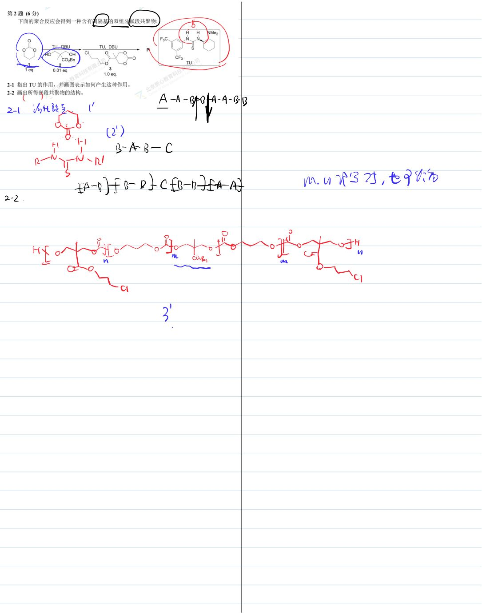
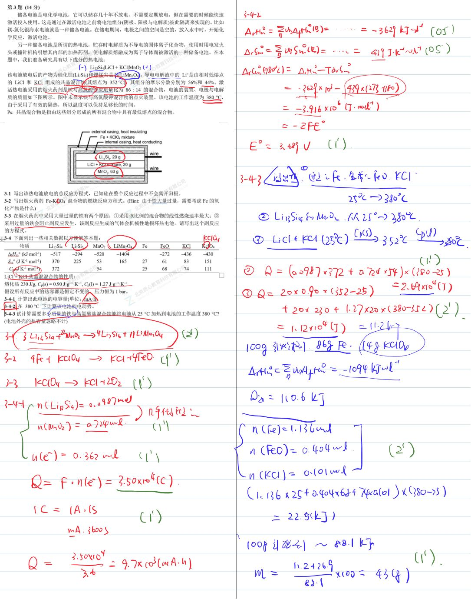
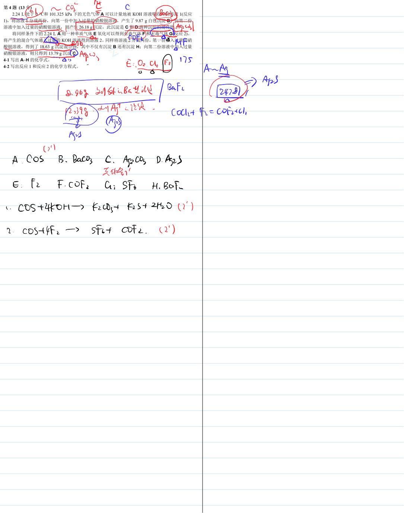
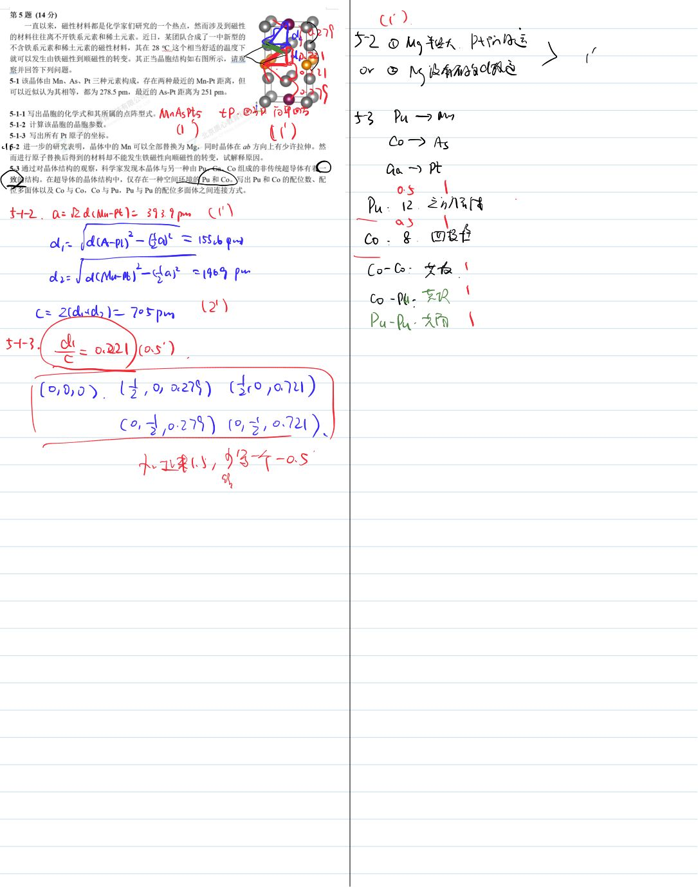
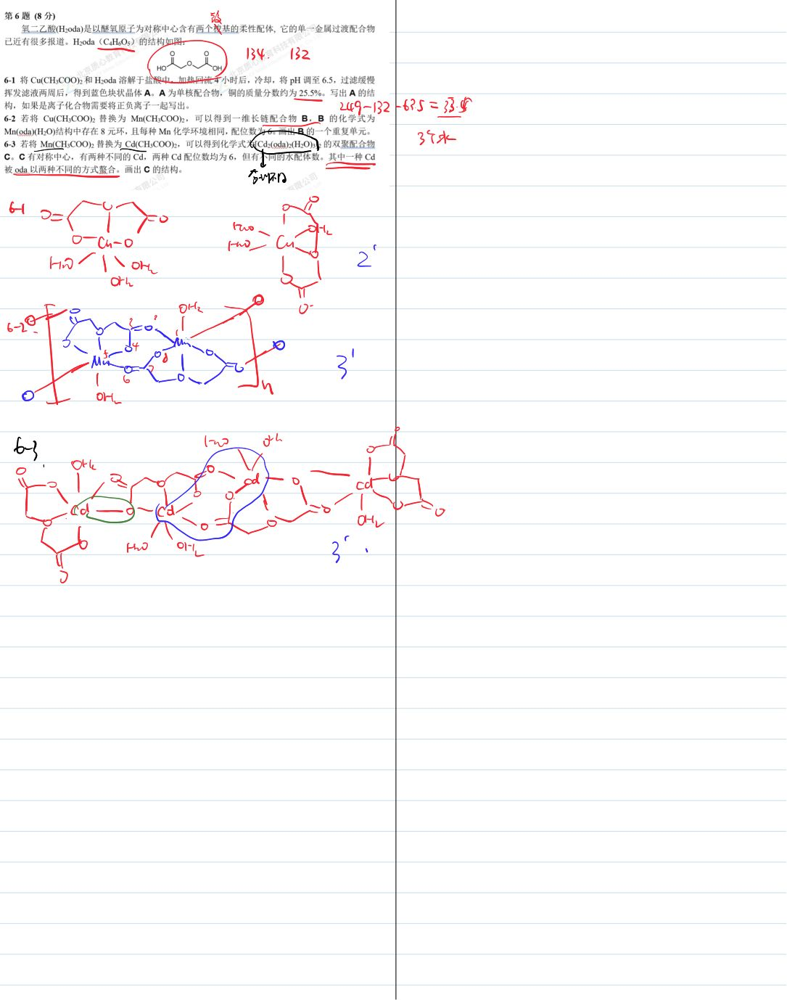
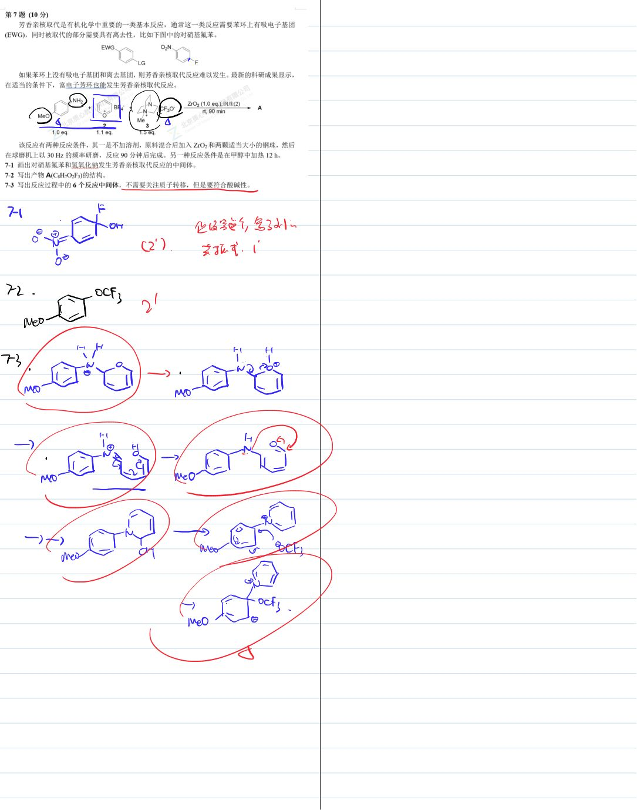
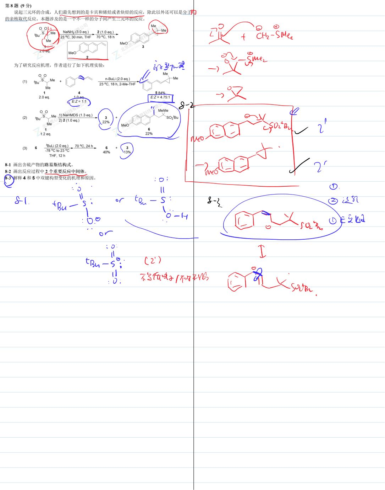
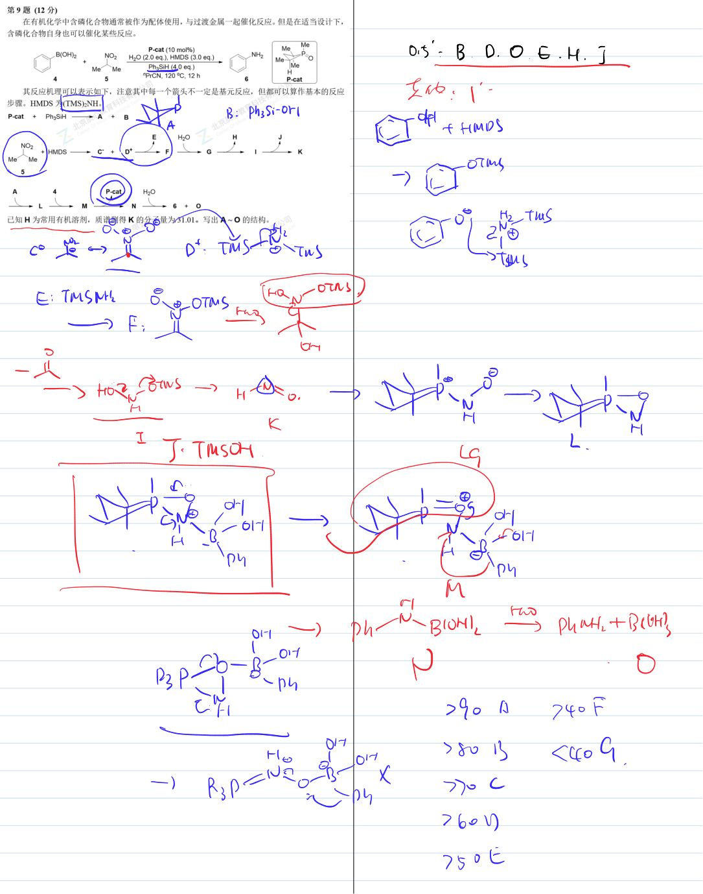

# 题-GChO-55-04-224L处于C和101325

## 题目

### 第 4 题 (13 分)

2.24 L 处于 $0^{\circ}$ C 和 101.325 kPa 下的无色气体 A 可以计量地被 KOH 溶液吸收得到溶液 1(反应 1)，将溶液 1 分成两份，向第一份中加入过量的硝酸钡溶液，产生了 9.87 g 白色沉淀 B；向第二份溶液中加入过量的硝酸银溶液，则产生 26.18 g 沉淀，此沉淀是 C 和 D 两种沉淀的混合物。

将同样条件下的 2.24 L A 用一种单质气体 E 氧化可以得到有毒气体 F 和无毒气体 G(反应 2)。将产生的混合气体通入过量的 KOH 溶液得到溶液 2。同样将溶液 2 分成两份，第一份加入过量的硝酸钡溶液，得到了 18.63 g 沉淀混合物，其中不仅有沉淀 B 还有沉淀 H；向第二份溶液中加入过量硝酸银溶液，则只得到 13.79 g 沉淀 C。

4-1 写出 A\~H 的化学式。

4-2 写出反应 1 和反应 2 的化学方程式。

## 参考答案

📎 **答案出处**：源卷**手写解析手稿**全部 9 页已随卡（见下），第 04 题解答在其内；手写笔迹，**文字化需人工转录**。

## 知识点映射

- （待人工校准）

> ⚠️ **自动拆卡标记**：`subject_module`/`difficulty` 为关键词粗判，答案数值与单位**尚未经人工复核**（OCR 原文逐字转录，可能保留原卷笔误）。