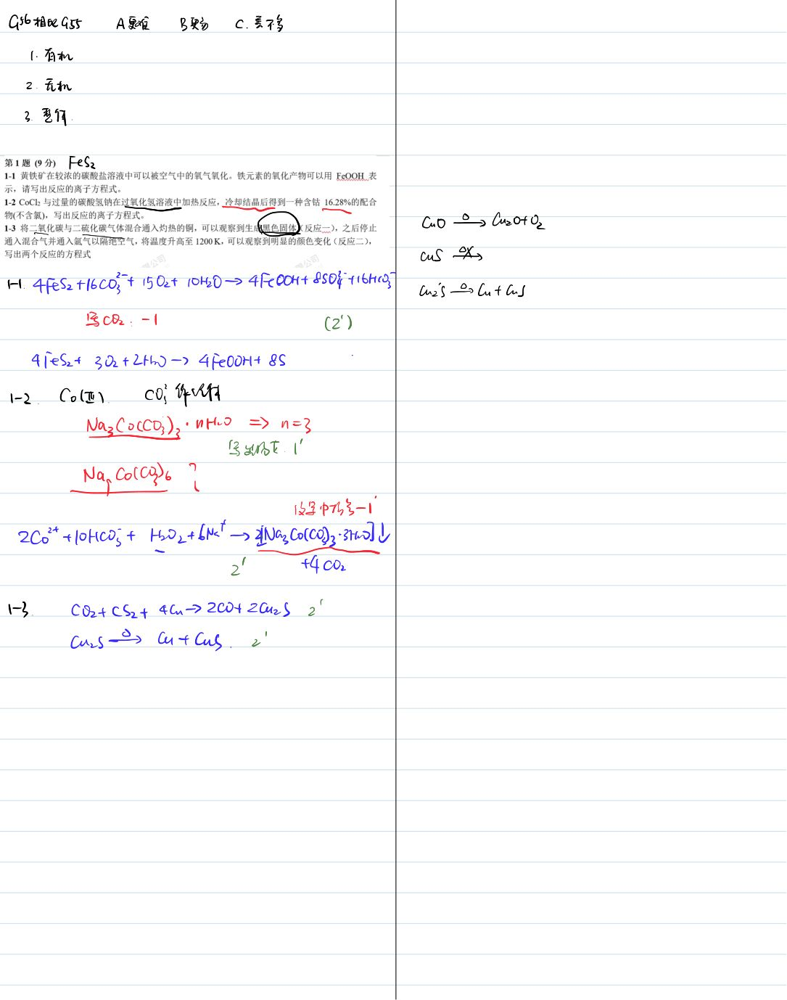
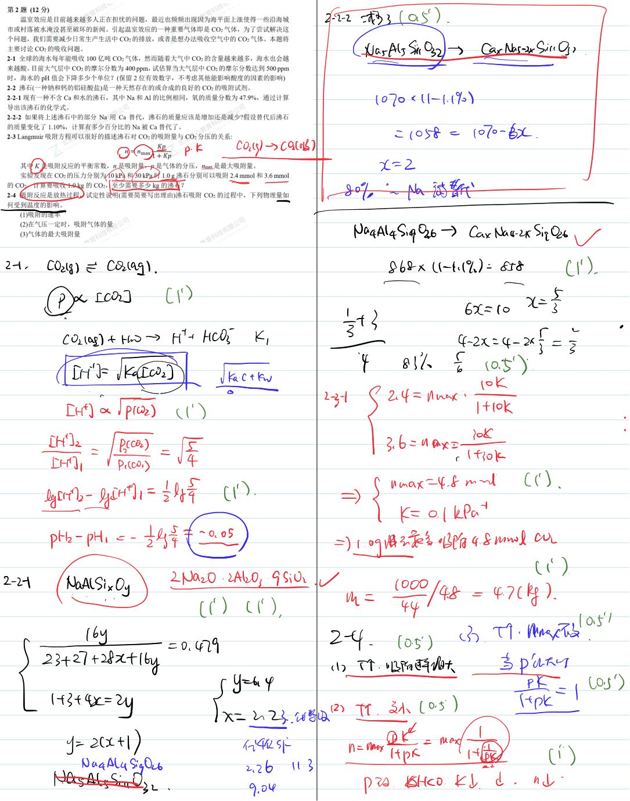
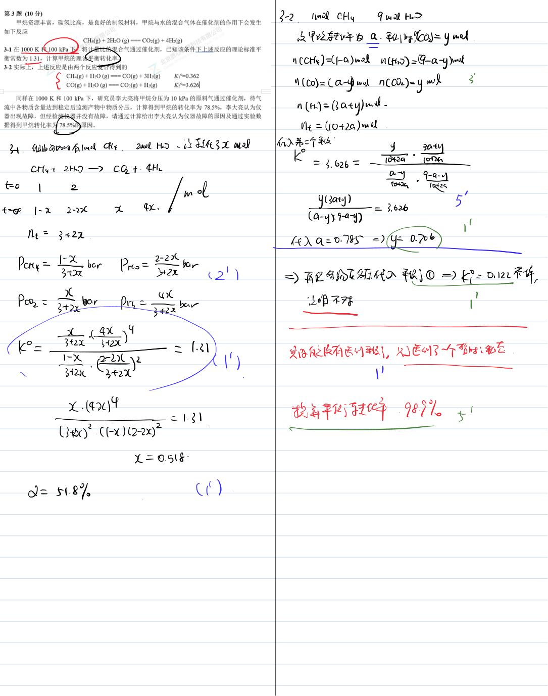
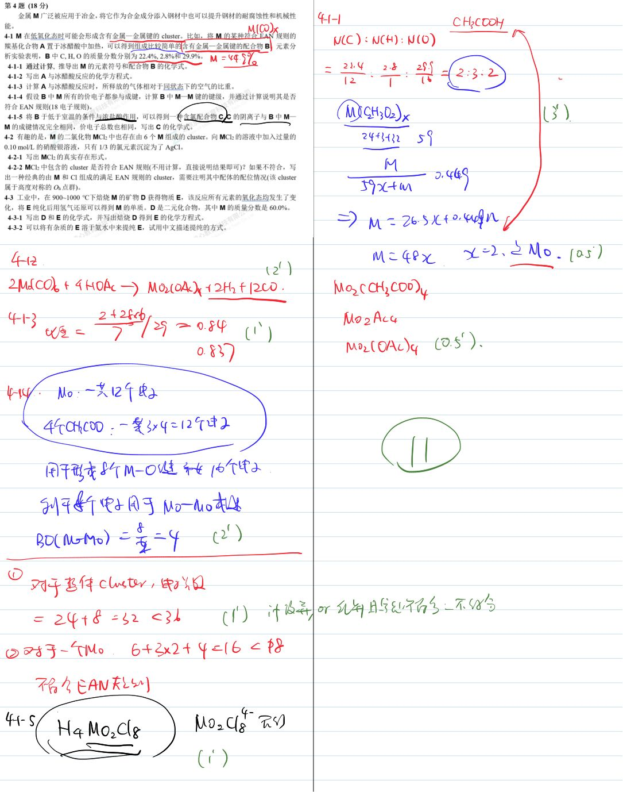
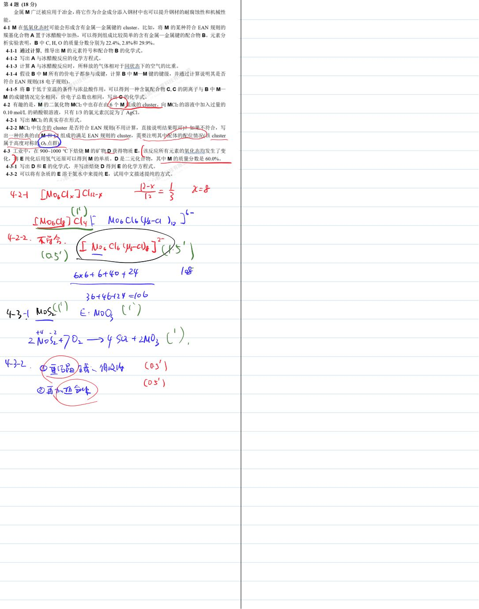
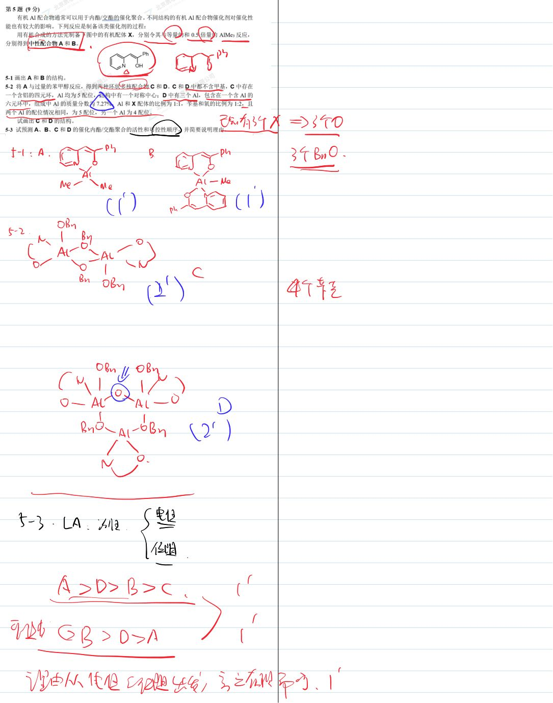
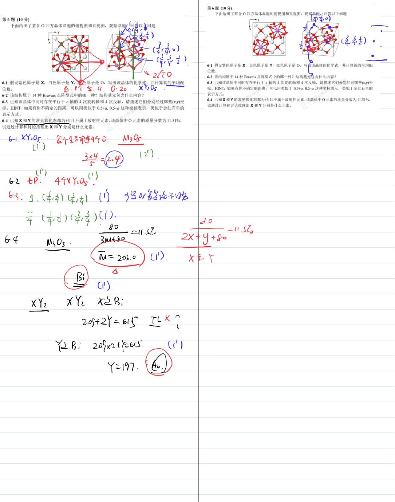
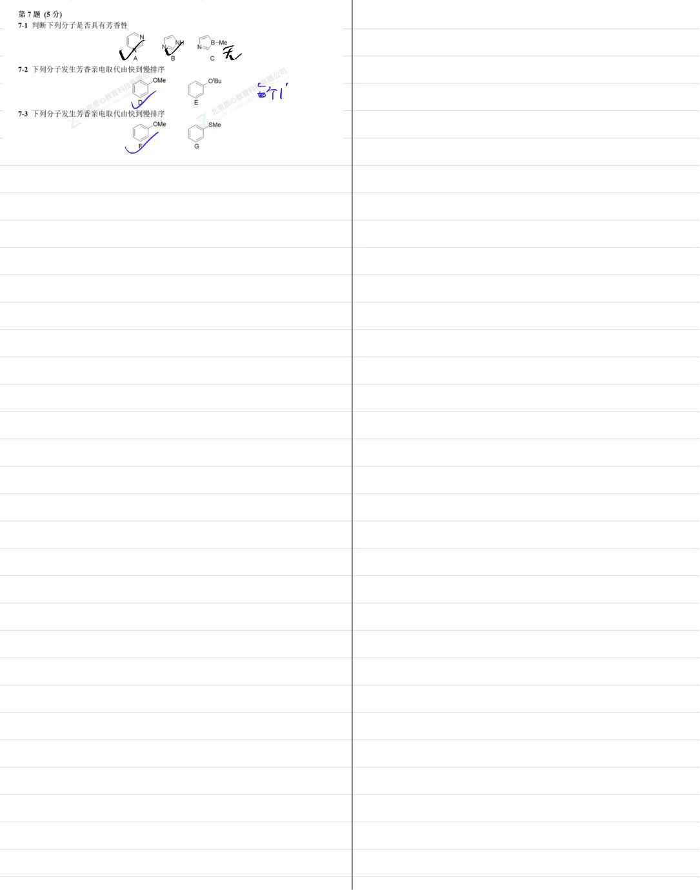
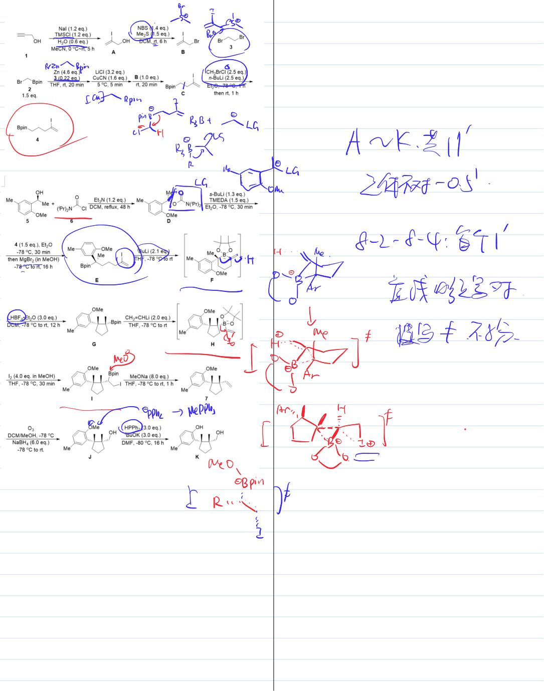
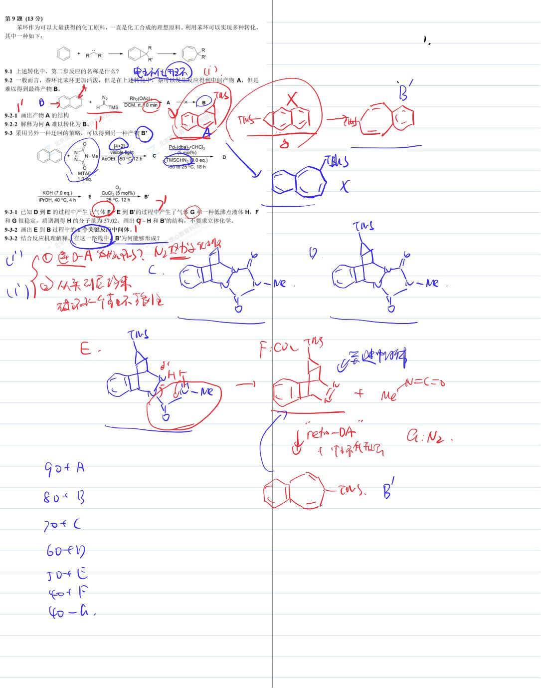

# 题-GChO-56-03-甲烷资源丰富碳氢比高是良好的

## 题目

### 第 3 题 (10分)

甲烷资源丰富，碳氢比高，是良好的制氢材料，甲烷与水的混合气体在催化剂的作用下会发生如下反应

$$
\mathrm{CH} _ {4} (\mathrm{g}) + 2 \mathrm{H} _ {2} \mathrm{O} (\mathrm{g}) = = = \mathrm{CO} _ {2} (\mathrm{g}) + 4 \mathrm{H} _ {2} (\mathrm{g})
$$

3-1 在 1000 K 和 100 kPa 下，将计量比的混合气通过催化剂，已知该条件下上述反应的理论标准平衡常数为 1.31，计算甲烷的理论平衡转化率。

3-2 实际上，上述反应是由两个反应复合得到的

$$
\begin{array}{r l r} \mathrm {CH_ {4} (g) + H_ {2} O(g) = = CO(g) + 3H_ {2} (g)} & K _ {1 ^ {\circ}} = 0.362 \\ \mathrm {CO(g) + H_ {2} O(g) = = CO_ {2} (g) + H_ {2} (g)} & K _ {2 ^ {\circ}} = 3.626 \end{array}
$$

同样在 1000 K 和 100 kPa 下，研究员李大亮将甲烷分压为 10 kPa 的原料气通过催化剂，待气流中各物质含量达到稳定后监测产物中物质分压，计算得到甲烷的转化率为 78.5%，李大亮认为仪器出现故障，但经检测仪器并没有故障，请通过计算给出李大亮认为仪器故障的原因及通过实验数据得到甲烷转化率为 78.5% 的原因。

## 参考答案

📎 **答案出处**：源卷**手写解析手稿**全部 10 页已随卡（见下），第 03 题解答在其内；手写笔迹，**文字化需人工转录**。

## 知识点映射

- （待人工校准）

> ⚠️ **自动拆卡标记**：`subject_module`/`difficulty` 为关键词粗判，答案数值与单位**尚未经人工复核**（OCR 原文逐字转录，可能保留原卷笔误）。