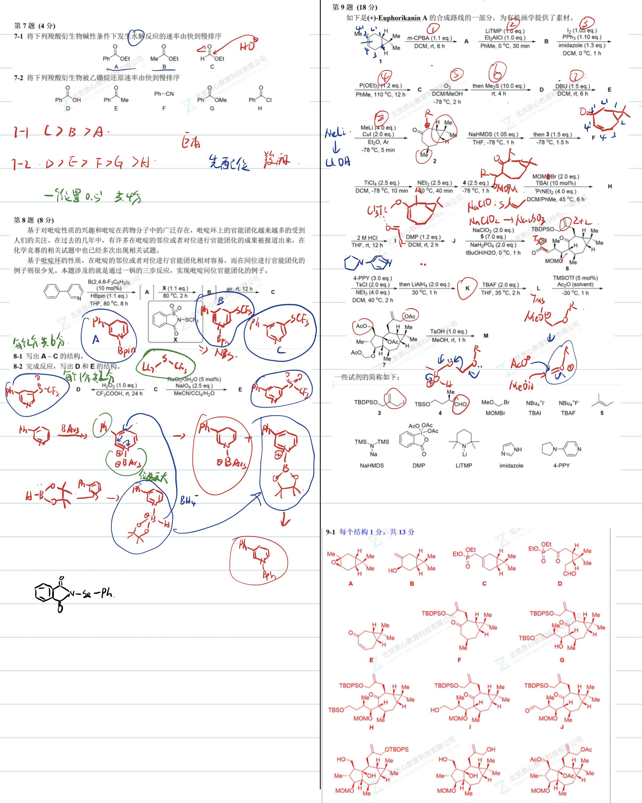

# 题-GChO-58-05-下图是的正当晶胞结构请仔细观

## 题目

### 第 5 题 (11分)

下图是 $Cd_{3}PCl_{3}$ 的正当晶胞结构，请仔细观察并回答问题。

5-1 描述每种(指化学环境)Cd 原子的配位环境（被哪些非金属原子配位，配位数，配位多面体以及每种 Cd 原子的占比）

## 5-2 该晶体属于什么晶系？什么点阵型式？

5-3 已知与 $c$ 轴平行的 $\mathrm{Cd}(z$ 坐标为0.49)— $\mathrm{P}(z$ 坐标为0.14)键长为 $254 \mathrm{pm}$ , 另一种 $\mathrm{Cd}-\mathrm{P}$ 键长是 $247 \mathrm{pm}$ , 估算晶体的密度.

## 5-41mol 化合物中有多少 mol 完全由 Cd 和 Cl 构成的八元环？

## 参考答案

下图是 $\mathrm{Cd}_3\mathrm{PCl}_3$ 的正当晶胞结构，请仔细观察并回答问题。

5-1 描述每种(指化学环境)Cd 原子的配位环境（被哪些非金属原子配位，配位数，配位多面体以及每种 Cd 原子的占比）

5-2 该晶体属于什么晶系？什么点阵型式？

5-3 已知与 $c$ 轴平行的 $\mathrm{Cd}(z$ 坐标为0.49)—P(z坐标为0.14)键长为 $254\mathrm{pm}$ ，另一种Cd—P键长是247 pm，估算晶体的密度.

5-41mol 化合物中有多少 mol 完全由 Cd 和 Cl 构成的八元环？

$$
\begin{array}{l l l l} {S - 1 \mathrm{两种}} & {C d S P \mathrm{配}.} & {2.} & {\mathrm{直线型}.} \\ {4 \mathrm{分.错个}} & {C d S P \mathrm{和C}.} & {P 1.} & {\mathrm{四面体}} \\ {\mathrm{小项,扣0.5}} & {C d S C 1.} & {C 1 B.} & \\ {\mathrm{扣完为止}} & & {6.} & {\mathrm{八面体}.} \\ \end{array} \quad \begin{array}{l l l l} {3 \mathrm{重心和面心}} & {\frac {1}{2}} \\ {2. \mathrm{体心}} & {\frac {1}{3}} \\ {1.} & {\frac {1}{6}} \end{array}
$$

5-2. 三方晶系. 简单方程. ${ln} \cdot  {ln}$ . 晶体对称性 $\leq$ 点阵

$$
c _ {3} \checkmark
$$

$$
16 \times
$$

$$
26 \times
$$

5-33分

$$
L = 2.54 \div (0.49 - 0.14) = 125.7 (\mathrm{pm}) = 126 (\mathrm{pm})
$$

$$
d (c d - p) = 24 p m)
$$

$$
h = c \times 0.14 \div 101.6 (p m)
$$

$$
l = \sqrt {d ^ {2} (c d - p) - h ^ {2}} = 225.14 (\mathrm{pm}) = 225 (\mathrm{pm}).
$$

$$
2 L \times \sqrt {3} = a \Rightarrow a = 2 \sqrt {3} \times L = 7 > 9.895 (p m) = 780 (p m)
$$

$$
V = a ^ {2} \cdot C \cdot S m 120 ^ {\circ} = 3.82 \times 10 ^ {8} (p m ^ {3}) = 3.82 \times 10 ^ {- 22} (c m ^ {3})
$$

$$
\rho = \frac {2 m}{V \times 10 ^ {4}} = \frac {2 \times (112.4 \times 3 + 30.97 + 35.45 \times 3)}{3.82 \times 10 ^ {- 2} \times 6.022 \times 10 ^ {2} 3} = 4.12 (g \cdot c m ^ {3}).
$$

5-41.5 mol

$$
\left\{ \begin{array}{l l} S & \text {   12A / A   } \\ K & \text {   No   } \end{array} \right.
$$

<table><tr><td>第6题(9分)配合物结构中配体的结构通常会影响配合物的性质和应用领域。6-1大π共轭体系与金属离子形成的配合物在发光、催化、生物领域有着广泛应用。下面这个有机物与 $ZnCl_{2}$ 反应,可以得到5配位的中性配合物A:若与 $Zn(NO_{3})$ 反应,可以得到6配位的配合物盐B。6-1-1画出A和B的结构,离子化合物的正负离子需要分开写。6-1-2令X在乙腈中与 $AgSbF_{x}$ 反应,得到四配位的配合物盐C。画出C的结构。一个方.○,导致配位多面体呈 $C_{2v}$ 对称[21]。图6 $[Fe(tpy)_{2}]^{2+}$ 的晶体结构</td><td> $AgSbF_{x}$   $AgPF_{x}$   $AgBr_{x}$  $Ag_{x}$ 亲电性质6-2Y是一种大环配体,其结构如下所示:神奇的是,Y与不同的Ag(I)盐作用得到结构迥异的配合物。6-2-1Y与 $AgOT(TiOH=三氯甲磺酸)$ 按1:1反应,可以得到双核配合物阳离子D,D中Ag的化学环境相同且均为三配位,已知配体的每个配位原子仅与一种金属配位,画出D的结构。6-2-2而Y与 $AgNO_{3}$ 按1:1作用,则得到E、E中Ag的配位数其实不太常见,含Ag的质量分数为21.1%,画出E的结构,如果是离子化合物,需要将正负离子一并写出。 $Ag_{2}Y_{2}$   $AgNO_{3}Y$ </td></tr></table>

<table><tr><td>9-2 每个结构0.5分,共2分</td><td colspan="2"></td></tr><tr><td>9-3 每个结构0.5分,共1.5分</td><td></td><td></td></tr><tr><td>9-4 每个0.5分,共1.5分(1)C (2)G (3)B</td><td>炼丽月 2+2</td><td>(丁会)</td></tr></table>

9-1 写出 $\mathbf{A} \sim \mathbf{M}$ 的结构，注意立体化学。

9-2 写出 B 到 C 过程中的 4 个关键反应中间体。

9-3 写出 6 到 K 过程中的 3 个关键反应中间体，不包含 LiAlH $_4$ 还原的过程。

9-4后处理也是一个反应重要的一部分，后处理操作不当，轻则是的产物分离困难，重则会发生副反应，使产率降低，甚至有可能无法得到想要的产物。常见的淬灭反应的试剂有如下几种：A.自来水 B.饱和 $\mathrm{NaHCO_3}$ 溶液 C.饱和 $\mathrm{NH_4Cl}$ 溶液D. $1\mathrm{mol} / \mathrm{L}$ 盐酸 E. $1\mathrm{mol} / \mathrm{L}$ NaOH F.饱和食盐水G.饱和 $\mathrm{Na_2SO_3}$ 溶液

分别为下列反应选择合适的淬灭试剂：
(1) E 到 2
(2) J 到 6
(3) 7 到 M

<table><tr><td>≥90</td><td>A</td><td> $P_{2}O_{5}$ </td><td> $P_{4}O_{10}$ </td></tr><tr><td>≥80</td><td>B</td><td> $1H_{2}Cl_{2}O_{4}$ </td><td></td></tr><tr><td>≥70</td><td>C</td><td></td><td></td></tr><tr><td>≥60</td><td>D</td><td></td><td></td></tr><tr><td>≥50</td><td>E</td><td></td><td></td></tr><tr><td>≥40</td><td>F</td><td></td><td></td></tr><tr><td>&lt;40</td><td>G</td><td></td><td></td></tr></table>

## 知识点映射

- （待人工校准）

> ⚠️ **自动拆卡标记**：`subject_module`/`difficulty` 为关键词粗判，答案数值与单位**尚未经人工复核**（OCR 原文逐字转录，可能保留原卷笔误）。