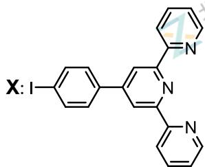
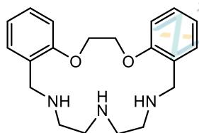
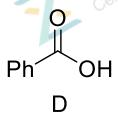
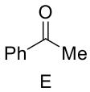
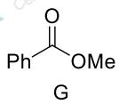
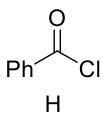

# 题-GChO-58-06-配合物结构中配体的结构通常会

## 题目

### 第 6 题 (9分)

配合物结构中配体的结构通常会影响配合物的性质和应用领域。

6-1 大 $\pi$ 共轭体系与金属离子形成的配合物在发光、催化、生物领域有着广泛应用。下面这个有机物与 $\mathrm{ZnCl}_2$ 反应，可以得到 5 配位的中性配合物 A；若与 $\mathrm{Zn(NO_3)}$ 反应，可以得到 6 配位的配合物盐 B。

6-1-1 画出 A 和 B 的结构，离子化合物的正负离子需要分开写。

6-1-2 令 X 在乙腈中与 AgSbF $_{6}$ 反应，得到四配位的配合物盐 C。画出 C 的结构。

6-2 Y 是一种大环配体，其结构如下所示:

神奇的是，Y与不同的 $\mathrm{Ag(I)}$ 盐作用得到结构迥异的配合物。

6-2-1 Y 与 AgOTf(TfOH=三氟甲磺酸)按 1:1 反应，可以得到双核配合物阳离子 D，D 中 Ag 的化学环境相同且均为三配位，已知配体的每个配位原子仅与一种金属配位，画出 D 的结构。

<table><tr><td></td><td></td><td>Ph-CN</td><td></td><td></td></tr><tr><td></td><td></td><td>F</td><td></td><td></td></tr></table>

6-2-2 而 Y 与 AgNO₃ 按 1:1 作用，则得到 E。E 中 Ag 的配位数其实不太常见，含 Ag 的质量分数为 21.1%。画出 E 的结构，如果是离子化合物，需要将正负离子一并写出。

## 参考答案

⛔ **源答案文件未含该题号**：本卷答案文件存在，但按题号定位未命中（可能为合并排版/缺页），需人工核。

## 知识点映射

- （待人工校准）

> ⚠️ **自动拆卡标记**：`subject_module`/`difficulty` 为关键词粗判，答案数值与单位**尚未经人工复核**（OCR 原文逐字转录，可能保留原卷笔误）。