# 题-GChO-63-06-如下是一个由Rh催化完成的反

## 题目

### 第 6 题 (10 分) Rh 配合物催化的反应

如下是一个由 Rh 催化完成的反应:

其中 $\mathbf{C} \rightarrow \mathbf{D}$ , $\mathbf{E} \rightarrow \mathbf{F}$ 的过程在金属有机化学中被称作“转移插入”或“迁移插入”，配合物的分子式并没有发生变化。还有若干步过程涉及到 CO 配体的解离或者配位。

6-1 写出总反应的化学方程式，产物用结构简式表示。

6-2 指出初始催化剂 A 中 Rh 的总价电子数和 Rh 的氧化态。

6-4 画出 B,C,E,F 的结构简式，并指出它们中 Rh 的氧化态和周围的总价电子数。

## 参考答案

📎 **答案出处**：源卷**手写解析手稿**全部 11 页已随卡（见下），第 06 题解答在其内；手写笔迹，**文字化需人工转录**。

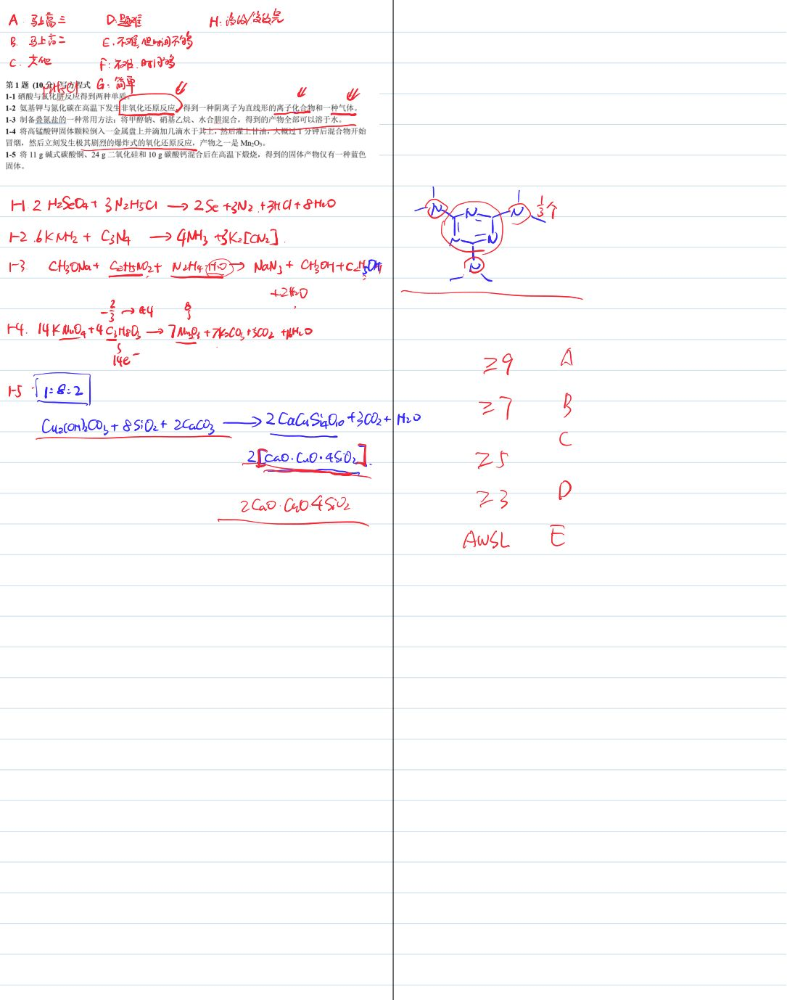

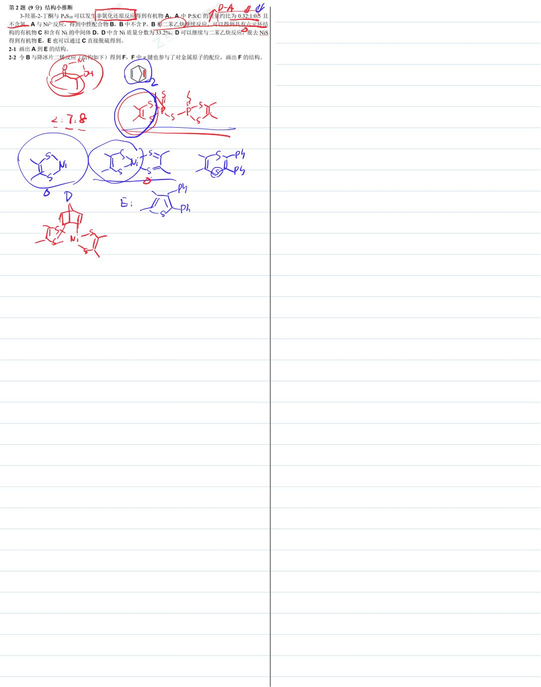

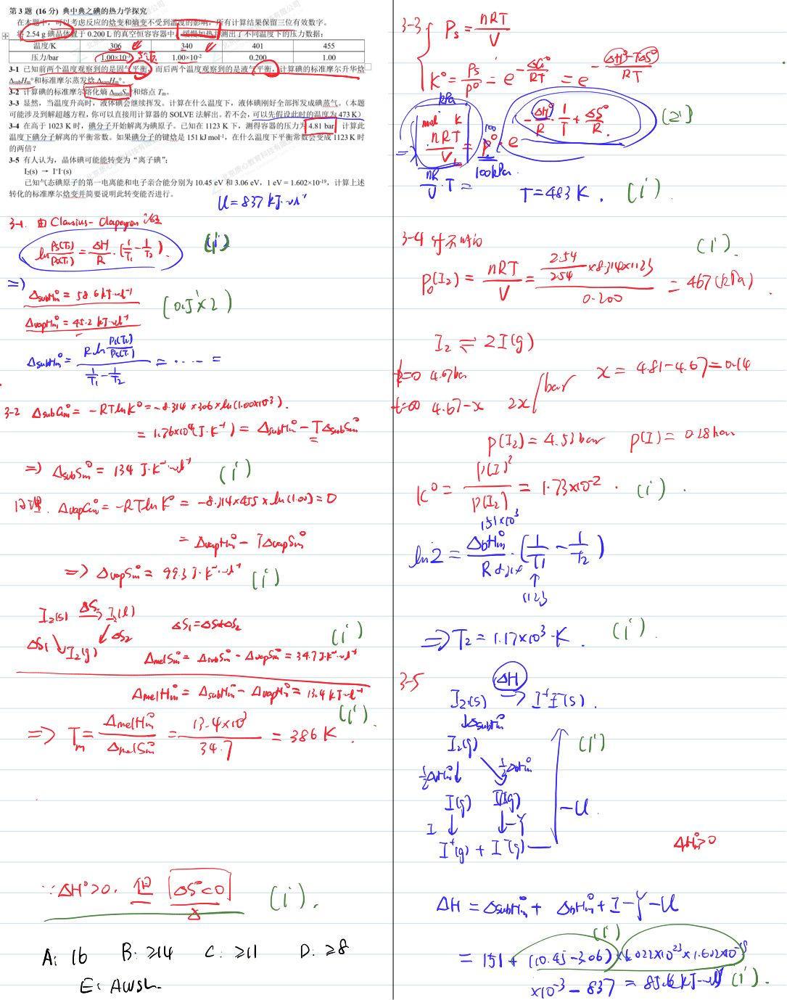

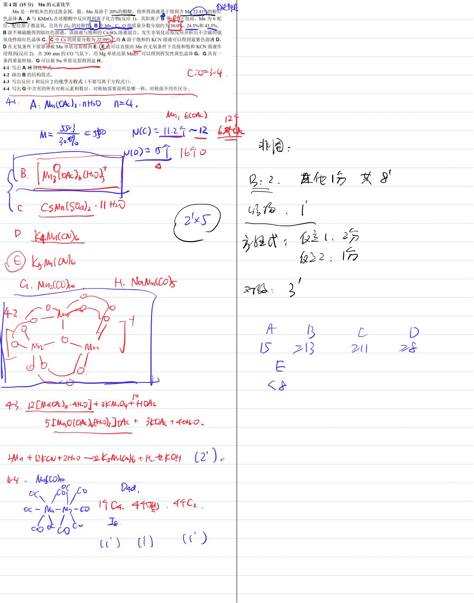

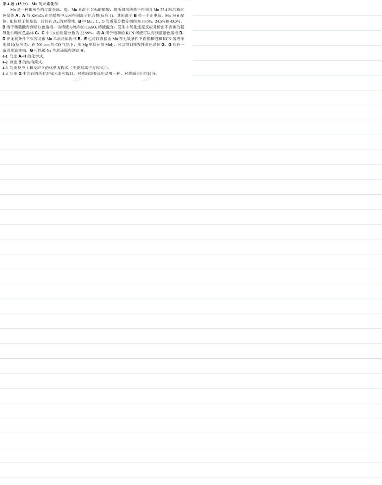

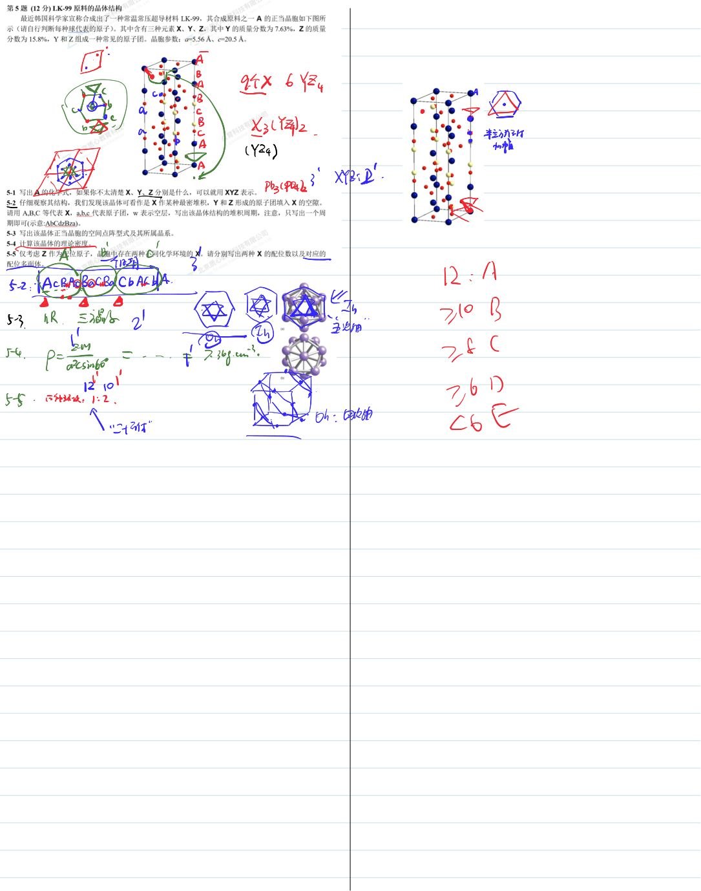

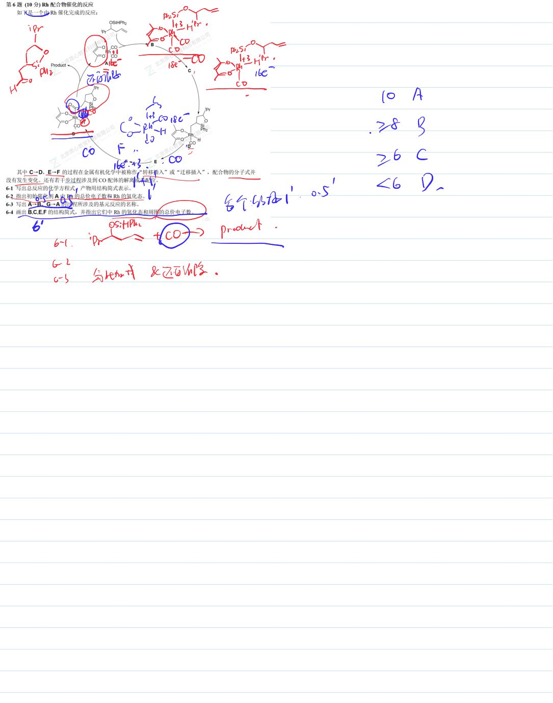

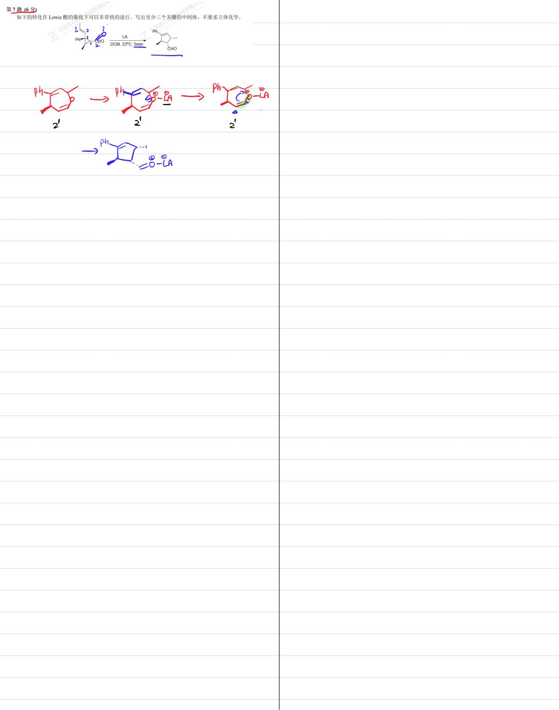

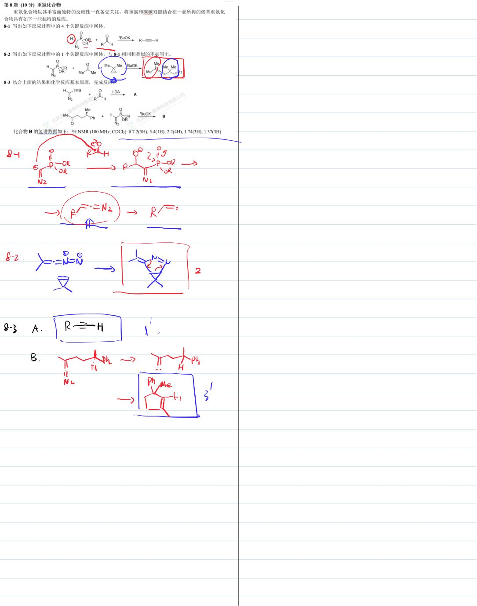

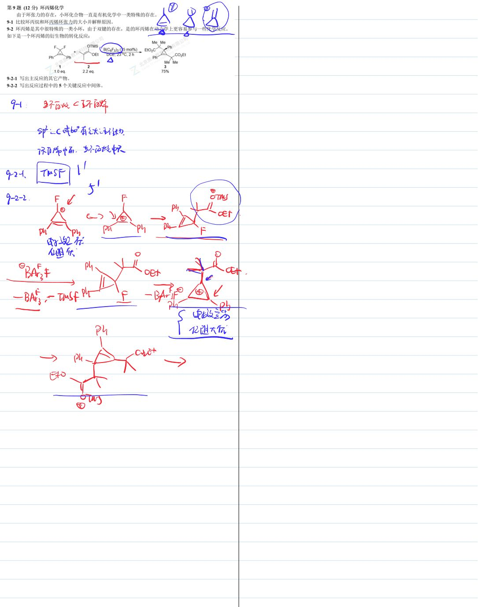

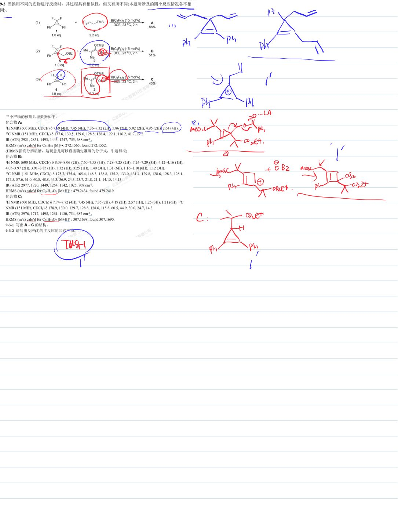

## 知识点映射

- （待人工校准）

> ⚠️ **自动拆卡标记**：`subject_module`/`difficulty` 为关键词粗判，答案数值与单位**尚未经人工复核**（OCR 原文逐字转录，可能保留原卷笔误）。