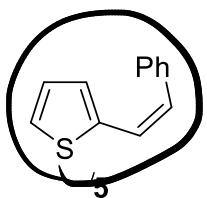
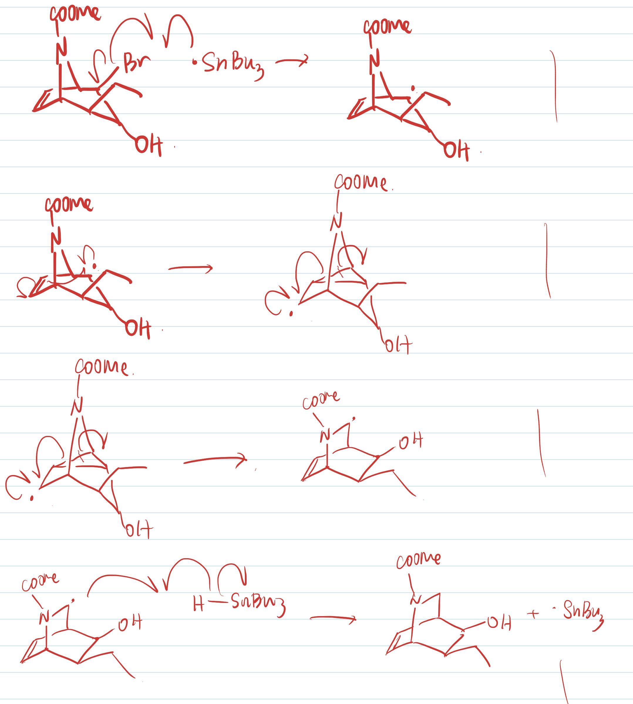
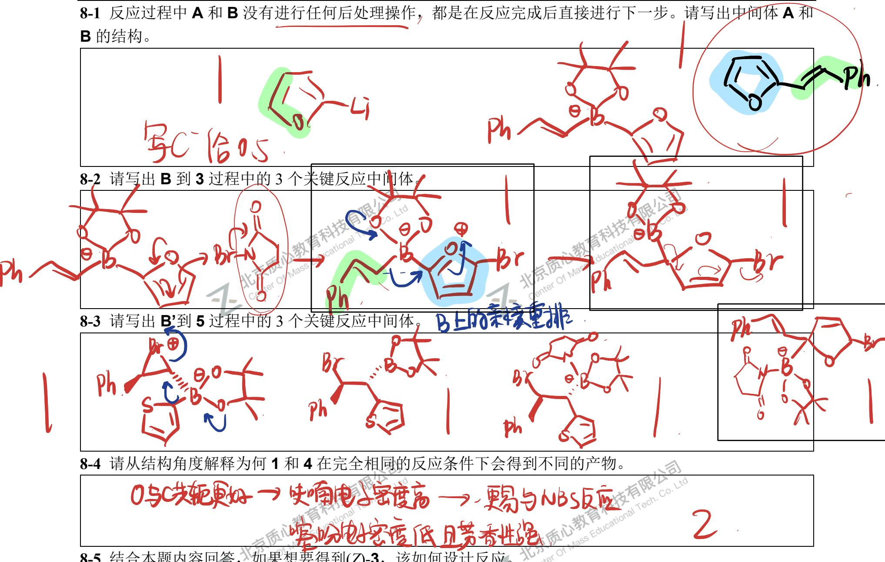
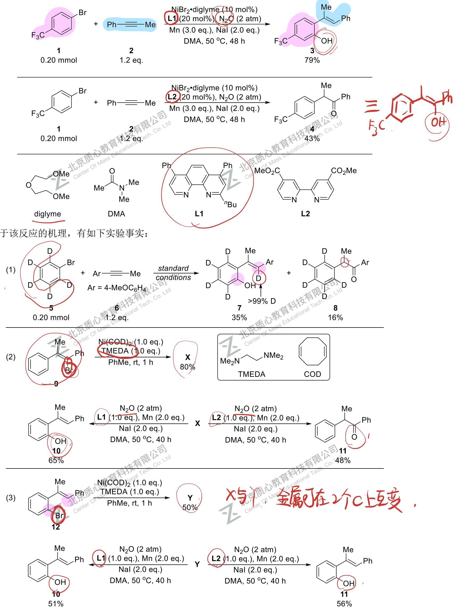

# 题-GChO-65-08-结构决定性质是化学反应的基本

## 题目

### 第 8 题 (11 分) 分子结构对反应性的影响

结构决定性质是化学反应的基本原理之一。如下反应中，反应原料的细微差别带来了不同的反应结果。

$$
\begin{array}{c c c} \text {   } & \xrightarrow {\text { nBuLi(1.5 eq.) }} & \text {   A } \\ \text {   } & \text { THF } & \text {   } \\ 1 & - 78 ^ {\circ} \text { C,30 min } & \text {   } \\ & \text { rt,30 min } & \text {   } \\ & & \text {   } \\ & & \text {   } \\ & & \text {   } \\ & & \text {   } \\ & & \text {   } \\ & & \text {   } \\ & & \text {   } \\ & & \text {   } \\ & & \text {   } \\ & & \text {   } \\ & & \text {   } \\ & & \text {   } \\ & & \text {.NBS(2.0 eq.)} \\ & & \text {   THF/DMF,-78^{\circ}C,1.5h} \\ & & \text {   } \\ & & \text {   } \\ & & \text {   } \\ & & \text {   } \\ & & \text {   } \\ & & \text {   } \\ & & \text {   } \\ & & \text {   } \\ & & \text {   } \\ & & \text {   } \\ & & \text {   } \\ & & \text {   } \\ & & \\ & & \text {   } \\ & & \text {   } \\ & & \text {   } \\ & & \text {   } \\ & & \text {   } \\ & & \text {   } \\ & & \text {   } \\ & & \text {   } \\ & & \text {   } \\ & & \text {   } \\ & & \text {   } \\ & & \text {   } \\ & & , 1.5 h \\ & & \end{array}
$$

$$
\begin{array}{c c c} \text {   S   } & \xrightarrow {\text { nBuLi(1.5eq.) }} & \text {   A'   } \\ & \text { THF } & \text {   then2(1.0eq.)   } \\ 4 & - 78 ^ {\circ} \text { C,30min } & \text {   B'   } \\ & \text { rt,30min } & \text {   THF   } \\ & & - 78 ^ {\circ} \text { C,30min } \\ & & 0 ^ {\circ} \text { C,1h } \\ & & \text {   NBS(2.0eq.)   } \\ & & \text {   THF / DMF, -78^{\circ}C,1.5h   } \\ & & \end{array}
$$

<table><tr><td>高质心教育科技有限公司Mass Educational Tech. Co. Ltd</td><td></td></tr></table>

8-1 反应过程中A和B没有进行任何后处理操作，都是在反应完成后直接进行下一步。请写出中间体A和B的结构。

8-2 请写出 B 到 3 过程中的 3 个关键反应中间体。

## 8-3 请写出 B'到 5 过程中的 3 个关键反应中间体。

8-4 请从结构角度解释为何 1 和 4 在完全相同的反应条件下会得到不同的产物。

## 8-5 结合本题内容回答，如果想要得到(Z)-3，该如何设计反应。

## 参考答案

结构决定性质是化学反应的基本原理之一。如下反应中，反应原料的细微差别带来了不同的反应结果。

$$
\frac {\text { NBS } (2.0 \text { eq. })}{\text { THF / DMF } , - 78 ^ {\circ} \text { C } , 1.5 \text { h }}
$$

<table><tr><td></td></tr><tr><td>ph Bpin 1.</td></tr></table>

已知 X 和 Y 都是电中性四配位正二价 Ni 配合物，X 和 Y 互为同分异构体。

<table><tr><td colspan="2">8-1 请画出 Ni(COD)2 的结构并写出其所属点群。</td></tr><tr><td colspan="2">8-2 画出 X 和 Y 的结构。</td></tr><tr><td colspan="2">8-3 结合题目信息和化学反应基本原理,写出该反应能确定的三个关键反应中间体,催化剂和所接的中性配体一起用[Ni]表示,但是带电配体需要标出。</td></tr></table>

## 知识点映射

- （待人工校准）

> ⚠️ **自动拆卡标记**：`subject_module`/`difficulty` 为关键词粗判，答案数值与单位**尚未经人工复核**（OCR 原文逐字转录，可能保留原卷笔误）。