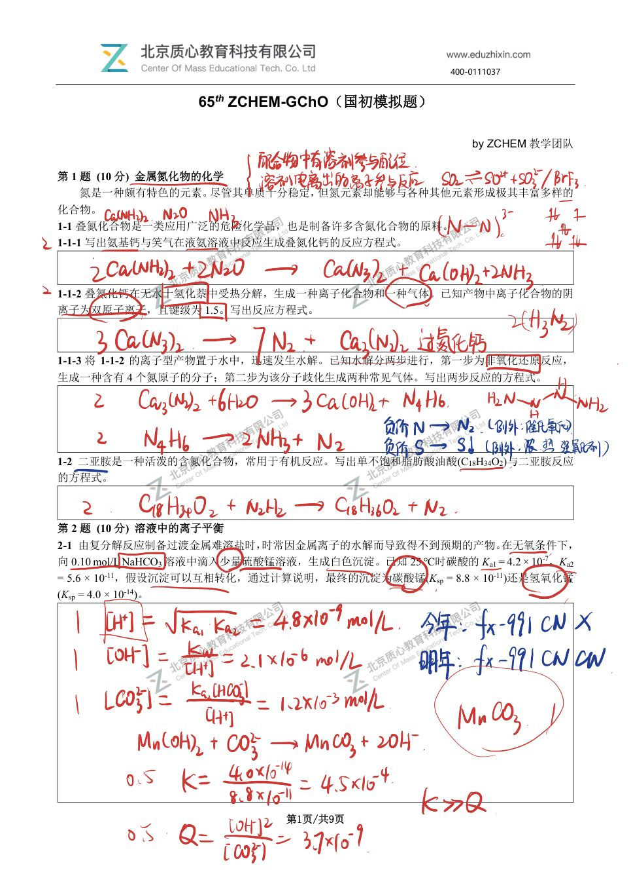
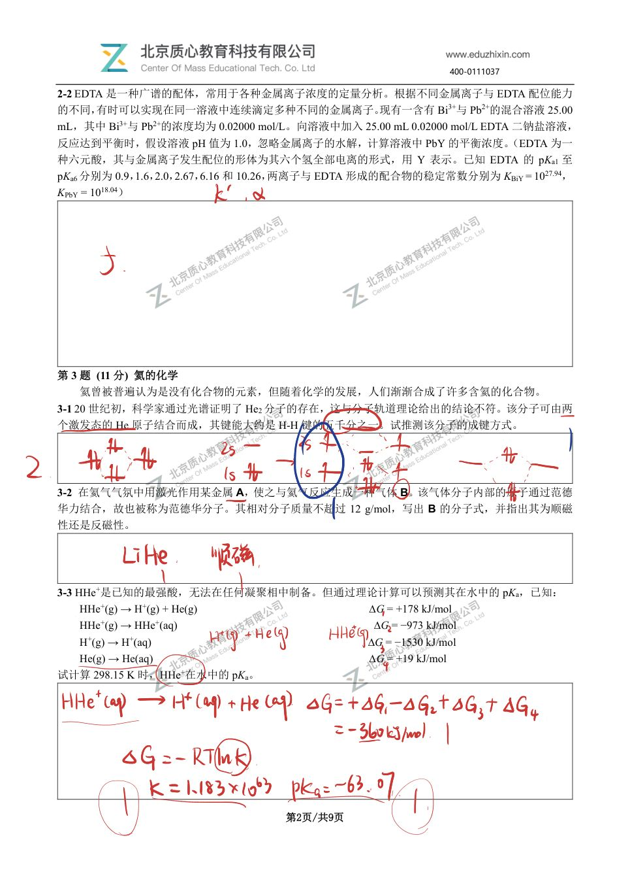
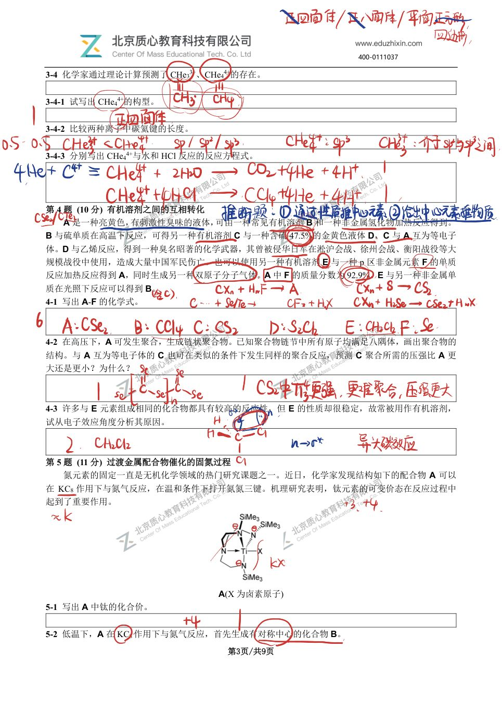
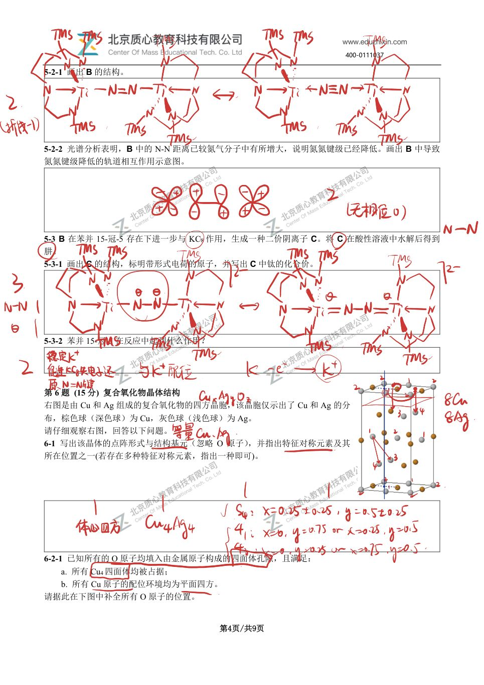
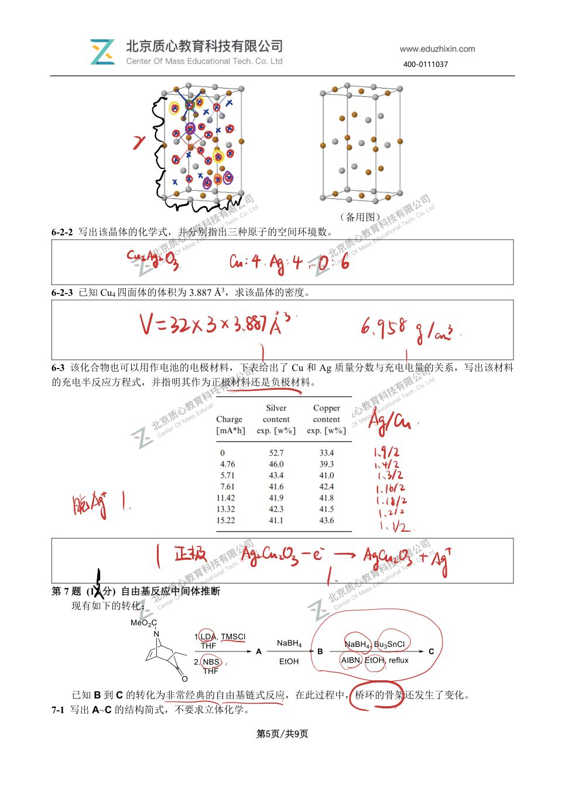
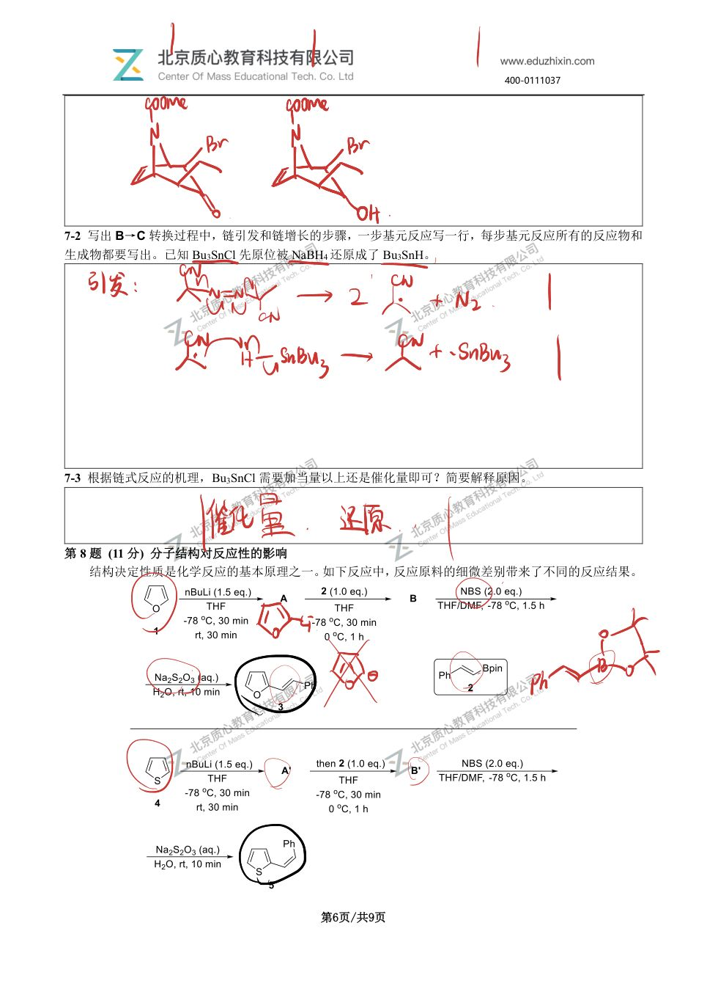
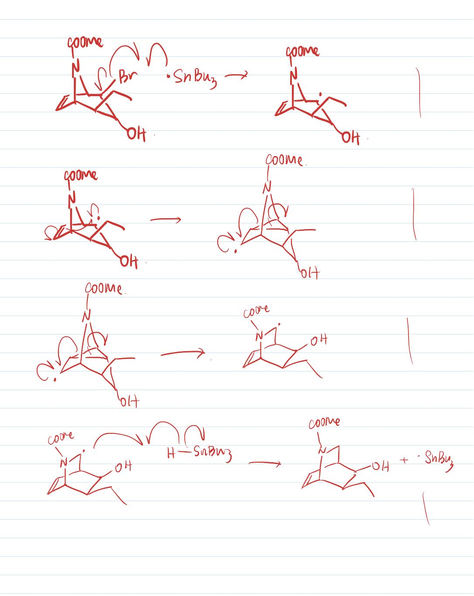
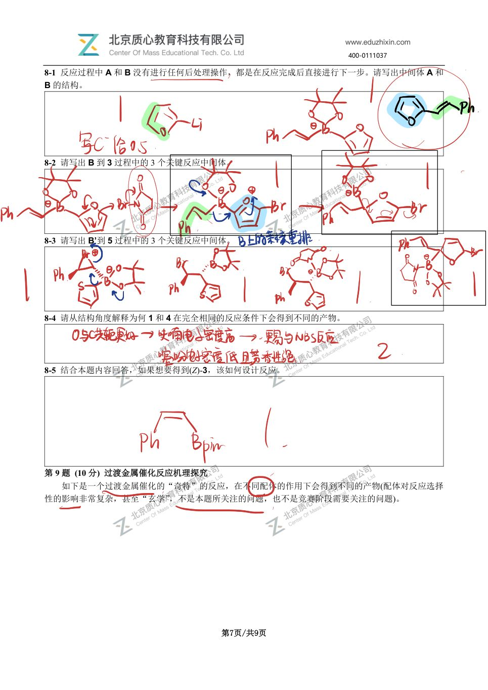
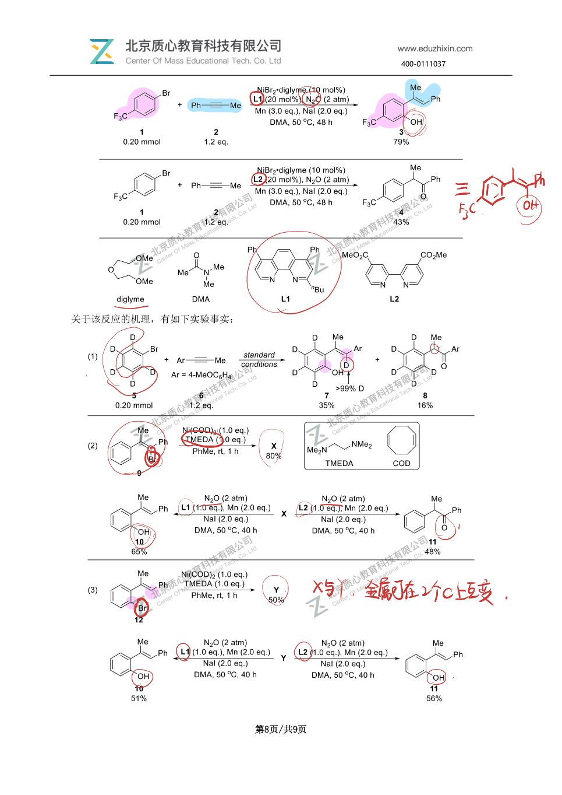
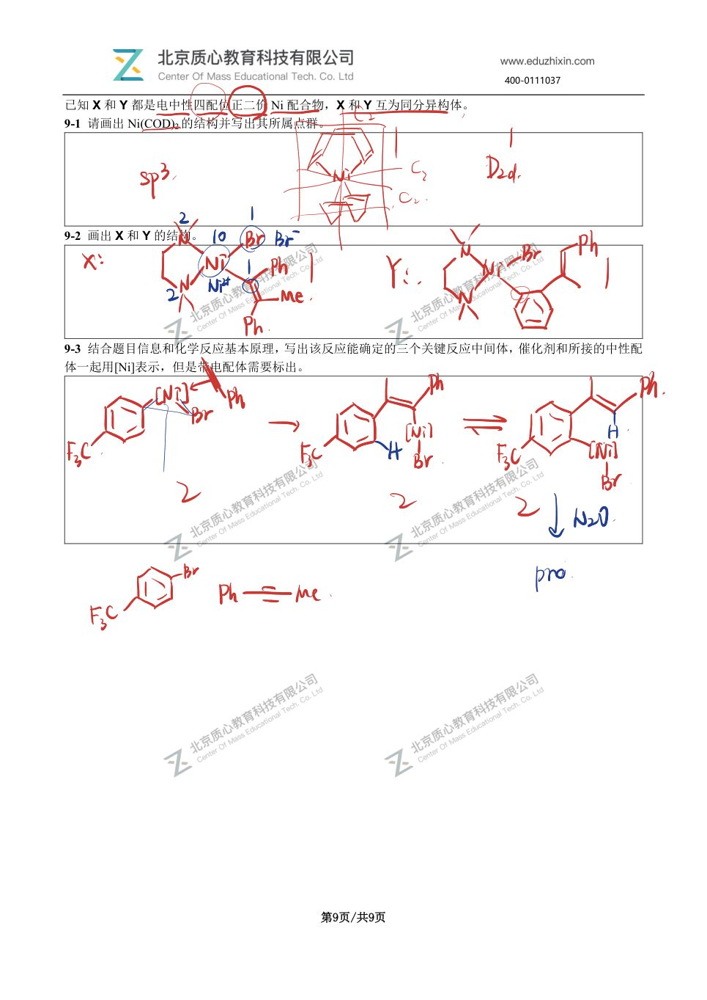

# 题-GChO-65-09-如下是一个过渡金属催化的奇特

## 题目

### 第 9 题 (10 分) 过渡金属催化反应机理探究

如下是一个过渡金属催化的“奇特”的反应，在不同配体的作用下会得到不同的产物(配体对反应选择性的影响非常复杂，甚至“玄学”，不是本题所关注的问题，也不是竞赛阶段需要关注的问题)。

关于该反应的机理，有如下实验事实：

已知 X 和 Y 都是电中性四配位正二价 Ni 配合物，X 和 Y 互为同分异构体。

9-1 请画出 Ni(COD) $_{2}$ 的结构并写出其所属点群。

9-2 画出 X 和 Y 的结构。

9-3 结合题目信息和化学反应基本原理，写出该反应能确定的三个关键反应中间体，催化剂和所接的中性配体一起用[Ni]表示，但是带电配体需要标出。

## 参考答案

📎 **答案出处**：源卷**手写解析手稿**全部 10 页已随卡（见下），第 09 题解答在其内；手写笔迹，**文字化需人工转录**。

## 知识点映射

- （待人工校准）

> ⚠️ **自动拆卡标记**：`subject_module`/`difficulty` 为关键词粗判，答案数值与单位**尚未经人工复核**（OCR 原文逐字转录，可能保留原卷笔误）。