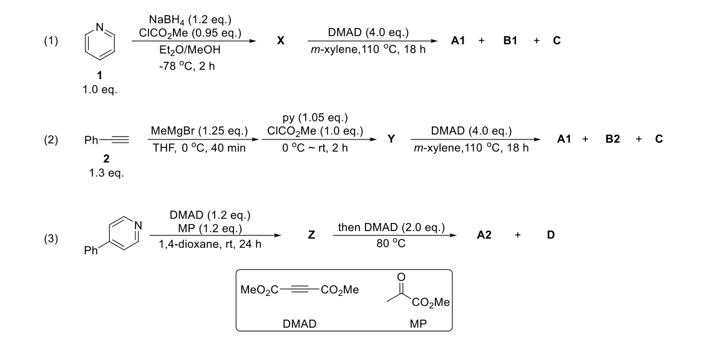

# 题-GChO-76-09-有机化学的魅力之一在于它有无

## 题目

### 第 9 题 吡啶环的转化（24分，占 $12\%$ ）

有机化学的魅力之一在于它有无穷的可能性。本题是通过不同的路径实现的一个有意义的转化。9-1 从吡啶出发通过如下三种不同的路径，都可以得到产物 A1/A2。三种路径细节各不相同，但基本策略是一致的。

部分化合物的数据如下:

(1) 中间产物 X:

$$
\begin{array}{r l} & ^ {1} \mathrm{HNMR(400MHz,CDCl} _ {3}) \delta 6.54 (\mathrm{dd}, J = 45.6, 7.9 \mathrm{Hz}, 1 \mathrm{H}), 5.67 (\mathrm{ddt}, J = 9.6, 5.3, 2.0 \mathrm{Hz}, 1 \mathrm{H}), 5.33 (\mathrm{ddt}, \\ & J = 26.1, 9.2, 4.1 \mathrm{Hz}, 1 \mathrm{H}), 5.04 - 4.90 (\mathrm{m}, 1 \mathrm{H}), 4.23 - 4.17 (\mathrm{m}, 2 \mathrm{H}), 3.61 (\mathrm{s}, 3 \mathrm{H}); \end{array}
$$

$$
\begin{array}{l} ^ {13} \mathrm{CNMR(101MHz,CDCl} _ {3}) \delta 154.2, 153.2, 126.0, 125.3, 121.9, 121.6, 118.8, 118.2, 104.4, 104.4, 52.8, 43.5, \\ \quad \quad \quad \quad \quad \quad \quad \quad \quad \quad \quad \quad \quad \quad \quad \quad \quad \quad \quad \quad \quad \quad \quad \quad \quad \quad \quad \quad \quad \quad \quad \quad \quad \quad \quad \quad \quad \quad \quad \text {43.2}. \end{array}
$$

(2) 中间产物 Y:

(3) 产物 A1:

$$
\begin{array}{l} ^ {1} \mathrm{HNMR(400MHz,CDCl} _ {3}) \delta 7.71 (\mathrm{dd}, J = 5.7, 3.3 \mathrm{Hz}, 2 \mathrm{H}), 7.53 (\mathrm{dd}, J = 5.8, 3.3 \mathrm{Hz}, 2 \mathrm{H}), 3.89 (\mathrm{s}, 6 \mathrm{H}); \\ ^ {13} \mathrm{CNMR(101MHz,CDCl} _ {3}) \delta 168.2, 132.0, 131.2, 128.9, 52.8. \end{array}
$$

(4) 产物 B2:

$$
{ } ^ { 1 } \mathrm{HNMR} ( \mathrm{CDCl} _ { 3 } , 400 \mathrm{MHz} ) \delta 7.38 - 7.42 ( \mathrm{m} , 2 \mathrm{H} ) , 7.47 - 7.51 ( \mathrm{m} , 1 \mathrm{H} ) , 7.59 - 7.62 ( \mathrm{m} , 2 \mathrm{H} ) , 9.42 ( \mathrm{s} , 1 \mathrm{H} ) ;
$$

$$
^ {13} \mathrm{CNMR(CDCl} _ {3}, 100 \mathrm{MHz)} \delta 88.5, 95.3, 119.5, 128.9, 131.4, 133.4, 177.0.
$$

9-1-1 没头脑同学在研究化合物 X 和 Y 的核磁数据时，发现其碳谱很奇怪。进一步查阅文献发现，化合物 X 在 273 K 时部分氢的变为两组峰，温度升高到 333 K 时，两组峰合并为一组。请结合反应和核磁共振数据，推出 X、Y、A 和 B2 的结构。(提示：核磁共振博大精深，在本题中仅仅是辅助判断结构的，切勿本末倒置)

9-1-2 结合反应机理，推出 B1 和 C 的结构。

9-1-3 推出 Z、A2 和 D 的结构。

9-1-4 结合 $\mathbf{X}$ 的结构，解释为何 $\mathbf{X}$ 在低温下部分H有两组峰。

9-2 结合上面的反应机理，写出如下反应的产物。

## 参考答案

有机化学的魅力之一在于它有无穷的可能性。本题是通过不同的路径实现的一个有意义的转化。9-1 从吡啶出发通过如下三种不同的路径，都可以得到产物 A1/A2。三种路径细节各不相同，但基本策略是一致的。

$$
\begin{array}{c} \mathrm{NaBH} _ {4} (1.2 \text { eq. }) \\ \mathrm{ClCO} _ {2} \mathrm{Me} (0.95 \text { eq. }) \\ \mathrm{Et} _ {2} \mathrm{O} / \mathrm{MeOH} \\ - 78 ^ {\circ} \mathrm{C}, 2 \mathrm{h} \end{array} \quad \mathrm{X} \quad \xrightarrow [ m - x y l e n e , 110 ^ {\circ} \mathrm{C} , 18 \mathrm{h} ]{\text { DMAD } (4.0 \text { eq. })} \quad \mathrm{A1} + \quad \mathrm{B1} + \quad \mathrm{C}
$$

$$
\mathrm{Ph} \xrightarrow {\text {DMAD(1.2eq.)}} \mathrm{MP(1.2eq.)} \quad \mathrm{Z} \quad \xrightarrow [ 80 ^ {\circ} \mathrm{C} ]{\text {thenDMAD(2.0eq.)}} \quad \mathrm{A2} + \quad \mathrm{D}
$$

部分化合物的数据如下:

(1) 中间产物 X:

$^{1}$ H NMR (400 MHz, CDCl $_{3}$ ) δ 6.54 (dd, J = 45.6, 7.9 Hz, 1H), 5.67 (ddt, J = 9.6, 5.3, 2.0 Hz, 1H), 5.33 (ddt, J = 26.1, 9.2, 4.1 Hz, 1H), 5.04 – 4.90 (m, 1H), 4.23 – 4.17 (m, 2H), 3.61 (s, 3H);

$^{13}$ C NMR (101 MHz, CDCl $_{3}$ ) δ 154.2, 153.2, 126.0, 125.3, 121.9, 121.6, 118.8, 118.2, 104.4, 104.4, 52.8, 43.5, 43.2.

(2) 中间产物 Y:

$^{1}$ H NMR (400 MHz, CDCl $_{3}$ ) δ 7.46 – 7.40 (m, 2H), 7.33 – 7.25 (m, 3H), 6.82 (dd, J = 50.8, 7.8 Hz, 1H), 6.04 (dd, J = 9.3, 5.7 Hz, 1H), 5.91 – 5.58 (m, 2H), 5.41 (dt, J = 22.4, 6.7 Hz, 1H), 3.88 (d, J = 9.2 Hz, 3H); $^{13}$ C NMR (101 MHz, CDCl $_{3}$ ) δ 154.3, 153.7, 132.0, 131.9, 131.7, 128.4, 128.2, 125.5, 124.7, 122.6, 122.2, 118.9, 118.4, 105.7, 86.5, 83.1, 53.6, 44.4, 44.0.

(3) 产物 A1:

$^{1}$ H NMR (400 MHz, CDCl $_{3}$ ) δ 7.71 (dd, J = 5.7, 3.3 Hz, 2H), 7.53 (dd, J = 5.8, 3.3 Hz, 2H), 3.89 (s, 6H); $^{13}$ C NMR (101 MHz, CDCl $_{3}$ ) δ 168.2, 132.0, 131.2, 128.9, 52.8.

## (4) 产物 B2:

$^{1}$ H NMR (CDCl $_{3}$ , 400 MHz) δ 7.38–7.42 (m, 2H), 7.47–7.51 (m, 1H), 7.59–7.62 (m, 2H), 9.42 (s, 1H);

$^{13}$ C NMR (CDCl $_{3}$ , 100 MHz) δ 88.5, 95.3, 119.5, 128.9, 131.4, 133.4, 177.0.9-1-1 没头脑同学在研究化合物 X 和 Y 的核磁数据时，发现其碳谱很奇怪。进一步查阅文献发现，化合物 X 在 273 K 时部分氢的变为两组峰，温度升高到 333 K 时，两组峰合并为一组。请结合反应和核磁共振数据，推出 X、Y、A 和 B2 的结构。(提示：核磁共振博大精深，在本题中仅仅是辅助判断结构的，切勿本末倒置)

$$
2 ^ {\prime} \times 4
$$

## 9-1-2 结合反应机理，推出 B1 和 C 的结构。

$$
2 ^ {1} \times 2
$$

## 9-1-3 推出 Z、A2 和 D 的结构。

D

9-1-4 结合 X 的结构，解释为何 X 在低温下部分 H 有两组峰。
脂肪：sp^{2}生化 情况下有顺反异吗
无B快速转化

9-2 结合上面的反应机理，写出如下反应的产物。

E
F

## 知识点映射

- （待人工校准）

> ⚠️ **自动拆卡标记**：`subject_module`/`difficulty` 为关键词粗判，答案数值与单位**尚未经人工复核**（OCR 原文逐字转录，可能保留原卷笔误）。