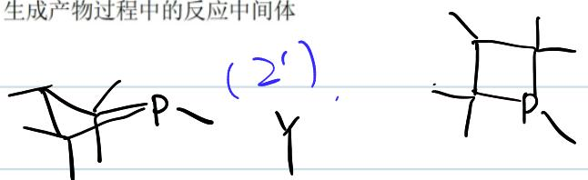
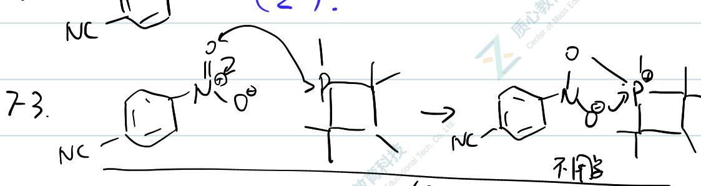
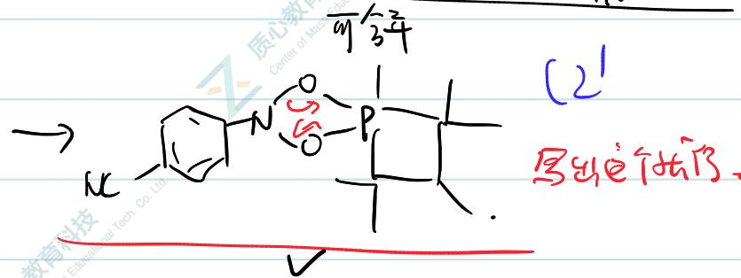
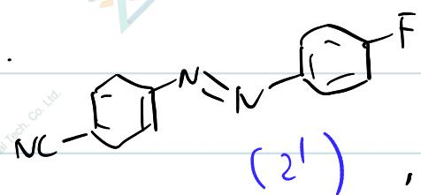
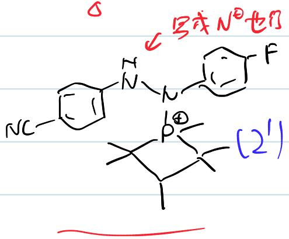

# 题-UChO-01-07-有机小分子催化剂X可催化如下

## 题目

### 第 7 题 (10分)

有机小分子催化剂 X 可催化如下转化:

在反应过程中，化合物 1 会首先在催化剂 X 的作用下转化为中间产物 A，A 再和 2 经 X 的催化得到产物。

7-1 X 本身并不具有催化活性, 这里是经过原位反应以后才得到了具有催化活性的物质 Y, 写出 Y 的结构。

7-2 推出 A 的结构。

7-3 写出生成 A 过程中的反应中间体。

7-4 写出由 A 生成产物过程中的反应中间体

## 参考答案

📎 **答案出处**：源卷答案（手写解答图）已随卡；解答以源卷图给出，文字未逐条复核。

> 源：4thZCHEM-UChO答案.md

**7-1~7-4 解答（源卷手写解答图）**

## 知识点映射

- （待人工校准）

> ⚠️ **自动拆卡标记**：`subject_module`/`difficulty` 为关键词粗判，答案数值与单位**尚未经人工复核**（OCR 原文逐字转录，可能保留原卷笔误）。