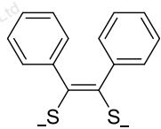
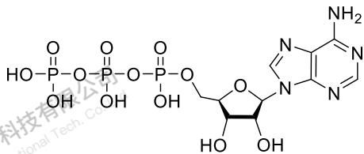
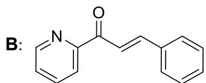

# 题-UChO-02-01-11ReSPhCCPhS是第

## 题目

### 第 1 题 (11分)

1-1 Re(SPhCCPhS) $_{3}$ 是第一例被报道的三棱柱形配合物，其配体结构可如下表示：

指出其中 Re 元素的氧化态，并用晶体场理论画出 Re 的 d 轨道分裂图（注意标出电子）。

1-2 发展金属—核酸杂化催化剂对人们认识核酸在自然界中的作用有着重要意义。在自然界中，三磷酸腺苷（ATP）和金属离子的复合物可以作为辅助底物参与酶催化反应。将一定浓度的 ATP 水溶液与 $\mathrm{Cu(OTf)_2}$ 在 4 ℃ 下反应 30 min，可以得到能够催化 Diels-Alder 反应的配合物 A。已知 ATP 结构如下图所示。

1-2-1 在制备 A 的反应过程中， $\mathrm{Cu(OTf)_2}$ 脱去 1 个 OTf 并与 ATP 发生配位，且在 ATP 内部形成分子内氢键，且有一个 O 同时参与配位键和氢键的形成。画出 A 的结构。

1-2-2 A 可以催化 B(下图结构)和 C(环戊二烯)的反应，会首先得到 A 与 B 形成的 5 配位的配合物 D，画出 D 的结构。(本问只需用配位原子和连接线代表 ATP)

1-2-3 D 中 ATP 磷酸基团上的 O 可与环戊二烯中 2,3 两个位置的烯氢中的两个形成氢键，再加上 1-2-1 题干描述的 “分子内氢键” 的作用，D-A 反应产物的立体化学得到了控制。画出反应产物的立体结构，标出手性碳的手性。（注意 ATP 的立体结构）。

1-2-4 即使有上述作用，与 B 相比，配合物 D 的形成也可能使 D-A 反应变慢，请指出其中的主要原因。

## 参考答案

⛔ **源池含本题解答（待人工核录入）**：源文件 `4thZCHEM-UChO答案.md` 中已按题面指纹定位到本题解答（310 字 / 13 图，自动定位），因其为**手写批注稿 / 讲稿口述**，未自动录入，建议人工核后补入。

## 知识点映射

- （待人工校准）

> ⚠️ **自动拆卡标记**：`subject_module`/`difficulty` 为关键词粗判，答案数值与单位**尚未经人工复核**（OCR 原文逐字转录，可能保留原卷笔误）。