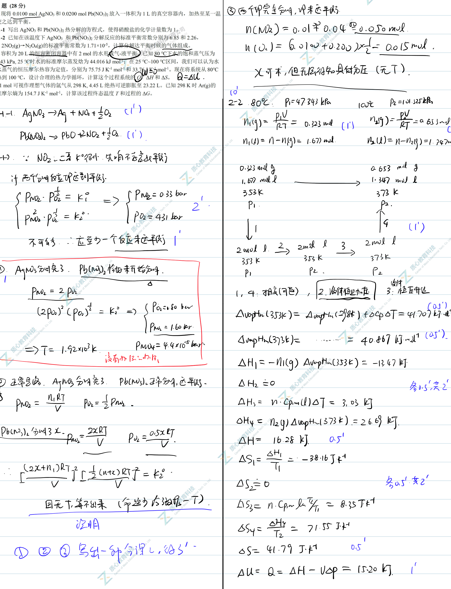
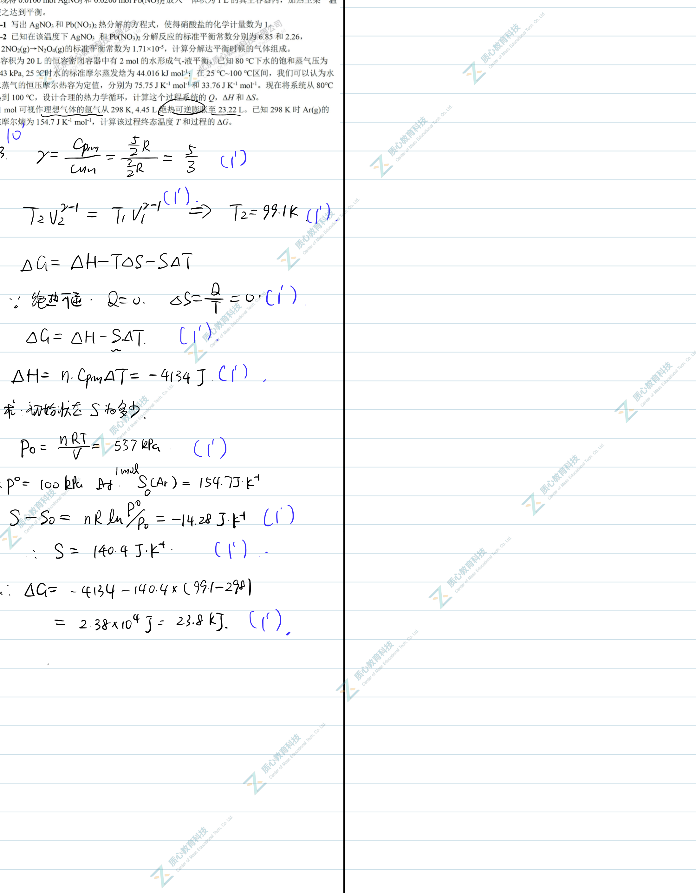

# 题-UChO-02-02-21现将和放入一体积为的真空

## 题目

### 第 2 题 (28分)

2-1 现将 $0.0100 \, mol \, AgNO_{3}$ 和 $0.0200 \, mol \, Pb(NO_{3})_{2}$ 放入一体积为 $1 \, L$ 的真空容器内，加热至某一温度使之达到平衡。

2-1-1 写出 $AgNO_{3}$ 和 $\mathrm{Pb(NO_{3})_{2}}$ 热分解的方程式，使得硝酸盐的化学计量数为 1。

2-1-2 已知在该温度下 $AgNO_{3}$ 和 $\mathrm{Pb(NO_{3})_{2}}$ 分解反应的标准平衡常数分别为 6.85 和 2.26,

$2\mathrm{NO}_{2}(\mathrm{~g})\rightarrow\mathrm{N}_{2}\mathrm{O}_{4}(\mathrm{~g})$ 的标准平衡常数为 $1.71\times10^{-5}$ ，计算分解达平衡时候的气体组成。

2-2 容积为 20 L 的恒容密闭容器中有 2 mol 的水形成气-液平衡。已知 80 ℃ 下水的饱和蒸气压为 47.343 kPa, 25 ℃ 时水的标准摩尔蒸发焓为 44.016 kJ mol $^{-1}$ ; 在 25 ℃\~100 ℃ 区间，我们可以认为水和水蒸气的恒压摩尔热容为定值，分别为 75.75 J K $^{-1}$ mol $^{-1}$ 和 33.76 J K $^{-1}$ mol $^{-1}$ 。现在将系统从 80 ℃ 加热到 100 ℃，设计合理的热力学循环，计算这个过程系统的 Q，ΔH 和 ΔS。

2-31 mol 可视作理想气体的氩气从 298 K, 4.45 L 绝热可逆膨胀至 23.22 L。已知 298 K 时 Ar(g)的标准摩尔熵为 $154.7 \, J \, K^{-1} \, mol^{-1}$ ，计算该过程终态温度 T 和过程的 $\Delta G$ 。

## 参考答案

（源：质心 UChO5 官方答案（手写稿）· Tour2 第 2 题；按原册裁区）

> 📌 据源答案册裁区回填（OCR 定位题界）。

## 知识点映射

- （待人工校准）

> ⚠️ **自动拆卡标记**：`subject_module`/`difficulty` 为关键词粗判，答案数值与单位**尚未经人工复核**（OCR 原文逐字转录，可能保留原卷笔误）。