# 题-UChO-10thZCHEM-UChO-08-Friedlnder环化是合

## 题目

### 第 8 题 Friedländer 环化(占 8%)

Friedländer 环化是合成多取代喹啉和相关氮杂环或氮杂芳香烃的方法之一，对邻氨基苯甲腈与酮的反应的研究十分广泛。

8-1 对邻氨基苯甲腈与酮的 Friedländer 环化反应可能会发生副反应，得到两种产物。

8-1-1 若 solvent 为路易斯酸，请分别画出生成 3a 和 4a 的关键中间体。

8-1-2 在强碱性条件下，请判断生成何种产物的产率几乎为 0，并结合机理解释原因。

<table><tr><td>Entries</td><td>Catalyst (equiv.)</td><td>Time (h)</td><td>3b Yield (%)</td><td>4b Yield (%)</td></tr><tr><td>1</td><td> $AlCl_{3}$ </td><td>1</td><td>70</td><td>0</td></tr><tr><td>2</td><td>p-Me $C_{6}H_{4}SO_{3}H$ </td><td>1</td><td>47</td><td>13</td></tr><tr><td>3</td><td> $CuCl_{2}$ </td><td>1</td><td>7</td><td>32</td></tr><tr><td>4</td><td>CuCl</td><td>1</td><td>6</td><td>38</td></tr><tr><td>5</td><td> $ZnCl_{2}$ </td><td>1</td><td>10</td><td>75</td></tr><tr><td>6</td><td> $ZnCl_{2}$ </td><td>0.5</td><td>8</td><td>40</td></tr><tr><td>7</td><td> $ZnCl_{2}$ </td><td>2</td><td>12</td><td>76</td></tr><tr><td>8</td><td> $ZnCl_{2}$ </td><td>3</td><td>15</td><td>76</td></tr><tr><td>9</td><td> $ZnCl_{2}$ </td><td>4</td><td>14</td><td>75</td></tr><tr><td>10</td><td> $ZnCl_{2}$ (0.5 equiv)</td><td>1</td><td>7</td><td>39</td></tr><tr><td>11</td><td> $ZnCl_{2}$ (1.5 equiv)</td><td>1</td><td>12</td><td>75</td></tr></table>

8-2 当 $R_{1}=NO_{2}$ ，另一底物为环己烷时，使用不同催化剂将会对反应产生极大影响。
8-2-1 当 Catalyst = ZnCl₂ 时，4b 为主产物，请简述反应时间对产率的影响。

8-2-2 当 Catalyst = AlCl₃ 或 p-MeC₆H₄SO₃H 时，主产物为 3b；当 Catalyst = CuCl₂ 或 CuCl 或 ZnCl₂ 时，4b 为主产物，试解释原因。

<table><tr><td>Entries</td><td> $R_1$ </td><td> $R_2$ </td><td>N</td><td>T(°C)</td><td>Time (h)</td><td>3 Yield (%)</td><td>4 Yield (%)</td></tr><tr><td>a</td><td> $NO_2$ </td><td>H</td><td>1</td><td>Reflux</td><td>1</td><td>15</td><td>70</td></tr><tr><td>b</td><td> $NO_2$ </td><td>H</td><td>2</td><td>Reflux</td><td>1</td><td>10</td><td>75</td></tr><tr><td>c</td><td> $NO_2$ </td><td>H</td><td>3</td><td>Reflux</td><td>1</td><td>7</td><td>80</td></tr><tr><td>d</td><td>H</td><td>Cl</td><td>1</td><td>Reflux</td><td>2</td><td>12</td><td>67</td></tr><tr><td>e</td><td>H</td><td>Cl</td><td>2</td><td>Reflux</td><td>1.5</td><td>15</td><td>70</td></tr><tr><td>f</td><td>H</td><td>H</td><td>1</td><td>Reflux</td><td>2.5</td><td>25</td><td>62</td></tr><tr><td>g</td><td>H</td><td>H</td><td>2</td><td>Reflux</td><td>2.5</td><td>21</td><td>64</td></tr><tr><td>h</td><td>H</td><td> $CH_3$ </td><td>1</td><td>160</td><td>4</td><td>11</td><td>25</td></tr><tr><td>i</td><td> $CH_3$ </td><td>H</td><td>2</td><td>160</td><td>4</td><td>12</td><td>23</td></tr><tr><td>j</td><td> $OCH_3$ </td><td> $OCH_3$ </td><td>1</td><td>160</td><td>4</td><td>15</td><td>28</td></tr><tr><td>k</td><td> $OCH_3$ </td><td> $OCH_3$ </td><td>2</td><td>160</td><td>4</td><td>10</td><td>25</td></tr></table>

8-3-1 请简述环系大小对反应的影响。
8-3-2 当苯环上的取代基为吸电子取代基时，产物 4 的产率较大，试解释原因。

## 参考答案

📎 **答案出处**：源卷答案区原文已随卡（含题面复读，原样保留）；OCR 原文转录，数值未逐条复核。

> 源：6thZCHEM-UChO-Tour1答案.md（第 8 题）

环丙烷在一定程度上具有与双键相似的性质，比如环丙烷 $\alpha$ 位的碳正离子与烯丙基碳正离子的稳定性相当(甚至略稳定一点)。基于此思考并回答下面的问题。

如下是一个合成含有手性中心的四元环的方法，其中 2 的立体化学没有完全表示。

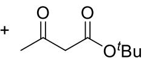

A

$$
\begin{array}{c} \text {p - ABSA(1.2eq.)} \\ \text {DBU(1.5eq.)} \\ 0 ^ {\circ} \mathrm{C}, 3 \mathrm{h} \end{array}
$$

$$
\frac {\mathrm{Rh} _ {2} (\mathrm{S-NTTL}) _ {4} (0 . 5 \mathrm{mol} \%)}{\mathrm{PhMe} , - 7 8 ^ {\circ} \mathrm{C}}
$$

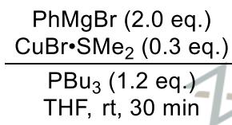

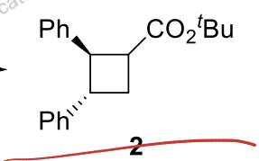

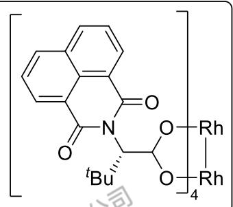

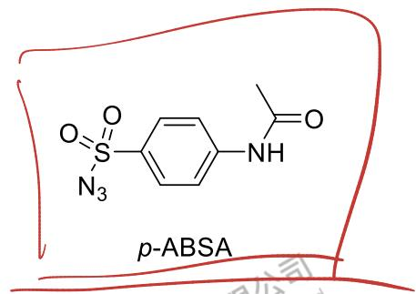

8-1 写出 A\~C 的结构，注意立体化学。

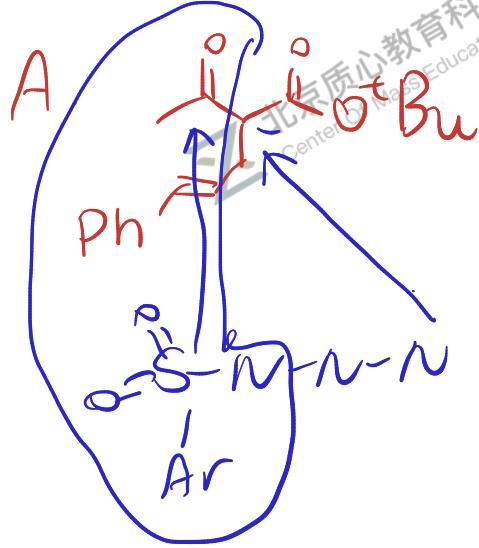

B.

C
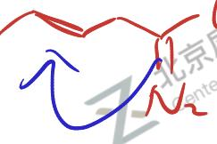

$CO_{2}^{t}Bu$

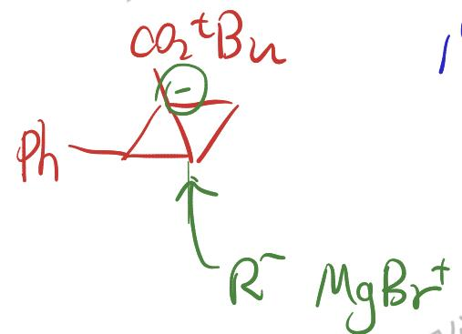

$$
1 ^ {1} \times 3
$$

8- 2 完成反应，已知 D，E 和 2 的立体化学不完全相同，请写出 D 和 E 的结构，注意立体化学。

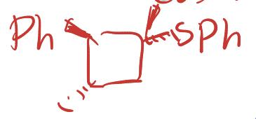

8- 3 当使用顺式的 1'为底物时, 得不到对应的化合物 C', 而是得到另外一种分子式为 $\mathrm{C}_{15} \mathrm{H}_{18} \mathrm{O}_{2}$ 的产物 F, F 不含 3 元环。

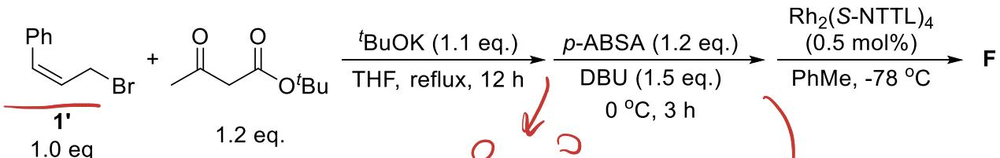

8-3-1 推出 $\mathbf{F}$ 的结构。

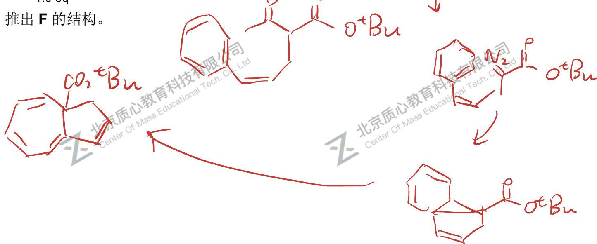

8-3-2 写出前一步产物生成 F 的反应名称。
电石化开环

8-3-3 解释 1 和 1'产物不同的原因。

1. 中双键反式，占宾与第环远，只能与双键环化得3并了结构
2. 中双键顺式，占宾与第环近，可直接环化

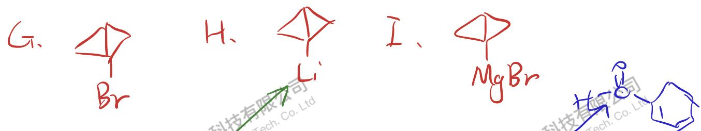

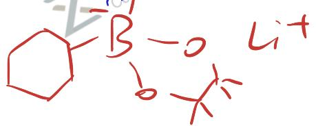

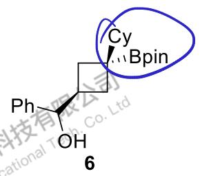

8- 4 上述过程中化合物 C 的骨架的性质引起了科研工作者的兴趣，并展开了一系列研究。如下路线中也包含化合物 C 的骨架，但骨架所体现的性质与 1- 1 和 1- 2 中的有所不同。

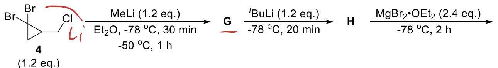

$$
\begin{array}{c} \text {5 (1.0 eq.)} \\ \hline - 7 8 ^ {\circ} \mathrm{C}, 5 \mathrm{min} \\ \text {rt,30min} \end{array}
$$

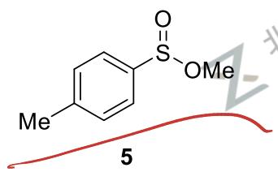

8-4-1 请写出 $\mathbf{G} \sim \mathbf{K}$ 的结构。

J.
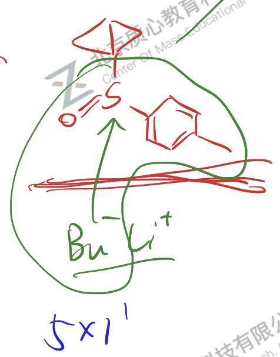

1.2 一重核重排

1 提高3并3碳负离子的稳定性

$$
\begin{array}{c} 2 \text {-Me - THF} \\ \hline - 7 8 ^ {\circ} \mathrm{C}, 1 \mathrm{h} \\ \text {rt,1h} \end{array}
$$

$$
\begin{array}{c} \text {2 - Me - THF} \\ \text {-78°C, 1 h} \\ \text {rt, 1 h} \end{array}
$$

$$
\begin{array}{c} 2 - \text {Me - THF} \\ \hline - 7 8 ^ {\circ} \mathrm{C}, 1 \mathrm{h} \\ \text {rt,1h} \end{array}
$$

$$
\begin{array}{c} \text {2 - Me - THF} \\ \text {-78°C, 1 h} \\ \text {rt, 1 h} \end{array}
$$

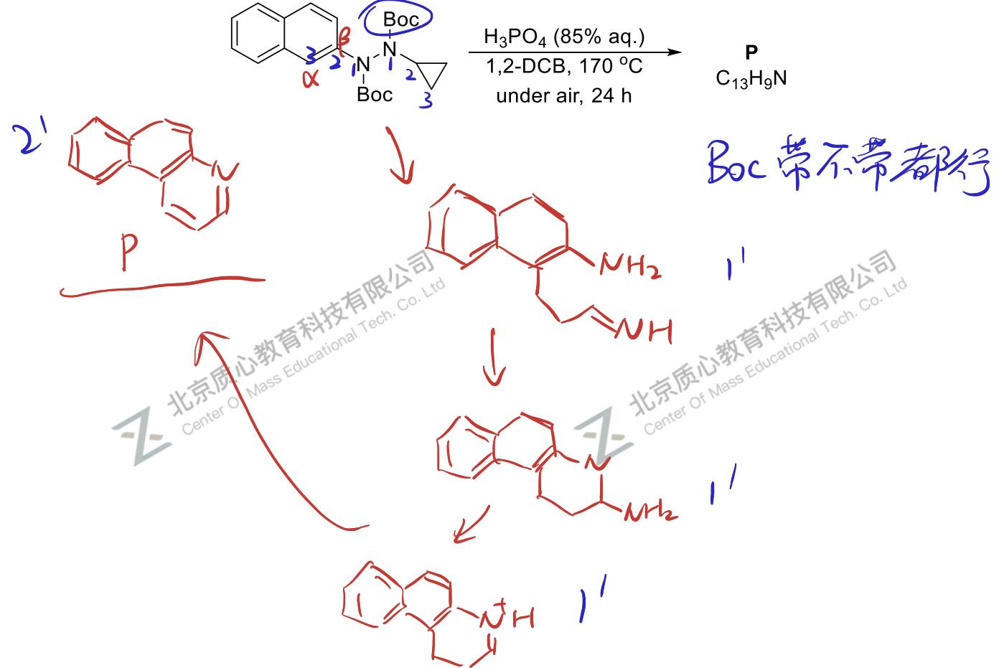

8-6 写出 P 的结构，并写出 3 个关键中间体。

## 知识点映射

- （待人工校准）

> ⚠️ **自动拆卡标记**：`subject_module`/`difficulty` 为关键词粗判，答案数值与单位**尚未经人工复核**（OCR 原文逐字转录，可能保留原卷笔误）。