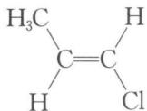
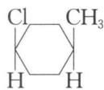
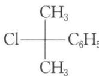
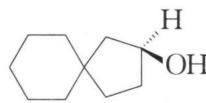
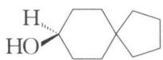
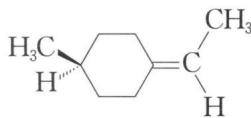
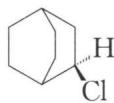
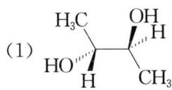

# 题-062：已拆分为10个单题文件

## 习题

### 1. 下列化合物中,哪些具有光学活性?

(1)

(2)

(3)

(4)

(5)

(6)

(7)

### 2. 将下列各化合物的结构式改写成费歇尔投影式, 并标出各手性碳原子的构型。

### 3. 某一系列的烷烃分子均只有一种一卤取代物。如：甲烷、戊烷、十七烷等。

这一系列烷烃具有一定的规律性,当一种烃分子的—H全部被—CH₃取代后,它的一卤代物异构体数目不变。试回答:

(1) 请写出这一系列第 4 种烷烃的分子式为 ____。

(2) 请写出这一系列所有烷烃分子式的通式为 ____。

(3) 这一系列烷烃中, 其中含碳量最高的烷烃其碳元素的质量分数为 ____。

(4) 另一系列烷烃分子也只有一种一卤取代物, 其分子式的通式为____。

(5) 这两个系列烷烃分子间是否存在同分异构体？为什么？

### 4.（1997年全国初赛试题）1964年伊顿研究团队合成了一种新奇的烷，叫立方烷，化学式为 C₈H₈(A)。20年后，在伊顿研究小组工作的博士后合成了这种烷的四硝基衍生物(B)，是一种烈性炸药。最近，有人计划将B的硝基用19种氨基酸取代，得到立方烷的四酰胺基衍生物(C)，认为极有可能从中筛选出最好的抗癌、抗病毒，甚至抗爱滋病的药物来。回答如下问题：

（1）四硝基立方烷理论上可以有多种异构体，但仅有一种是最稳定的，它就是(B)，请画出它的结构简式。

(2) 写出四硝基立方烷(B)爆炸反应方程式。

(3) C 中每个酰胺基是一个氨基酸基团。请估算, B 的硝基被 19 种氨基酸取代, 理论上总共可以合成多少种氨基酸组成不同的四酰胺基立方烷(C)?

(4) C 中有多少对对映异构体?

### 5.（1998年全国初赛试题）1932年捷克研究团队从南摩拉维亚油田的石油分馏物中发现一种烷(代号A)，次年借X-射线技术证实了其结构，竟是有人早就预言过了。后来A被大量合成，并发现它的胺类衍生物具有抗病毒、抗震颤的药物活性，开发为常用药。下图给出三种已经合成的由2,3,4个A为基本结构单元"模块"像搭积木一样"搭"成的较复杂笼状烷。

(1) 请根据这些图形画出 A 的结构, 并给出 A 的分子式。

(2) 图中 B、C、D 三种分子是否与 A 属于一个同系列中的 4 个同系物？为什么？

（3）如果在 D 上继续增加一"块"A"模块"，得到 E，给出 E 的分子式。E 有无异构体？若有，给出异构体的数目，并说明你得出结论的理由，也可以通过作图来说明。

### 6. (2000年全国初赛试题)我国一留美化学家参与合成了一种新型炸药, 它跟三硝基甘油一样抗打击、抗震, 但一经引爆就发生激烈爆炸, 据说是迄今最烈性的非核爆炸品。该炸药的分子式为 C₈N₈O₁₆, 同种元素的原子在分子中是毫无区别的。

(1) 画出它的结构简式。

(2) 写出它的爆炸反应方程式。

(3) 解释该物质为何是迄今最烈性的非核爆炸品。

### 7.（2002年全国初赛试题）组合化学是一种新型合成技术。今用21种氨基酸借组合化学技术合成由它们连接而成的三肽（注：三肽的组成可以是ABC，也可以是AAA或者AAB等等，还应指出，三肽ABC不等于三肽CBA）。

(1) 该组合反应能得到多少个三肽的产物库？

(2) 假设所得的库中只有一个三肽具有生物活性。有人提出,仅需进行不多次实验,即可得知活性三肽的组成(每次实验包括对全库进行一次有无生物活性的检测)。请问:该实验是如何设计的?按这种实验设计,最多需进行多少次实验,最少只需进行几次实验?简述理由。

### 8. (2003年全国初赛试题)(1)咖啡因对中枢神经有兴奋作用,其结构式如下。常温下,咖啡因在水中的溶解度为 2 g/100g H₂O,加适量水杨酸钠[C₆H₄(OH)(COONa)],由于形成氢键而增大咖啡因的溶解度。请在附图上添加水杨酸钠与咖啡因形成的氢键。

（2）氯仿在苯中的溶解度明显比1,1,1-三氯乙烷的大，请给出一种可能的原因(含图示)。

### 9. (2003年全国初赛试题) 中和 1.2312 g 平面构型的羧酸消耗 18.00 mL 1.20 mol/L NaOH 溶液, 将该羧酸加热脱水, 生成含碳量为 49.96% 的化合物。确定符合上述条件的摩尔质量最大的羧酸及其脱水产物的结构简式, 简述推理过程。

### 10.（2004年全国初赛试题）有一种测定多肽、蛋白质、DNA、RNA等生物大分子的相对分子质量的新实验技术称为ESI-FTICR-MS，精度很高。图谱中的峰是质子化肌红朊的信号，纵坐标是质子化肌红朊的相对丰度，横坐标是质荷比 m/Z，m 是质子化肌红朊的相对分子质量，Z 是质子化肌红朊的电荷（源自质子化，取正整数），图谱中的相邻峰的电荷数相差1，右起第4峰和第3峰的 m/Z 分别为1542和1696。求肌红朊的相对分子质量 (M)。

---

## 答案

### 1.
一般可通过分子中是否具有对称面或对称中心来判断该分子是否有光学活性。

(1)、(2)、(3)、(5)、(9)、(10)、(11)、(14)、(15)、(16)有对称面,无光学活性。

(4)、(6)、(7)、(8)、(12)、(13)、(17)无对称面和对称中心,有光学活性。

### 2.
费歇尔投影式及构型标注见原书答案图示。

### 3.
分析: 考查分子结构, 这一系列中任一分子所有的—H 被—CH₃取代后所得分子也属于该系列, 即 H 原子个数由一变三, 且该系列的第一个分子为 CH₄, 由等比数列知识可求得该系列分子氢原子通项可表示为 H₄×3^(n-1), 然后根据烷烃分子通项公式 CₙH₂ₙ₊₂ 可知该系列烷烃通项公式为 C₂×3^(n-1)-1 H₄×3^(n-1)。

答案：
(1) C₅₃H₁₀₈

(2) C₂×3^(n-1)-1 H₄×3^(n-1) (n=1,2,3,4...)

(3) lim(n→∞) [12×(2×3^(n-1) - 1)] / [12×(2×3^(n-1) - 1) + 4×3^(n-1)] = 85.7%

(4) C₃×3^(n-1)-1 H₆×3^(n-1) (n=1,2,3,4...)

(5) 不存在。这两系列烷烃没有相同的分子式。

### 4.
(1) 四硝基立方烷(B)的结构简式：8个C原子形成立方烷骨架, 8个硝基取代了立方烷中的8个氢原子。

(2) C₈H₄(NO₂)₄ = 2C + 6CO↑ + 2H₂O + 2N₂↑

(3) 若用 abcde... 代表 19 种不同的氨基酸,且考虑到 4 个酰胺基呈四面体分布,则计算过程如下:
① 若为 Aa₄ 型，则 C₁₉¹ = 19
② 若为 Aa₃b 型，则 C₁₉¹C₁₈¹ = 19×18 = 342
③ 若为 Aa₂b₂ 型，则 C₁₉² = 19×18÷2 = 171
④ 若为 Aa₂bc 型，则 C₁₉²C₁₇¹ = 19×18÷2×17 = 2907
⑤ 若为 Aabcd 型，则 C₁₉⁴ = 19×18×17×16÷(4×3×2×1) = 3876，且该种类型分子结构中没有镜面和对称中心，存在对映体。

因此，共计 19 + 342 + 171 + 2907 + 3876×2 = 11191 种

(4) Aabcd 型有对映异构体, 共 3876 对。

### 5.
(1) 由题述"B、C、D分别由2、3、4个A为基本结构单元以搭积木的方式构建成的笼状烷", 再结合题给B、C、D的结构图, 不难发现它们均以A即金刚烷为基本单元通过共用六元环而形成。因此, A的分子式为 C₁₀H₁₆。

(2) A、B、C、D 在结构上具有相同的特征, 在组成上的系差为 C₄H₄, 该系列分子的通式为: C₄ₙ₊₆H₄ₙ₊₁₂ (n=1,2,3,4...)，属于同系物。

(3) 在 D 上继续增加一"块"A"模块"，得到 E，此时 n=5 时，E 的分子式为 C₂₆H₃₂。D 中六元环取向有 3 组，因此 E 的构造异构体有 3 种。其中 E₁ 分子中存在镜面,无对映异构体,而 E₂、E₃ 都没有对称中心和镜面,都存在对映异构体,所以总共有 5 种异构体。

### 6.
(1) 8 个 C 原子形成立方烷骨架, 8 个硝基取代了立方烷中的 8 个氢原子。

(2) C₈(NO₂)₈ = 8CO₂ + 4N₂

(3) ① 八硝基立方烷分解得到的两种气体都是最稳定的化合物,且由于分解产物完全是气体,体积膨胀将引起激烈爆炸。② 立方烷的碳架键角只有 90°,远小于 109°28',环的张力很大,因而八硝基立方烷是一种高能化合物,分解时将释放大量能量。

### 7.
(1) 21³ = 9261

(2) 实验设计: 每次减少 1 个氨基酸用 20 个氨基酸进行同上组合反应, 若发现所得库没有生物活性, 即可知被减去的氨基酸是活性肽的组分。

按这种实验设计,若前三次实验发现所得库均无生物活性,则可知被减去的三种氨基酸是活性肽的组成。因此,最少只需进行3次实验就可完成实验。

### 8.
(1) 形成氢键时, C₆H₄(OH)(COONa) 中的羟基应是质子的给体, 而咖啡因中氮原子上的孤对电子应是质子的受体。咖啡因分子结构中共有 4 个氮原子, 其中两个酰胺键氮上孤对电子占有的 p 轨道参与形成离域 π 键而不易给出。咪唑环上连有甲基的氮上孤对电子在未杂化的 p 轨道中, 参与形成离域 π 键而不易给出; 而另一氮上孤对电子在 sp² 杂化轨道中, 未参与形成离域 π 键, 能给出, 应是氢键质子的受体。

(2) 氯仿 CHCl₃ 为四面体构型, 极性分子, 1,1,1-三氯乙烷 CH₃CCl₃ 也为极性分子, 但是苯 C₆H₆ 为非极性分子, 根据"相似相溶"经验规律, 氯仿在 1,1,1-三氯乙烷中溶解度应大于在苯中。但这与题述相矛盾, 说明有其他因素在影响氯仿的溶解度。此时, 应考虑到氢键也是影响溶解度的重要因素。在 CHCl₃ 分子中, 3 个 Cl 原子和 C 原子相连, 由于 Cl 原子的强吸电子效应, 使和 3 个 Cl 相连的 C 原子正电性大大增强, C—H 键极性增强, 此时氢原子可参与形成氢键。而苯环离域 π 键体系作为质子的受体, 可与 Cl₃C—H 形成 X—H…π 氢键即芳香氢键。

### 9.
设羧酸为 n 元酸; 则羧酸的摩尔质量为 M = 1.2312 / [(1.20 × 18.00 ÷ 1000) / n] = 57n(g/mol)。羧基(—COOH)的摩尔质量为 45 g/mol, 对于 n 元酸, 则 n 个羧基的摩尔质量为 45n g/mol; n 元酸分子中除羧基外的基团的摩尔质量为 (57-45)×n = 12n (n=1,2,3,4,...); 因此该基团只能是 n 个碳原子才符合题意。

若为一元酸：n = 1，结构为：C—COOH，不存在。

若为二元酸：n=2，结构为：HOOC—C≡C—COOH，非最大摩尔质量平面结构。

若为三元酸：n=3，无论3个碳呈链状结构还是三元环结构，都不存在。

若为四元酸：n = 4，第一个结构符合题意,但非最大摩尔质量的平面结构羧酸;后两者非平面结构,不符合题意。

若为五元酸,与三元酸一样不能存在,实际上 n 为奇数均不能成立。

若为六元酸：n=6，羧酸及其脱水产物结构符合题意。

若 n 更大, 则不存在平面结构的羧酸。

### 10.
设右起第 4 峰质子化肌红朊的电荷数为 Z, 则其相对分子质量为 M + Z; 而右起第 3 峰质子化肌红朊的电荷数为 Z - 1, 则其相对分子质量为 M + Z - 1。据题意, 可列式:

(M + Z) / Z = 1542

[M + (Z - 1)] / (Z - 1) = 1696

联立解得 M = 16951, Z = 11

或设右起第3峰质子化肌红朊的电荷数为Z，则其相对分子质量为 M+Z；而右起第4峰质子化肌红朊的电荷数为 Z+1，则其相对分子质量为 M+Z+1。据题意，可列式：

(M + Z) / Z = 1696

[M + (Z + 1)] / (Z + 1) = 1542

联立解得 M = 16950, Z = 10

所以,肌红朊的相对分子质量为 16951(或 16950)。

---

## 知识点

- [[有机化学基础]]
- [[立体化学]]
- [[光学活性]]
- [[对称面]]
- [[对称中心]]
- [[费歇尔投影式]]
- [[手性碳]]
- [[同分异构]]

---

## 相关题目

- [[题-062-上海中学-有机化学准备知识-习题1]]
