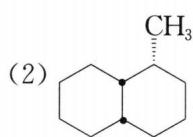
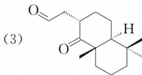
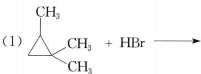
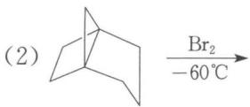
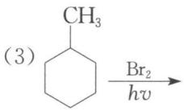
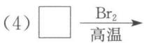
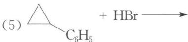
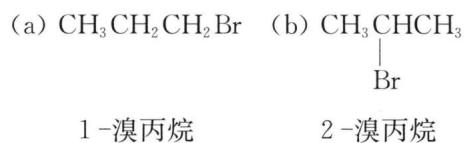
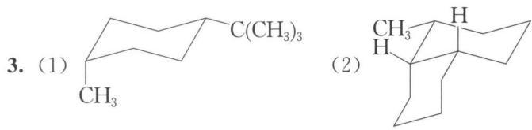
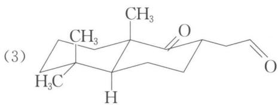

## 本讲习题

1. 试将下列烷烃按沸点降低的次序排列。

(1) 3,3-二甲基戊烷 (2) 庚烷 (3) 2-甲基庚烷 (4) 戊烷 (5) 2-甲基己烷

2. 烷烃中伯氢、仲氢、叔氢被溴化时的相对活性比为 1:82:1600, 计算丙烷被一溴化时, 各一溴产物的相对比及各产物的百分比。

3. 画出下列化合物稳定的构象式。

(1) 顺-1-甲基-4-叔丁基环己烷

chemical

Chemical structure of a fused bicyclic compound with methyl group at position 3

chemical

Chemical structure of a steroid derivative with acetyl and hydroxyl substituents, labeled as (3)

4. 烷烃的自由基卤化反应中,通常是卤素在光照或加热情况下,首先引发卤素自由基,四乙基铅被加热到 $150^{\circ}$ C 时也可以引发氯产生氯自由基。试写出烷烃与氯在四乙基铅作用下发生氯化的反应机理。

5. 完成下列反应式。

chemical

Chemical reaction equation showing cycloaddition of a methyl-substituted cyclohexane with HBr as reagent

chemical

Chemical reaction diagram showing bromination of a bridged bicyclic compound at -60°C

chemical

Chemical reaction equation showing cyclohexane with methyl group and bromine under hv conditions

chemical

Chemical reaction equation showing cyclopropane reacting with HBr to form a brominated alkene

6. 某烃含 C 89.94%, H 10.06%, 相对分子质量为 80。该烃分子中只含有一种化学环境相同的氢原子和两种化学环境相同的碳原子。试写出该烃的结构简式。

7. 正 n 烷的二氯取代物的同分异构体数目是多少(不考虑立体异构)?

---

## 答案

### 第1题

沸点降低次序：**(3)>(2)>(5)>(1)>(4)**

### 第2题

解析：丙烷为 $CH_{3}CH_{2}CH_{3}$ ，具有两种化学环境不同的氢，一溴化后分别得到：

chemical

Two chemical reaction equations showing bromination of 1-butadiene and bromoethane

相对比为 $a:b=(6\times1):(2\times82)=6:164=3:82$ 。

百分比为 $a=\frac{3}{82+3}\times100\%=3.5\%$ , $b=\frac{82}{82+3}\times100\%=96.5\%$ 。

### 第3题

chemical

Two organic molecular structures labeled (1) and (2), showing carbon backbone with methyl and hydrogen substituents

chemical

Chemical structure of a cyclic ester with methyl and hydrogen substituents, labeled as (3)

### 第4题

解析: 四乙基铅中由于 $\mathrm{C}-\mathrm{Pb}$ 键比较弱, 在 $150^{\circ} \mathrm{C}$ 时会发生均裂, 产生 $\mathrm{CH}_{3} \mathrm{CH}_{2} \cdot$ 自由基, 从而引发氯产生氯自由基, 使氯化反应能顺利进行。

$$
(\mathrm{C} _ {2} \mathrm{H} _ {5}) _ {4} \mathrm{Pb} \longrightarrow \cdot \dot {\mathrm{Pb}} \cdot + 4 \mathrm{CH} _ {3} \mathrm{CH} _ {2} \cdot
$$

$$
\mathrm{CH} _ {3} \mathrm{CH} _ {2} \cdot + \mathrm{Cl} _ {2} \longrightarrow \mathrm{CH} _ {3} \mathrm{CH} _ {2} \mathrm{Cl} + \mathrm{Cl} \cdot
$$

$$
\begin{array}{l} \mathrm{Cl} \cdot + \mathrm{RH} \longrightarrow \mathrm{R} \cdot + \mathrm{HCl} \\ \mathrm{R} \cdot + \mathrm{Cl} _ {2} \longrightarrow \mathrm{RCl} + \mathrm{Cl} \cdot \end{array} \text {链增长}
$$

### 第5题

(1) $\mathrm{CH}_3\mathrm{-C} \begin{array}{c}\mathrm{CH}_3 \\ | \\ \mathrm{Br} \end{array} \mathrm{-CH}-\mathrm{CH}_3$

(2) (提示：三元环、四元环张力同时被解除。）

(3) $\mathrm{CH}_3$ Br

(4) $\mathrm{Br}$

(5) $\mathrm{C_6H_5CHCH_2CH_3}$ Br

### 第6题

解析：该烃分子中碳原子数： $80 \times 89.94\% / 12.01 = 6$ ，氢原子数： $80 \times 10.06\% / 1.008 = 8$ ，即该烃分子式为 $C_{6}H_{8}$ 。由于只有一种化学环境相同的氢原子，只可能是4个 $CH_{2}$ 形成2个 $-CH_{2}CH_{2}-$ ，而且这两个1,2-亚乙基两端相连的基团相同。此时，去掉了8个化学环境相同的氢原子，同时也去掉了4个化学环境相同的碳原子。只剩下2个碳原子而且要化学环境相同，那只可能是这2个碳原子形成双键，且每个碳原子和一个1,2-亚乙基的两端相连，或每个碳原子和两个1,2-亚乙基的一端相连。因此，该烃可能是或。

### 第7题

n 为奇数： $(n+1)^{2}/4$ ; n 为偶数： $n(n+2)/4$ 。
