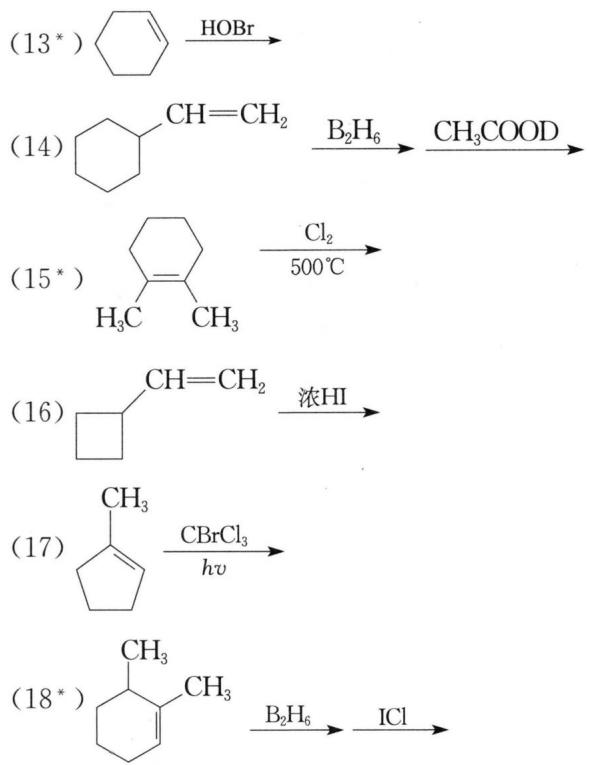
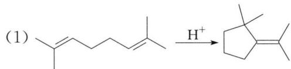
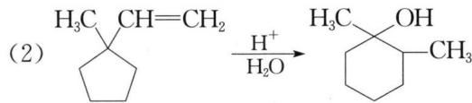
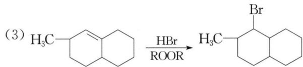
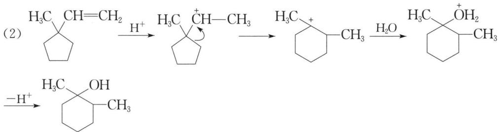
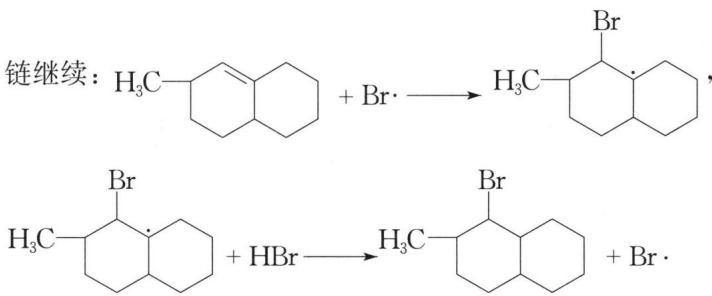
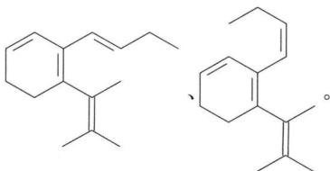

# 第四讲 烯烃 习题

## 题目

### 1. 完成下列反应式（有"*"标注的，写出反应产物的构型式）

(1) $\mathrm{BrCH = CH_2\xrightarrow{HBr}}$

(2) $\mathrm{CH_3OCH = CHCH_3\xrightarrow{HBr}}$

(3) $\ce{C6H5 -> CH3}$ HBr

(4) $(\mathrm{CH_3})_3\mathrm{CCH = CH_2\xrightarrow{HCl}}$

(5) $\mathrm{CH_2 = CHCOOCH = CH_2 \xrightarrow[CCl_4]{1molBr_2}}$

(6*) $\ce{C6H5CH3 ->[1) B2H6][2) H2O2, OH-}$

(7*) $\ce{H-C(=CH3)-C(H)=CH3}$ $\xrightarrow[2)\ce{H3O+}]{1)\ce{C6H5CO3H}}$

(8*) $\begin{array}{c}CH=CH_{2}\\\\|\\\\CH_{2}\\\\H-Cl\\\\CH_{2}CH_{3}\end{array}$ $\xrightarrow{HBr\atop ROOR}$

(9) $\ce{CH2} + Br2 \xrightarrow{hv}$

(10*) $\ce{C2H5-C(=CH3)-CH(OH)-CH3} \xrightarrow[2) NaHSO_3]{1) OsO_4}$

(11*) $\ce{H3C-\overset{\cdots}{\underset{\cdots}{\chemfig{*6((=CH2)=-=)}}H}=\text{CH}_2\xrightarrow[Pt]{\ce{H2}}}$

(12) $\ce{C6H5=CH2 ->[1) Hg(OOCCH3)_2, H_2O] NaBH_4}$

### 2. 写出下列反应的机理

### 3. 烯烃 $C_{6}H_{12}$ 具有旋光性，催化氢化后旋光性消失，试画出该烯烃的结构简式（以费歇尔投影式表示）

### 4. 某化合物 A，分子式为 $C_{6}H_{12}$，能使 $Br_{2}/CCl_{4}$ 溶液褪色，A 经热的酸性高锰酸钾溶液氧化得到 $C_{4}H_{9}COOH$，此酸可以拆分为一对对映异构体。试推测 A 的结构简式

### 5. 化合物 A 的分子式为 $C_{15}H_{22}$，1 mol A 催化氢化最多只能吸收 4 mol $H_{2}$，产物为 1-正丁基-2-(1,2-二甲丙基)环己烷，A 经臭氧氧化，然后再用 Zn、$H_{2}O$ 处理得 1 分子丙醛、1 分子丙酮、1 分子丙二醛酮和 1 分子己醛-4,5-二酮。试推测 A 可能的结构简式

### 6.（2003年全国初赛试题）某烯烃混合物的摩尔分数为十八碳-3,6,9-三烯9%，十八碳-3,6-二烯57%，十八碳-3-烯34%

（1）烯烃与过氧乙酸可发生环氧化反应，请以十八碳-3,6,9-三烯为例，写出化学反应方程式

(2) 若所有的双键均被环氧化，计算 1 摩尔该混合烯烃需要多少摩尔过氧乙酸

（3）若上述混合烯烃中只有部分不饱和键环氧化，请设计一个实验方案，用酸碱滴定法测定分离后产物的环氧化程度：简述实验方案；写出相关的反应方程式和计算环氧化程度(%)的通式

---

## 参考答案

### 1. 反应式答案

(1) $\mathrm{Br_2CHCH_3}$

(2) $CH_{3}OCHCH_{2}CH_{3}$ Br

(3) $\mathrm{C_6H_5}$ Br CH₃

(4) $\left(\mathrm{CH}_{3}\right)_{2}\mathrm{CCH}(\mathrm{CH}_{3})_{2}$ （提示：二级碳正离子重排成更稳定的三级碳正离子。）Cl

(5) $CH_{2}=CHCOOCH-CH_{2}$ Br Br

(6) $\text{CH}_3\text{CH}=\text{CH}-\text{CH}=\text{CH}-\text{OH}$ + （提示：顺式加成，产物符合反马氏规则。）

(7) $\mathrm{HOCH_3}$ + $\mathrm{HOCH_3}$

(8) $\mathrm{H}-\begin{array}{c}\mathrm{CH}_{2} \mathrm{CH}_{2} \mathrm{CH}_{2} \mathrm{Br} \\\\ \mid \\\\ \mathrm{Cl} \\\\ \mathrm{CH}_{2} \mathrm{CH}_{3}\end{array}$

(9) $\mathrm{CH_2Br} + \mathrm{CH_2Br}$ （提示：反应为自由基机理，$\alpha - H$ 被卤素取代，中间体为 $CH_{2}$ ⇌ $CH_{2}$

(10) $\begin{array}{c}\mathrm{CH_2CH_3}\\\\ \mathrm{H} - \mathrm{OH}\\\\ \mathrm{HO} - \mathrm{H}\\\\ \mathrm{H} - \mathrm{OH}\\\\ \mathrm{CH_3}\end{array} +\quad \begin{array}{c}\mathrm{CH_2CH_3}\\\\ \mathrm{HO} - \mathrm{H}\\\\ \mathrm{H} - \mathrm{OH}\\\\ \mathrm{H} - \mathrm{OH}\\\\ \mathrm{CH_3}\end{array}$

(11) $\text{CH}_3\text{CH}$ （提示：顺式加成，发生在位阻较小的面的一侧。）

(12)

(13) HO Br(±)

(14) $\text{C}_6\text{H}_{10}\text{CH}_2\text{CH}_2\text{D}$ （提示：$\text{C}_6\text{H}_{10}\text{CH}=\text{CH}_2 \xrightarrow[2\text{BH}_3]{\text{B}_2\text{H}_6} \left[ \text{C}_6\text{H}_{10}\text{CH}=\text{CH}_2 \right]^+$

$\text{CH}_2\text{CH}_2\text{BH}_2 \xrightarrow{\text{CH}_3\text{COD}} \left[ \text{CH}_2\text{CH}_2\text{B} \begin{array}{c} \text{H} \\\\ | \\\\ \text{H} \\\\ | \\\\ \text{O} \end{array} \right]^+$

$CH_{2}CH_{2}D + CH_{3}COBH_{2}$

(15) $\ce{H3C-\overset{\text{Cl}}{\underset{\text{CH}_3}{\text{C}}}-\text{CH}_3(\pm)-}\cdot\ce{\underset{\text{CH}_3}{\text{C}}-CH_3(\pm)}$

(16)

(17) $\mathrm{H_3C}$ Br CC $Cl_{3}$

(18)

### 2. 反应机理答案

(1) $\mathrm{CH=CH-CH_2CH=CH_2}\xrightarrow{\mathrm{H}^+}\mathrm{CH=CH-CH_2CH_2}\xrightarrow{\oplus}\mathrm{C_6H_{10}}\xrightarrow{-\mathrm{H}^+}\mathrm{C_6H_{10}}$

(3) 链引发: ROOR → 2RO ·, RO · + HBr → ROH + Br ·

### 3. 答案

H—CH₂CH₃ CH=CH₂
    |   CH₃CH₂—H CH=CH₂

### 4. 答案

$CH_{3}CH_{2}CH=CH_{2}$ $CH_{3}$

### 5. 答案

解析：化合物 A 的催化加氢产物为 1-正丁基-2-(1,2-二甲丙基)环己烷，则 A 的分子骨架为。结合 A 臭氧化分解反应的产物，可知 A 除了有 1 个环外，还有4个碳碳双键，且4个碳碳双键的位置应为____。2号位碳碳双键的构型有顺式、反式，所以化合物 A 可能的结构简式为：

### 6. 答案

解析：

（1）烯烃在过氧酸作用下生成环氧化物，以十八碳-3,6,9-三烯与过氧乙酸反应为例，化学方程式为：

$C_{2}H_{5}-CH=CH-CH_{2}-CH=CH-CH_{2}-CH=CH-C_{8}H_{17}+3CH_{3}COOOH\rightarrow C_{2}H_{5}-CH-CH-CH_{2}-CH-CH-CH_{2}-CH-CH-C_{8}H_{17}+$ $3CH_{3}COOH$

(2) 1 mol 十八碳三烯环氧化需 3 mol 过氧乙酸，1 mol 十八碳二烯环氧化需 2 mol 过氧乙酸，1 mol 十八烯环氧化需 1 mol 过氧乙酸。因此：1 mol 混合烯完全过氧化需过氧乙酸：$0.09 \times 3 + 0.57 \times 2 + 0.34 \times 1 = 1.75 \, mol$

（3）环氧化物在酸的作用下，开环生成反式邻二醇，1 mol 环氧结构需要消耗 1 mol HCl。

**实验方案**：用过量且定量的 $c_{1} \, mol \cdot L^{-1}$ 盐酸 $(V_{1} \, \text{mL})$ 与环氧化并经分离后的混合烯烃反应，反应完成后，用 $c_{2} \, mol \cdot L^{-1}$ 的氢氧化钠标准溶液滴定反应剩余的酸，记录滴定终点氢氧化钠溶液的体积 $(V_{2} \, \text{mL})$。

**相关方程式**：R—CH—CH—R' + HCl $\longrightarrow$ R—CH—CH—R'，NaOH + HCl $\longrightarrow$ NaCl + $\mathrm{H}_{2}\mathrm{O}$

**计算式**：该混合烯烃环氧化程度 $(\%) = [(c_{1}V_{1} - c_{2}V_{2})\times 10^{-3} / 1.75]\times 100\%$

若设 x, y, z 分别为某混合烯烃中三烯、二烯和单烯的摩尔分数，则计算通式为：环氧化程度（%）= $\left[(c_{1}V_{1}-c_{2}V_{2})\times10^{-3}/(3x+2y+z)\right]\times100\%$