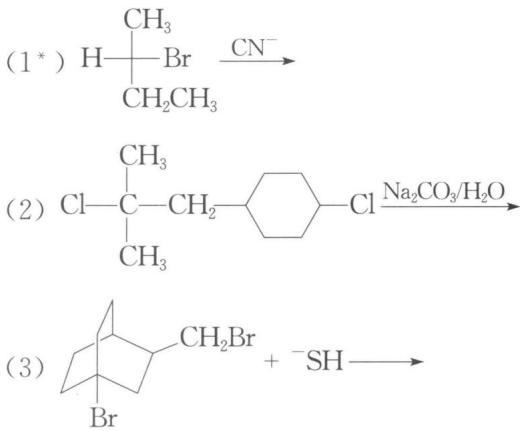
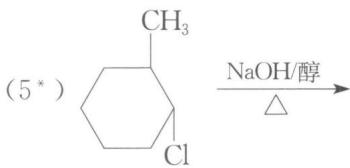
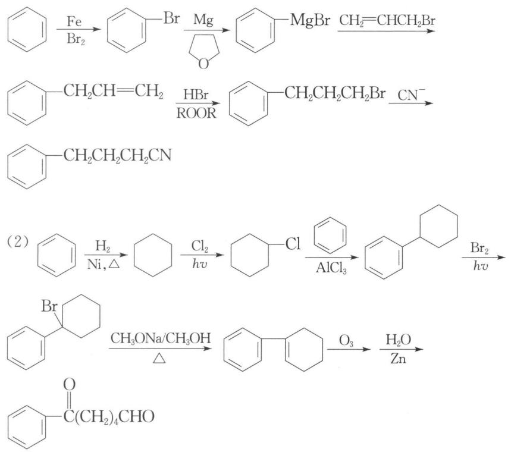

## 本讲习题

**1. 完成下列反应式(有"\*"标注的,写出反应产物的构型式)。**

(4) $CH_{3}CH=CHCH_{2}Cl \xrightarrow{Ag_{2}O} OH^{-}$

(6) Ph—CH₂—Ph $\xrightarrow[hv]{Cl_{2}足量}$ ( ) $\xrightarrow[\\mathrm{H_2O}]{\\mathrm{NaOH}}$ （ ） $\xrightarrow[\\mathrm{FeCl_3}]{\\mathrm{Cl}_2}$

( ) $\xrightarrow[\\triangle]{\\mathrm{NaNH_2}}$ ( )

(7) $\mathrm{ClCH_2}$ $\mathrm{Br} \xrightarrow{\mathrm{CN}^-}$

(8) $\mathrm{O}_2\mathrm{N}-\text{C}_6\mathrm{H}_3(\text{Cl})_2 \xrightarrow[\\mathrm{CH}_3\\mathrm{OH}]{\\mathrm{CH}_3\\mathrm{ONa}}$

(9) $\mathrm{CH}_2\mathrm{CH}_2\mathrm{NHCH}_3$ $\xrightarrow[\\mathrm{Et}_2\\mathrm{O}]{\\mathrm{PhLi}}$

$\mathrm{CH_{3}I}$

(10) $\ce{H-Br-D} \xrightarrow[\\Delta]{\\ce{NaOH/C2H5OH}}$

(11) $\mathrm{CH_3CH_2CHCH_3}\xrightarrow[\\triangle]{\\mathrm{(CH_3)_3COK / (CH_3)_3COH}}$

(12) $\mathrm{F}-\underset{\\text{苯环}}{\\ce{C6H4}}-\\overset{\\text{O}}{\\ce{CCH3}}+\\mathrm{NH(CH3)}_{2}\\rightarrow$

(13\*) $\ce{Br}$ $\xrightarrow[\\Delta]{\\text{KOH/C}_2\\text{H}_5\\text{OH}}$ ( ) $\xrightarrow[\\text{H}_2\\text{O}]{\\text{Cl}_2}$ ( )

**2. (1) 试以苯和丙烯为原料合成 $\ce{C6H5CH2CH2CN}$ ，其他无机试剂任选。**

**(2) 试以苯为原料合成 $\mathrm{C(OH)}_4\\mathrm{CHO}$ , 其他无机试剂任选。**

**3. 化合物 A, 分子式为 $C_{16}H_{16}Br_{2}$ , 无光学活性, 强碱处理后得 $\mathrm{B}(\mathrm{C}_{16}\mathrm{H}_{14})$ 。B 催化氢化时可先与 $2\\ mol\\ H_{2}$ 加成。B 发生臭氧化分解反应后得到两个产物, 一个是分子式为 $C_{7}H_{6}O$ 的醛 C, 另一个是乙二醛。试推测 A、B、C 的结构简式。**

**4. 化合物 A 的分子式为 $C_{6}H_{14}$ ，光照氯化时得到 3 种一氯代烷 B、C 和 D。B 和 C 在叔丁醇钾-叔丁醇溶液中生成同一烯烃 E，D 不能发生消除反应。写出 A、B、C、D 和 E 的结构简式。**

**5. (2007年全国初赛试题)甲苯与干燥氯气在光照下反应生成氯化苄,用下列方法分析粗产品的纯度: 称取 0.255 g 样品, 与 25 mL 4 mol·L $^{-1}$ 氢氧化钠水溶液在 100 mL 圆底烧瓶中混合, 加热回流 1 小时; 冷至室温, 加入 50 mL 20% 硝酸后, 用 25.00 mL 0.1000 mol·L $^{-1}$ 硝酸银水溶液处理, 再用 0.1000 mol·L $^{-1}$ NH $_{4}$ SCN 水溶液滴定剩余的硝酸银, 以硫酸铁铵为指示剂, 消耗了 6.75 mL。**

**(1) 写出分析过程的反应方程式。**
**(2) 计算样品中氯化苄的质量分数(%)。**
**（3）通常，上述测定结果高于样品中氯化苄的实际含量，指出原因。**
**(4) 上述分析方法是否适用于氯苯的纯度分析？请说明理由。**

---

## 参考答案

### 第七讲 卤代烃与有机金属化合物

**1.** (1) NC—H (提示: 强亲核试剂对仲卤代烷发生 $\mathrm{S}_{\mathrm{N}}2$ 反应, 手性碳构型翻转。)

(2) $\ce{H3C-C(=CH-)-Cl}$ (提示: 在弱碱性条件下, 主要发生叔卤代烷的消除反应, 产物符合扎伊采夫规则。)

(3) BrCH₂SH (提示: 伯卤代烷在较强亲核试剂的作用下发生 Sₙ2 反应, 而桥头的叔卤代烷因刚性结构及空间位阻,使其不能发生亲核取代反应。)

(4) $CH_{3}CH=CHCH_{2}OH$ 和 $CH_{3}CHCH=CH_{2}$ （提示： $S_{N}1$ 反应，中间体烯丙基碳正离子有共振结构： $CH_{3}CH=CH-CH_{2}\longleftrightarrow CH_{3}CHCH=CH_{2}$ ，得到两个醇。）

(5) $\ce{C6H5R}$ $CH_{3}$ (提示: E2 反应, 反式共平面消除, 反应物叔碳上的 H 与 Cl 是同侧的, 不利于消除。)

(6) $\mathrm{PhCCl_2Ph, Ph-C(=O)-Ph}$ , $\ce{C6H5CO-CH2-CH2Cl}$ , $\ce{C6H5CO-CH2-CH2NH2}$

(7) $\mathrm{NCCH}_2\text{—}\overline{\bigcirc}\text{—Br}$ (提示: 苄基氯的亲核取代反应活性高。)

(8) O₂N-Cl-OCH₃ (提示：硝基对位氯易被亲核取代。)

(9) $\mathrm{C}_{10}\mathrm{H}_{12}\mathrm{N}_{3}\mathrm{O}$ , $\mathrm{C}_{10}\mathrm{H}_{12}\mathrm{N}_{3}\mathrm{O}\mathrm{I}^{-}$ (提示：反应底物在强碱的作用下经由苯炔机理生成了分子内的取代产物,然后与 $CH_{3}I$ 作用生成季铵盐。)

(10) D （提示：该 $\beta-$ 消除反应是按同面顺式方式进行的。反应物中2-位和3-位的两个碳是重叠式构象关系。)

(11) $CH_{3}CH_{2}CH=CH_{2}$

(12) $\mathrm{CH}_3\mathrm{-C}(=\mathrm{O})\mathrm{-}\mathrm{C}_6\mathrm{H}_4\mathrm{-N(CH_3)_2}$

(13) 答案见图片。

**2.** (1) $\mathrm{CH}_2 = \mathrm{CHCH}_3 \xrightarrow[\text{高温}]{\mathrm{Br}_2} \mathrm{CH}_2 = \mathrm{CHCH}_2\mathrm{Br}$

**3.** B 的分子式为 $\mathrm{C}_{16} \mathrm{H}_{14}$ , 不饱和度为 10, 而催化氢化时可先与 $2 \mathrm{~mol} \mathrm{H}_{2}$ 加成, 说明含有两个碳碳双键, 则余下的不饱和度可能是两个苯环形成的。醛 C 的分子式为 $\mathrm{C}_{7} \mathrm{H}_{6} \mathrm{O}$ , 应是 $\mathrm{C}_{6} \mathrm{H}_{5} \mathrm{CHO}$ 。B 臭氧化分解反应得到 C 和乙二醛, 则不难确定 B 为 $\mathrm{C}_{6} \mathrm{H}_{5} \mathrm{CH}=\mathrm{CH}-\mathrm{CH}=\mathrm{CHC}_{6} \mathrm{H}_{5}$ 。A 分子消除 2 个 HBr 后得 B, 且无光学活性, 则 A 可能为 $\mathrm{C}_{6} \mathrm{H}_{5}-\mathrm{C}-\mathrm{CH}_{2} \mathrm{CH}_{2}-\mathrm{C}-\mathrm{C}_{6} \mathrm{H}_{5}$ 或 $\mathrm{C}_{6} \mathrm{H}_{5}-\mathrm{CH}_{2}-\mathrm{C}-\mathrm{C}-\mathrm{CH}_{2}-\mathrm{C}_{6} \mathrm{H}_{5}$ 。

**4.** A: $(\mathrm{CH}_3)_3\mathrm{CCH}_2\mathrm{CH}_3$ , B: $(\mathrm{CH}_3)_3\mathrm{CCHClCH}_3$ , C: $(\mathrm{CH}_3)_3\mathrm{CCH}_2\mathrm{CH}_2\mathrm{Cl}$ D: $(\mathrm{CH}_3)_2(\mathrm{CH}_2\mathrm{Cl})\mathrm{CCH}_2\mathrm{CH}_3$ , E: $(\mathrm{CH}_3)_3\mathrm{CCH} = \mathrm{CH}_2$

**5.**

(1) 氯化苄分析过程的反应方程式: $\mathrm{C}_{6} \mathrm{H}_{5} \mathrm{CH}_{2} \mathrm{Cl} + \mathrm{NaOH} \longrightarrow \mathrm{C}_{6} \mathrm{H}_{5} \mathrm{CH}_{2} \mathrm{OH} + \mathrm{NaCl}$, $\mathrm{NaOH} + \mathrm{HNO}_{3} = \mathrm{NaNO}_{3} + \mathrm{H}_{2} \mathrm{O}$, $\mathrm{AgNO}_{3} + \mathrm{NaCl} = \mathrm{AgCl} \downarrow + \mathrm{NaNO}_{3}$, $\mathrm{NH}_{4} \mathrm{SCN} + \mathrm{AgNO}_{3} = \mathrm{AgSCN} \downarrow + \mathrm{NH}_{4} \mathrm{NO}_{3}$, $\mathrm{Fe}^{3+} + \mathrm{SCN}^{-} = \mathrm{Fe(SCN)}^{2+}$ 。

(2) 样品中氯化苄的物质的量: $n(\text{氯化苄}) = n(\mathrm{Cl}^{-}) = n(\mathrm{Ag}^{+}) - n(\mathrm{SCN}^{-})$ 。所以, 样品中氯化苄的质量分数为: $M(\mathrm{C}_{6}\mathrm{H}_{5}\mathrm{CH}_{2}\mathrm{Cl}) \times [0.1000 \times (25.00 - 6.75)] / 255 = \{126.6 \times [0.1000 \times (25.00 - 6.75)] / 255\} \times 100\% = 91\%$ 。(注: $91\%$ 相当于三位有效数字)

(3) 测定结果偏高的原因是在甲苯与 $\mathrm{Cl}_{2}$ 反应生成氯化苄的过程中, 可能生成少量的多氯代物 $\mathrm{C}_{6} \mathrm{H}_{5} \mathrm{CHCl}_{2}$ 和 $\mathrm{C}_{6} \mathrm{H}_{5} \mathrm{CCl}_{3}$ , 反应物 $\mathrm{Cl}_{2}$ 及另一个产物 $\mathrm{HCl}$ 在氯化苄中也有一定的溶解, 这些杂质在与 $\mathrm{NaOH}$ 反应中均可以产生氯离子, 从而导致测定结果偏高。

(4) 不适用。氯苯中, 氯原子与苯环 $\mathrm{p} - \pi$ 共轭, 结合牢固, 难以被 $\mathrm{OH}^{-}$ 取代下来。因此, 氯苯与氢氧化钠需在高温高压下才能反应, 而且该反应进行得也不彻底。
