## 本讲习题

1. 完成下列反应式(有"\*"标注的,写出反应产物的构型式)。

(1) $(\mathrm{CH}_3\mathrm{CH}_2)_3\stackrel {+}{\mathrm{NCH}}_2\mathrm{CH}_2\mathrm{COCH}_3\mathrm{OH}^- \xrightarrow{\triangle}$

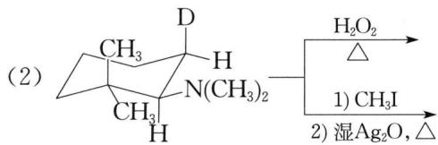

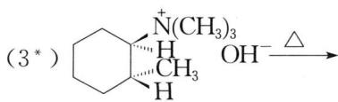

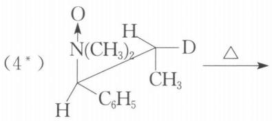

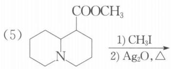

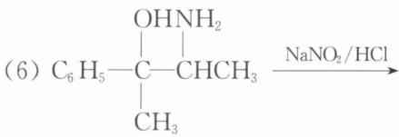

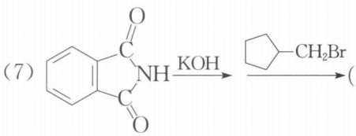

$$
\mathrm{Ph}\overset{\mathrm{C}_2\mathrm{H}_5}{\underset{\mathrm{H}}{\mathrm{C}}}-\mathrm{COOH}\xrightarrow[\mathrm{2})\mathrm{CH}_2\mathrm{N}_2]{1)\mathrm{SOCl}_2}(\tag{8*}
$$

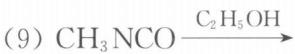

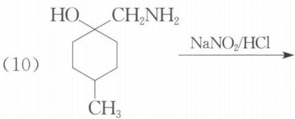

$$
\mathrm{NH} + \mathrm{Br}(\mathrm{CH}_2)_4\mathrm{Br} \tag{11}
$$

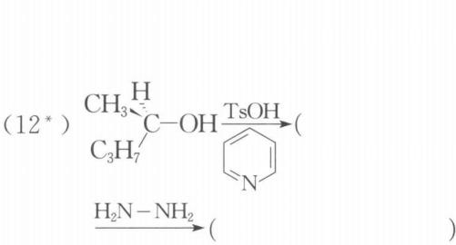

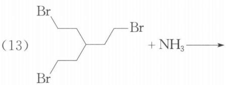

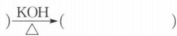

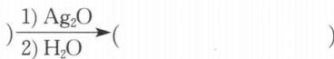

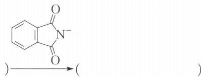

(14\*) $C_{2}H_{5}\overset{H}{\underset{n-C_{4}H_{9}}{\ce{C}}}-\overset{O}{\ce{C}}-NH_{2} \xrightarrow[\text{NaOH}]{Br_{2}}$

(15) $\mathrm{C}_6\mathrm{H}_3(\mathrm{OH})_2 + \mathrm{CH}_3\mathrm{I} \xrightarrow{\mathrm{NaOH}}$

$\text{OH}^{-}\xrightarrow{\text{(C}_2\text{H}_5\text{)}_2\text{SO}_4}$

(16) $\mathrm{CH}_3\text{-}\xrightarrow[\mathrm{OH}^-]{\mathrm{Cl}^*\mathrm{CH}_2\mathrm{CH}=\mathrm{CH}_2}$

) $\xrightarrow{200^{\circ}\mathrm{C}}$ ( )

$\frac{\mathrm{ClCH_{2}CH=CHCH_{3}}}{\mathrm{OH^{-}}}$

$200^{\circ}C$

(17) $N_{2}^{+}$ COO $^{-}$ $\xrightarrow{\triangle}$

) $\xrightarrow{\text{O}}$ ( ) $\xrightarrow{\mathrm{H}^{+}}$

( ) $\xrightarrow{-\mathrm{H}^{+}}$ (

)

(18) $\ce{C6H5-COOH}$ $\ce{H2N-C6H5}$ $\xrightarrow[\text{2)}\text{Cu/}\triangle]{\text{1)}\ce{HNO2}}$

(19) $\mathrm{C}_6\mathrm{H}_5\mathrm{NH}_2\xrightarrow[\mathrm{H_2O}]{\mathrm{Br}_2}$

$\frac{NaNO_{2}}{HCl}\xrightarrow{H_{3}PO_{2}}($

(20) $\mathrm{C6H5OH}\xrightarrow{\mathrm{Ag_2O}}$

(21) $\mathrm{H_2SO_4}$ $160^{\circ}\mathrm{C}$

$\frac{NaOH}{280^{\circ}C}\xrightarrow{H_{3}O^{+}}($

$\frac{NH_{3},NH_{4}HSO_{3}}{加热加压}$ ( )

(22) $\ce{C6H5CH2OH} \xrightarrow{PBr3}$

$\text{OH}^{-} \rightarrow (\text{NBS}) \rightarrow$

( )

(23) $\mathrm{CH}_3\text{-}\underset{\text{O}}{\overset{\text{O}}{\ce{C6H4}}} - \mathrm{OCC}_2\mathrm{H}_5 \xrightarrow[\Delta]{\mathrm{AlCl}_3}$

(24) $\ce{CH3-\underset{\vert}{\overset{\vert}{\ce{C6H5}}}-OH+CHCl3+NaOH\xrightarrow{\triangle} }$

(25) $\ce{C6H5OH + ClCCl ->[NaOH] O}$

(26) $\ce{CH3-\underset{\text{OH}}{\underset{|}{\ce{C6H4}}}-CH(CH3)_2 + NaNO2 -> HCl}$

(27) $\mathrm{C}_6\mathrm{H}_4\mathrm{OH}$ $\xrightarrow[2)\mathrm{H}_3\mathrm{O}^+]{1)\mathrm{K}_2\mathrm{S}_2\mathrm{O}_8}$

(28) $\ce{C6H5OH ->[\ce{(CH3O)2SO2}][NaOH]}$

$\text{)} \xrightarrow{n-C_{4}H_{9}Li} \text{ (}$

) $\xrightarrow{\mathrm{D}_2\mathrm{O}}$

( ) $\xrightarrow{DBr}$ ( ) $D_{2}O, \triangle$

2.（1）试以环戊酮为原料合成环己酮，其他无机试剂任选。

(2) 试以 $\mathrm{H}_{5} \mathrm{C}_{2} \stackrel{\mathrm{H}}{\underset{\mathrm{Ph}}{\rightleftharpoons}} \mathrm{C}-\mathrm{C}=\mathrm{O}$ 和含一个碳的有机物为原料合成 $\mathrm{H}_{5} \mathrm{C}_{2} \stackrel{\mathrm{H}}{\underset{\mathrm{Ph}}{\rightleftharpoons}} \mathrm{C}-\mathrm{CH}_{2} \mathrm{COOCH}_{3}$ , 其他无机试剂任选。

（3）试以2-氯丁烷、环氧乙烷、萘为原料合成 $CH_{3}CH_{2}CHCH_{2}CH_{2}NH_{2}$ ，其他无机试剂任选。

（4）（2006年全国初赛试题）试以氯苯为起始原料，用最佳方法合成1-溴-3-氯苯（限用具有高产率的各反应）。

（5）试以甲苯为原料合成，其他无机试剂任选。

3. 比较下列两组酚类化合物的酸性大小。

(1) $p - \mathrm{O}_2\mathrm{NC}_6\mathrm{H}_4\mathrm{OH}, m - \mathrm{O}_2\mathrm{NC}_6\mathrm{H}_4\mathrm{OH}, \mathrm{C}_6\mathrm{H}_5\mathrm{OH}$

(2) $p - \mathrm{ClC}_{6}\mathrm{H}_{4}\mathrm{OH}, m - \mathrm{ClC}_{6}\mathrm{H}_{4}\mathrm{OH}, \mathrm{C}_{6}\mathrm{H}_{5}\mathrm{OH}$

4. 下列化合物中碱性最强的是\_\_\_\_。

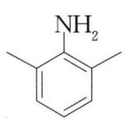
A

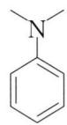
B

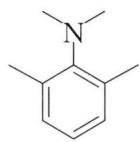
C

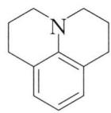
D

5. 奴弗卡因(Novocaine)是一种局部麻醉剂, 它的分子式为 $\mathrm{C}_{13} \mathrm{H}_{20} \mathrm{~N}_{2} \mathrm{O}_{2}$ 。它不溶于水和稀碱, 但溶于稀酸中。用 $\mathrm{NaNO}_{2} / \mathrm{HCl}$ 处理后与 $\beta$ -萘酚作用得到红色固体。当奴弗卡因与稀碱溶液煮沸时可缓慢溶解。这个碱溶液用乙醚萃取, 分出醚层, 水层酸化得到白色沉淀 A, 若继续加酸则可使 A 溶解。分出 A, 测得其分子式为 $\mathrm{C}_{7} \mathrm{H}_{7} \mathrm{NO}_{2}$ , 并发现 A 可通过对硝基甲苯合成。醚层蒸出乙醚得到一个液体 B, B 的分子式为 $\mathrm{C}_{6} \mathrm{H}_{15} \mathrm{NO}$ 。B 可使石蕊试纸变蓝, 用醋酐处理 B 得到 $\mathrm{C}(\mathrm{C}_{8} \mathrm{H}_{17} \mathrm{NO}_{2})$ 。C 不溶于水和稀碱但溶于稀酸中。B 可由二乙胺和环氧乙烷作用制备。试推测 A、B、C 和奴弗卡因的结构简式。

6. 某碱性化合物 A $\left(\mathrm{C}_{7}\mathrm{H}_{9}\mathrm{NO}\right)$ ，与 $\mathrm{NaNO}_{2}/\mathrm{HCl}$ 0℃时反应得到盐 B $\left(\mathrm{C}_{7}\mathrm{H}_{7}\mathrm{ClN}_{2}\mathrm{O}\right)$ ，B 在水溶液中加热得 C $\left(\mathrm{C}_{7}\mathrm{H}_{8}\mathrm{O}_{2}\right)$ ，C 与浓 HBr 反应得 D $\left(\mathrm{C}_{6}\mathrm{H}_{6}\mathrm{O}_{2}\right)$ ，D 在苯溶液中用 PbO₂ 氧化得到红色产物 E $\left(\mathrm{C}_{6}\mathrm{H}_{4}\mathrm{O}_{2}\right)$ ，E 与邻苯二胺反应很快得到 F $\left(\mathrm{C}_{12}\mathrm{H}_{8}\mathrm{N}_{2}\right)$ 。试推测 A、B、C、D、E 和 F 的结构简式。

7. 根据下列转化关系, 推测 A、B、C、D、E、F 和 G 的结构简式:

$$
\mathrm{H} _ {3} \mathrm{C} \xrightarrow [ \mathrm{O} ]{\mathrm{N}} \xrightarrow {\mathrm{LiAlH} _ {4}} \mathrm{A} \xrightarrow [ \triangle ]{\mathrm{H} ^ {+}} \mathrm{B} \xrightarrow [ \text {过量} ]{\mathrm{CH} _ {3} \mathrm{I}} \mathrm{C} \xrightarrow [ 2) \triangle ]{1) \mathrm{AgOH}} \mathrm{D} \xrightarrow [ 2) \triangle ]{\mathrm{CH} _ {3} \mathrm{I}} \xrightarrow [ 2) \triangle ]{1) \mathrm{AgOH}} \mathrm{E}
$$

$$
\xrightarrow {\mathrm{Br} _ {2}} \mathrm{F} \xrightarrow [ 2) \mathrm{CH} _ {3} \mathrm{I} ]{1) \mathrm{HN} (\mathrm{CH} _ {3}) _ {2} (\text {过量})} \mathrm{G} \xrightarrow [ 2) \triangle ]{1) \mathrm{AgOH}}
$$

8. (1992年全国初赛试题)局部麻醉剂普鲁卡因的结构式如下式所示(代号: B)

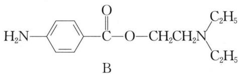

已知普鲁卡因的正离子(代号： $BH^{+}$ )的电离常数 $K_{a}=1\times10^{-9}$ 。

(1) 普鲁卡因作为局部麻醉剂的麻醉作用是由于它的分子能够透过神经鞘的膜,但它的正离子 $\mathrm{BH}^{+}$ 基本上不能透过神经鞘膜。试计算在 $\mathrm{pH}$ 为7时,盐酸普鲁卡因溶液里的B和 $\mathrm{BH}^{+}$ 的浓度比,并用来说明它的麻醉作用的药效跟用药量相比是高还是低。

(2) 已知如果把普鲁卡因分子里的叔氨基改成仲氨基(C), 伯氨基(D), 改造后的麻醉剂 C 和 D 的碱性顺序是 C > B > D, 问它们通过神经鞘膜的趋势是增大还是减小, 为什么?

---

## 答案

### 第1题

(1) $\mathrm{CH}_3\mathrm{COCH} = \mathrm{CH}_2 + (\mathrm{CH}_3\mathrm{CH}_2)_3\mathrm{N}$ (提示: 霍夫曼消除时, 酸性较强的 $\beta - \mathrm{H}$ 更易离去。)

(2) 提示: 氧化叔胺在加热条件发生科普消除, 顺式消除;季铵碱在加热时发生霍夫曼消除,反式消除。

(3) $\ce{C6H5CH3}$ (提示：反式消除。)

(4) $\ce{C6H5\overset{H}{\underset{\vert}{C}}=C\overset{CH3}{\underset{\vert}{D}}}$ （提示：稳定构象上的顺式消除）

(5) COOCH₃, CH₃

(6) $\mathrm{CH}_3\mathrm{COCHPh}$

(7) $\mathrm{C}_{10}\mathrm{H}_{12}\mathrm{N}-\mathrm{CH}_{2}-\mathrm{C}_{10}\mathrm{H}_{12}-\mathrm{CH}_{2}\mathrm{NH}_{2}$

(8) $\mathrm{Ph} \stackrel{\mathrm{C}_{2} \mathrm{H}_{5}}{\underset{\mathrm{H}}{\rightleftharpoons}} \mathrm{COCHN}_{2}, \quad \mathrm{Ph} \stackrel{\mathrm{C}_{2} \mathrm{H}_{5}}{\underset{\mathrm{H}}{\rightleftharpoons}} \mathrm{CH}_{2} \mathrm{COOH}$

(9) $CH_{3}NHCOOCH_{2}CH_{3}$

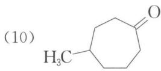

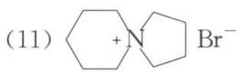

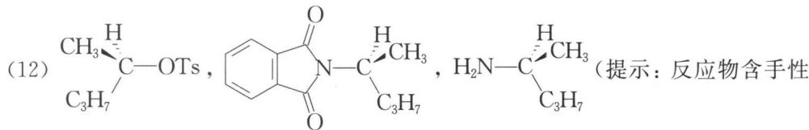

碳,反应时要注意手性碳构型是否发生变化。第一步反应,对甲苯磺酰氯醇解时不对称碳的构型保持。第二步反应,是 $S_{N}2$ 反应,不对称碳的构型翻转。第三步反应,不对称碳的构型保持。

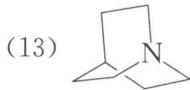

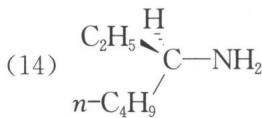

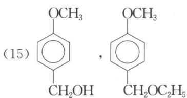

(提示: 在碱性条件下首先是酚羟基以氧负离子的形态与 $CH_{3}I$ 按 $S_{N}2$ 机理生成醚，然后是较活泼的苄羟基与硫酸乙酯反应生成乙基醚。)

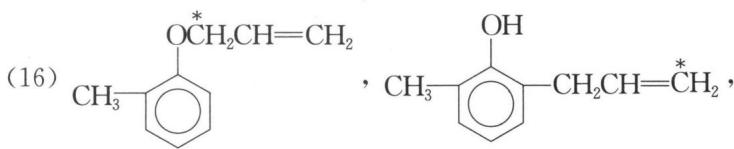

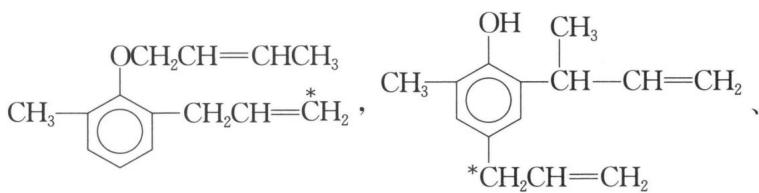

CH₃—C₆H₄(OH)—CH₂—CH=CH₂

CH₂CH=CHCH₃

(提示: 在最后一步的克莱森重排中,有两个产物生成,它们是由同一个中间体分别迁移不同的烯丙基到对位得到的。)

(17) $\ce{C6H5, C6H5OH, C6H5OH}^+$ , $\ce{C6H5OH}$

(19) Br— $\ce{C6H4BrNH2}$ , Br— $\ce{C6H4BrBr}$

(21) $\text{C}_{10}\text{H}_{13}\text{SO}_{3}\text{H}, \text{C}_{10}\text{H}_{14}\text{OH}, \text{C}_{10}\text{H}_{15}\text{NH}_{2}$

(22) $\ce{C6H5CH2BrOH}$ , $\ce{C10H10O}$ , $\ce{C10BrO}$

(23) $\mathrm{CH}_3\text{-}\underset{\mathrm{O}=\mathrm{C}}{\underset{|}{\mathrm{C}}}-\mathrm{OH}$

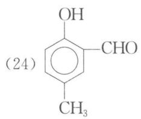

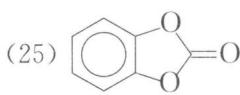

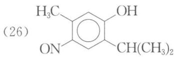

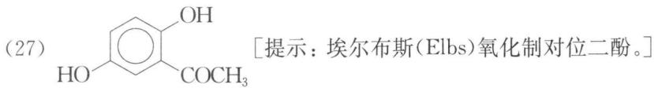

[提示: 埃尔布斯(Elbs)氧化制对位二酚。]

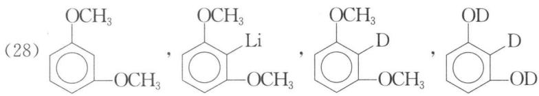

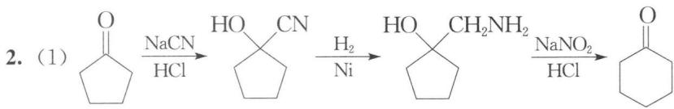

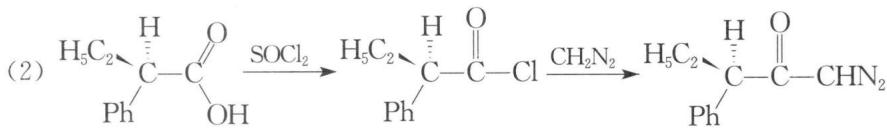

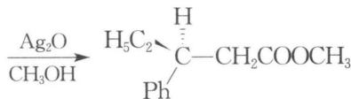

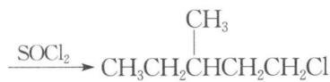

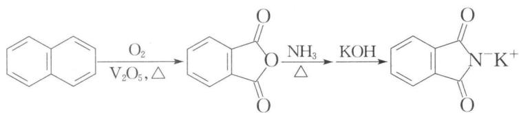

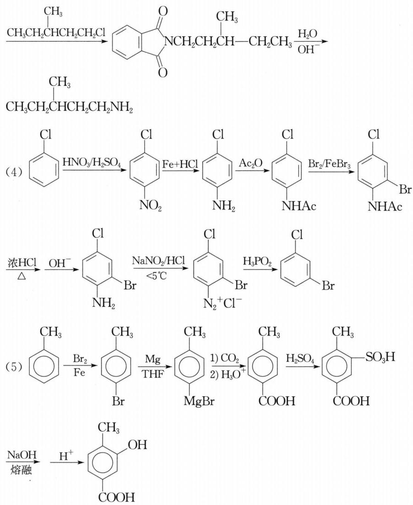

### 第2题

(1) 以环戊酮为原料合成环己酮（合成路线略，涉及环扩大的反应）

(2) 以 $\mathrm{H}_{5} \mathrm{C}_{2} \stackrel{\mathrm{H}}{\underset{\mathrm{Ph}}{\rightleftharpoons}} \mathrm{C}-\mathrm{C}=\mathrm{O}$ 为原料合成目标产物

（3）以2-氯丁烷、环氧乙烷、萘为原料合成 $CH_{3}CH_{2}CHCH_{2}CH_{2}NH_{2}$

（4）以氯苯为起始原料合成1-溴-3-氯苯

（5）以甲苯为原料合成目标产物

### 第3题

**(1)** $p - \mathrm{O}_{2} \mathrm{NC}_{6} \mathrm{H}_{4} \mathrm{OH} > m - \mathrm{O}_{2} \mathrm{NC}_{6} \mathrm{H}_{4} \mathrm{OH} > \mathrm{C}_{6} \mathrm{H}_{5} \mathrm{OH}$ 。硝基是吸电子基团, 有利于酚氧负离子上负电荷的分散, 使酚的酸性增强。而且硝基处于酚羟基邻、对位时比间位吸电子效应更显著。

**(2)** $m - \mathrm{ClC}_{6} \mathrm{H}_{4} \mathrm{OH} > p - \mathrm{ClC}_{6} \mathrm{H}_{4} \mathrm{OH} > \mathrm{C}_{6} \mathrm{H}_{5} \mathrm{OH}$ 。氯原子有给电子共轭效应和吸电子诱导效应，但共轭效应小于诱导效应，故氯原子从整体上看是吸电子的。氯原子处于对位时给电子共轭效应强于间位，但吸电子诱导效应弱于间位，故氯原子处于间位时比对位更有利于酚氧负离子上负电荷的分散，相应酚的酸性更强。

### 第4题

**C**

### 第5题

解析: A 的分子式为 $\mathrm{C}_{7} \mathrm{H}_{7} \mathrm{NO}_{2}$ , 且可由对硝基甲苯合成, 不难确定 A 为对氨基苯甲酸。B 的分子式为 $C_{6}H_{15}NO$ ，且可由二乙胺和环氧乙烷制备，则 B 为 $\mathrm{HOCH}_{2}\mathrm{CH}_{2}\mathrm{N}(\mathrm{C}_{2}\mathrm{H}_{5})_{2}$ 。B 与醋酐反应生成 C，C 不溶于水和稀碱液，但溶于稀酸中，说明反应生成了酯，而胺的结构得以保留。所以，C 为 $\mathrm{CH}_{3}\mathrm{COOCH}_{2}\mathrm{CH}_{2}\mathrm{N}(\mathrm{C}_{2}\mathrm{H}_{5})_{2}$ 。奴弗卡因与稀碱液共热后酸化得 A 和 B，这应是酯的水解反应，故奴弗卡因的结构简式为 $H_{2}N-\text{C}_6\text{H}_4-\text{OOC}-\text{CH}_2\text{CH}_2\text{N}(\text{C}_2\text{H}_5)_2$ ，符合题意。

**A: 对氨基苯甲酸** $H_{2}N-C_6H_4-COOH$

**B: N,N-二乙基乙醇胺** $HOCH_2CH_2N(C_2H_5)_2$

**C: N,N-二乙基乙酸乙酯胺** $CH_3COOCH_2CH_2N(C_2H_5)_2$

**奴弗卡因: 对氨基苯甲酸二乙氨基乙酯** $H_2N-C_6H_4-COOCH_2CH_2N(C_2H_5)_2$

### 第6题

A: $\ce{C6H5NH2OCH3}$ (邻甲氧基苯胺/藜芦胺), B: $\ce{C6H5N2+Cl-}$ (重氮盐), C: $\ce{C6H5OH}$ (愈创木酚), D: $\ce{C6H5OH}$ (邻苯二酚), E: $\ce{C6H5O}$ (邻苯醌), F: $\ce{C12H12N2}$ (吩嗪)

### 第7题

A: $\ce{CH3CH(OH)CH3}$, B: $\ce{CH3CH=CH2}$, C: $\ce{CH3CHICH3}$, D: $\ce{CH3CH(N(CH3)2)CH3}$, E: $\ce{CH3CH=CH2}$ (Hofmann消除产物)

F: $\ce{CH2=CHCH2Br}$, G: $\ce{CH2=CHCH2N(CH3)3+I-}$

### 第8题

**(1)** $K_{a} = \frac{[B][H^{+}]}{[BH^{+}]}$ , 则 $\frac{[B]}{[BH^{+}]} = \frac{K_{a}}{[H^{+}]} = \frac{1 \times 10^{-9}}{1 \times 10^{-7}} = \frac{1}{100}$ , 显然药效与用药量相比较低。

**(2)** 药效的顺序为 D>B>C, 因为碱性越强, 其共轭酸越难电离, 中性分子对正离子的浓度比越小, 药效越低。
