## 本讲习题

### 1. 完成下列反应式

(1)~(6) 见下图：

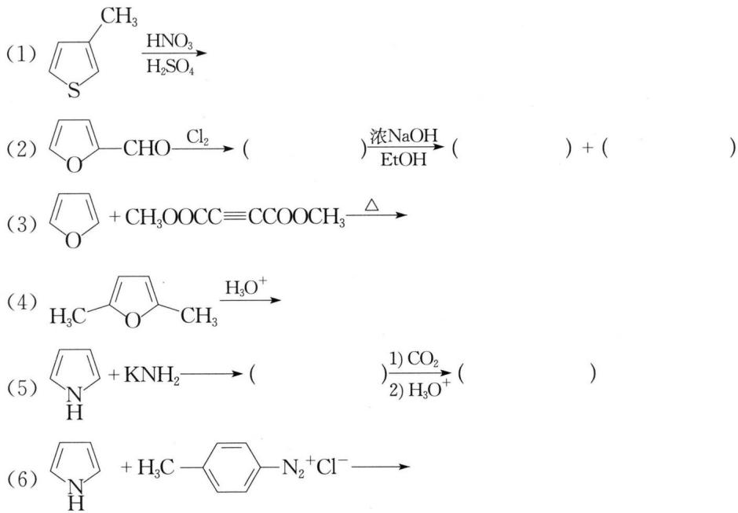

(7) $\mathrm{CH}_3\mathrm{N}\mathrm{CH}_3 + \mathrm{PhCHO} \xrightarrow{\mathrm{ZnCl}_2}$

(8) $\ce{C6H5N2CH3} \xrightarrow[\ce{H2SO4}]{\ce{HNO3}}$

(9) $\mathrm{N}-\mathrm{CH}=\mathrm{CH}_{2}+\mathrm{CH}_{2}(\mathrm{COOEt})_{2}\xrightarrow{\mathrm{EtONa}}$

(10) $\mathrm{C}_{10}\mathrm{H}_{8}\mathrm{N} \xrightarrow[\triangle]{\mathrm{KMnO}_{4}/\mathrm{H}^{+}} (\quad) \xrightarrow{\triangle} (\quad)$

(11) $\ce{C6H5Cl-CH2CH2NHCH3 ->[C6H5Li][乙醚]}$

(12) $\mathrm{N} \xrightarrow{\mathrm{H}_2\mathrm{O}_2} (\quad) \frac{\mathrm{HNO}_3}{\mathrm{H}_2\mathrm{SO}_4} (\quad) \xrightarrow{\mathrm{PCl}_3} (\quad)$

(13) $\ce{CH3-C6H2-CH3-N(CH3)2} \xrightarrow[\text{100°C}]{\text{PhCHO, ZnCl}_2}$

(14) $\ce{C6H5N(H)-CH2 ->[CHCl3][KOH]}$

(15) $\ce{Cl-C6H4-Cl ->[\text{EtONa}][\text{EtOH}] Cl}$

(16) $\mathrm{CHO} \xrightarrow[\mathrm{CH_3CH_2COONa,}\triangle]{\mathrm{(CH_3CH_2CO)_2O}}$

(17) $\mathrm{C}_{10}\mathrm{H}_{12}\mathrm{N}-\mathrm{CH}_{3} + \mathrm{O}-\mathrm{CHO} \xrightarrow[\Delta]{\mathrm{NaNH}_{2}}$

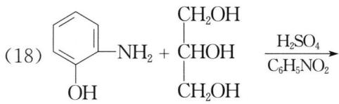

## 参考答案:
>
> (1) $\ce{C6H5CH3}$ $\ce{C6H5NO2}$（提示：甲基为邻、对位定位基，故2-取代产物为主产物。）
>
> (2) $\mathrm{Cl}-\text{ } O-\text{CHO}, \mathrm{Cl}-\text{ } O-\text{CH}_2\text{OH}$ 和 $\mathrm{Cl}-\text{ } O-\text{COONa}$（提示：对于呋喃而言，无论 $\alpha-$ 位是何种类型定位基，后续基团均进入另一 $\alpha-$ 位。第二步反应是无 $\alpha-H$ 的醛在浓碱液中发生康尼扎罗反应。）
>
> (3) COOCH₃（提示：狄尔斯-阿尔德反应。）
>
> (4) $\mathrm{CH}_3\mathrm{C}-\mathrm{CH}_2\mathrm{CH}_2\mathrm{C}-\mathrm{CH}_3$（提示：呋喃遇酸不稳定，易水解成二烯醇再互变异构为较稳定的二酮。）
>
> (5) $\ce{C6H5N, C6H5N-COOH}$（提示：吡咯与强碱成盐，再发生科尔伯-施密特反应。）
>
> (6) $\ce{C10H5N2N=N-C6H4-CH3}$
>
> (7) CH=CHPh（提示：吡啶4-位上的甲基氢酸性较强。）
>
> (8) $\mathrm{O}_2\mathrm{N}-\underset{\mathrm{CH}_3}{\underset{|}{\mathrm{C}}} - \mathrm{N}$（提示：咪唑5-位上电子云密度较大。）
>
> (9) $\ce{C6H5N-CH2CH2CH(COOEt)2}$（提示：共轭加成。）
>
> (10) $\mathrm{COOH}$（提示：苯环更易被氧化。2,3-吡啶二羧酸中，由于氮原子的吸电子作用，吡啶环中 2-位碳原子上的电子云密度降低得更多，使得 2-位羧基更容易离去。）
>
> (11)（提示：先生成苯炔，然后加成。）
>
> (12) $NO_{2}$
>
> (13)
>
> 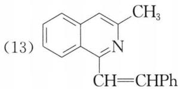
>
> 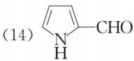
>
> (14)
>
> 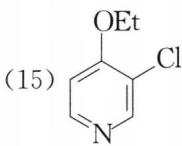
>
> 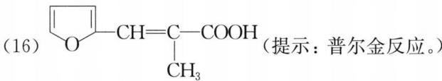
>
> （提示：普尔金反应。）
>
> (15)
>
> 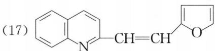
>
> (16)
>
> 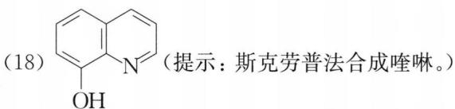
>
> 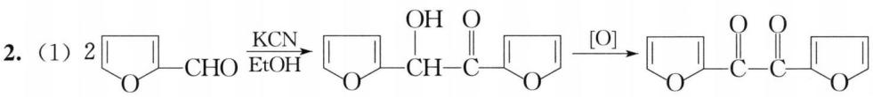
>
> 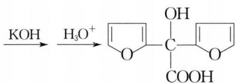
>
> (17)
>
> 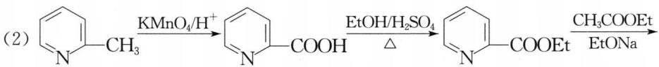
>
> 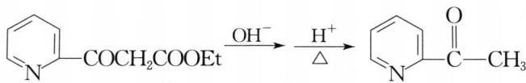

---

### 2. 合成题

(1) 试以 $\ce{C6H5CHO}$ 为原料合成 $\ce{C6H5OH}$，其他无机试剂任选。

(2) 试以 2-甲基吡啶和不超过四个碳的有机物为原料合成 $\mathrm{C}_{10}\mathrm{H}_{10}\mathrm{N}$，其他无机试剂任选。

---

### 3. 2,4,6-三氯均三嗪

2,4,6-三氯均三嗪可由氯化氰单体三聚而来。

(1) 2,4,6-三氯均三嗪和水反应生成 $\mathrm{A}(\mathrm{C}_{3}\mathrm{H}_{3}\mathrm{O}_{3}\mathrm{N}_{3})$，写出 A 及其单体 B 的结构简式并命名。

(2) A 是有羟基的，一经生成马上转变为它的较稳定的同分异构体 C，写出 C 及其单体 D 的结构简式并命名。

(3) C 和氢氧化钠反应生成三钠盐，此三钠盐和氯气反应得到 $\mathrm{E}(\mathrm{C}_{3}\mathrm{O}_{3}\mathrm{N}_{3}\mathrm{Cl}_{3})$，写出 E 及其单体 F 的结构简式并命名。

(4) E 是一种净水消毒剂，它和水反应放出次氯酸，写出反应方程式。

(5) C 可以由尿素三聚而成，试写出反应方程式。

## 参考答案:
>
> 分析：Cl—C≡N 三聚反应与乙炔三聚成苯相似，故 2,4,6-三氯均三嗪的结构简式为：
>
> 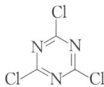
>
> 2,4,6-三氯均三嗪水解时氯原子转化为羟基，则 2,4,6-均三嗪三酚为：
>
> 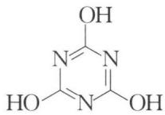
>
> 该烯醇式结构可通过互变异构转化为较稳定的酮式结构 C：
>
> 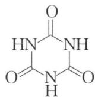
>
> 由于 C 中亚氨基旁边的两个羰基有吸电子作用，使得氮上的氢有弱酸性，可与氢氧化钠反应生成三钠盐。该三钠盐再与 $\mathrm{Cl}_{2}$ 反应得 E：
>
> 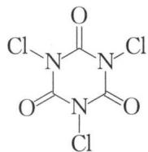
>
> E 的水解与 $\mathrm{NCl}_{3}$ 水解相似，会产生 HClO。
>
> **答案：**
>
> (1) A: 2,4,6-均三嗪三酚，$\ce{HO-C(=N)-N}$；B: 氰酸，HOCN。
>
> (2) C: 2,4,6-均三嗪三酮，$HN\overset{O}{\underset{||}{C}}NH$；D: 异氰酸，H—N=C=O。
>
> (3) E: 1,3,5-三氯-2,4,6-均三嗪三酮，$Cl-N=Cl$；F: 异氰酰氯，Cl-N=C=O。
>
> 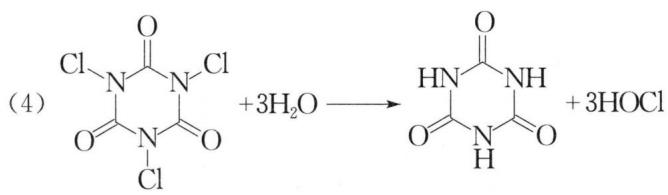
>
> 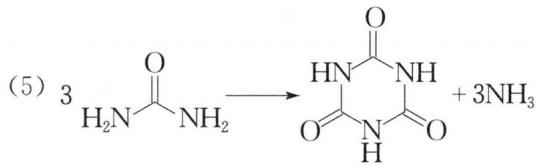

---

### 4. 氧化吡啶与溴乙烷反应

氧化吡啶和溴乙烷起反应得到 A，A 和等摩尔氢氧化钠反应得到有机化合物 B、C（含有吡啶环）和 2 个无机化合物 D、E。试推测 A、B 和 C 的结构简式以及 D、E 的化学式，并指出这两步反应的反应类型。

## 参考答案:
>
> 氧化吡啶中的氧负离子对溴乙烷亲核取代生成 A，然后 $\mathrm{OH}^{-}$ 进攻氧原子所在碳上的氢，反应过程如下所示：
>
> 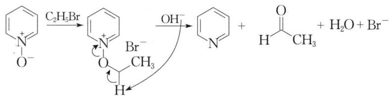
>
> 因此，A为 $\mathrm{N}^{+} \mathrm{Br}^{-}$，B为 $\mathrm{CH}_3\mathrm{CHO}$，C为 $\mathrm{N}^{+}$，D、E为 $\mathrm{NaBr}$ 和 $\mathrm{H}_2\mathrm{O}$。第一步是 $\mathrm{S}_{N}2$ 亲核取代反应，第二步是 E2 消除反应。

---

### 5. 结构推测

在下面的反应中，E 和 F 为互变异构体。A、B、C、D 均为带负电荷的中间体。画出 A、B、C、D、E 和 F 的结构简式。

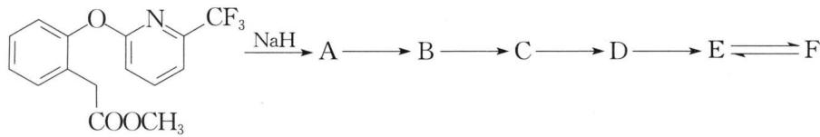

## 参考答案:
>
> 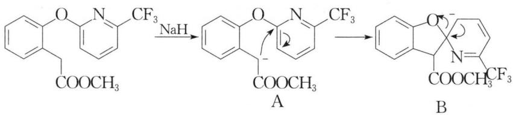
>
> 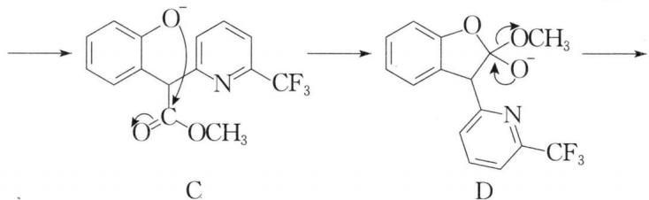
>
> 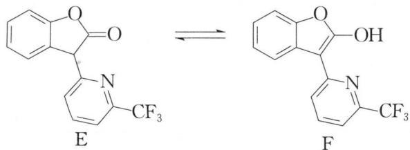
