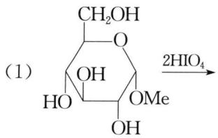
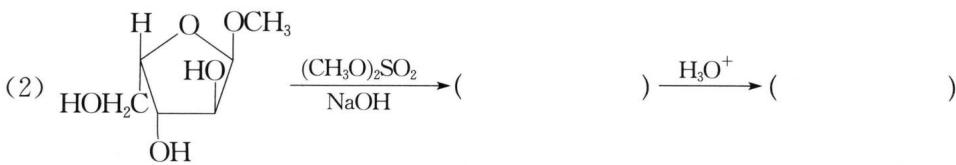
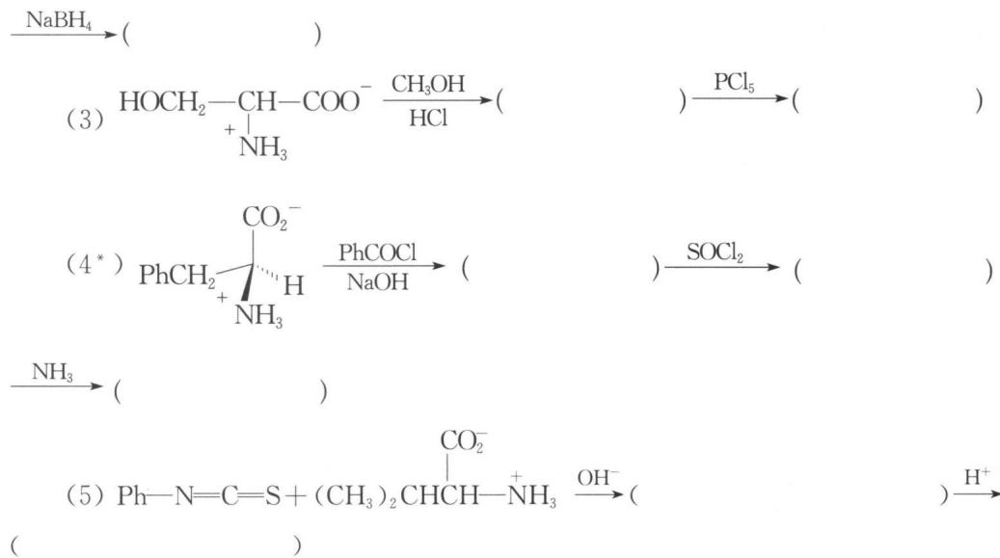
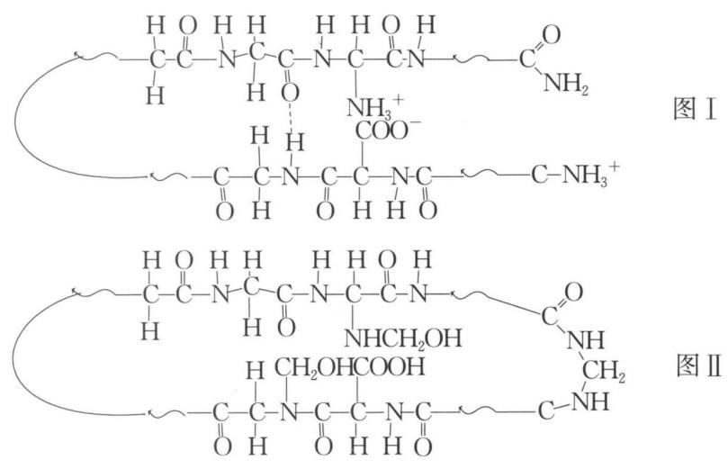
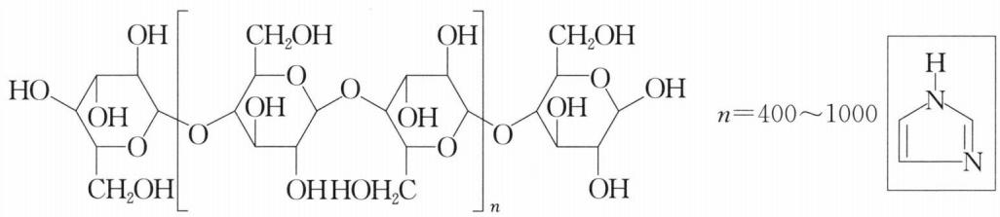
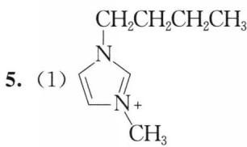
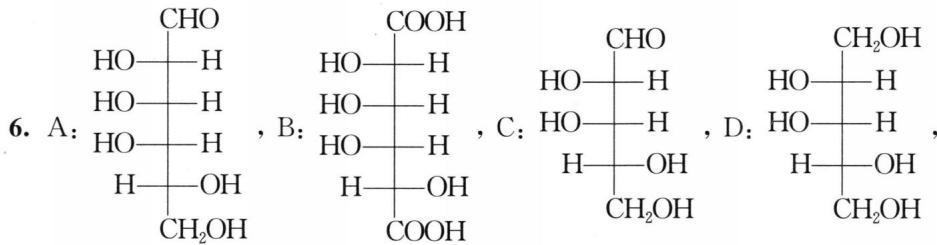
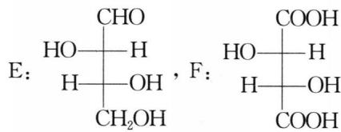
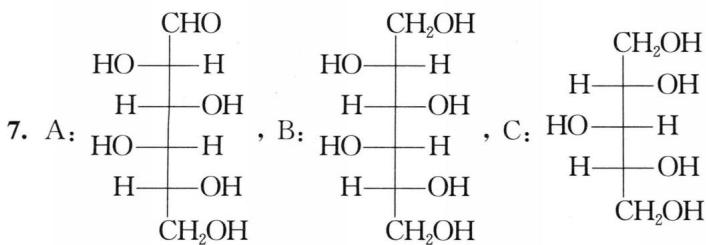

## 习题

### 1. 完成下列反应式(有"*"标注的,写出反应产物的构型式)。

### 2. 合成题

试以邻苯二甲酰亚胺钾、 $\alpha-$ 溴代丙二酸二乙酯、苄氯为原料合成(±)苯丙氨酸, 其他无机试剂任选。

### 3. (2000年全国初赛试题)

某中学生在一本英文杂志上发现 2 张描述结构变化的简图如下(图中"—～—"是长链的省略符号):

未读原文,他已经理解: 图Ⅰ是生命体内最重要的一大类有机物质____(填中文名称)的模型化的结构简图,图Ⅱ是由于图Ⅰ物质与____(结构简式),即____(中文名称)发生反应后的模型化的结构简图。由Ⅰ至Ⅱ的变化的主要科学应用场合是____;但近年来我国一些不法奸商却利用这种变化来坑害消费者,消费者将因____

### 4. (2003年全国初赛试题)

沃森(Watson)和克里克(Crick)因发现DNA双螺旋而获得诺贝尔化学奖。DNA的中文化学名称是____；构成DNA的三种基本组分是：____、____和____；DNA中的遗传基因是以____的排列顺序存储的；DNA双键之间的主要作用力是____。给出DNA双螺旋结构在现代科技中应用的一个实例：____。

### 5. (2002年全国初赛试题)

离子液体是常温下呈液态的离子化合物,已知品种几十种,是一类"绿色溶剂"。据2002年4月的一篇报道,最近有人进行了用离子液体溶解木浆纤维素的实验,结果如下表所示:向溶解了纤维素的离子液体添加约1.0%(质量)的水,纤维素会从离子液体中析出而再生;再生纤维素跟原料纤维素的聚合度相近;纤维素分子是葡萄糖( $\mathrm{C}_{6} \mathrm{H}_{12} \mathrm{O}_{6}$ )的缩合高分子,可粗略地表示如下图,它们以平行成束的高级结构形成纤维;葡萄糖缩合不改变葡萄糖环的结构;纤维素溶于离子溶液又从离子液体中析出,基本结构不变。

**表 木浆纤维在离子液体中的溶解性**

| 离子液体 | 溶解条件 | 溶解度(质量%) |
|---------|---------|--------------|
| $[C_4min]Cl$ | 加热到100°C | 10% |
| $[C_4min]Cl$ | 微波加热 | 25%,清澈透明 |
| $[C_4min]Br$ | 微波加热 | 5~7% |
| $[C_4min]SCN$ | 微波加热 | 5~7% |
| $[C_4min][BF_4]$ | 微波加热 | 不溶解 |
| $[C_4min][PF_4]$ | 微波加热 | 不溶解 |
| $[C_6min]Cl$ | 微波加热 | 5% |
| $[C_8min]Cl$ | 微波加热 | 微溶 |

表中 $\left[\mathrm{C}_{4} \min\right] \mathrm{Cl}$ 是 1-丁基-3-甲基咪唑正一价离子的代号,"咪唑"的结构如右上图所示。

回答如下问题:

(1) 画出以 $\left[C_{4}\min\right]^{+}$ 为代号的离子的结构简式。

(2) 符号 $\left[C_{6}\min\right]^{+}$ 和 $\left[C_{8}\min\right]^{+}$ 里的 $C_{6}$ 和 $C_{8}$ 代表什么?

(3) 根据上表所示在相同条件下纤维素溶于离子液体的差异可见, 纤维素溶于离子液体的主要原因是纤维素分子与离子液体中的 ____ 之间形成了 ____ 键; 纤维素在 $\left[\mathrm{C}_{4} \min\right] \mathrm{Cl}$ 、 $\left[\mathrm{C}_{4} \min\right] \mathrm{Br}$ 、 $\left[\mathrm{C}_{4} \min\right]\left[\mathrm{BF}_{4}\right]$ 中的溶解性下降可用 ____ 来解释, 而纤维素在 $\left[\mathrm{C}_{4} \min\right] \mathrm{Cl}$ 、 $\left[\mathrm{C}_{6} \min\right] \mathrm{Cl}$ 和 $\left[\mathrm{C}_{8} \min\right] \mathrm{Cl}$ 中溶解度下降是由于 ____ 的摩尔分数 ____ 。

(4) 在离子液体中加入水会使纤维素在离子液体里的溶解度下降, 可解释为:

(5) 假设在 $\left[\mathrm{C}_{4} \min\right] \mathrm{Cl}$ 里溶解了 $25 \%$ 的聚合度 $n = 500$ 的纤维素, 试估算, 向该体系添加 $1.0 \%$ (质量)的水, 占整个体系的摩尔分数多少? 假设添水后纤维素全部析出, 析出的纤维素的摩尔分数多大?

### 6. 糖结构推断

一个 D-己醛糖 A 用稀硝酸氧化生成有旋光性的糖二酸 B。A 经拉夫降级生成一个戊醛糖 C。C 经还原得到有旋光活性的糖醇 D。C 经拉夫降级生成丁醛糖 E，E 被硝酸氧化给出有旋光活性的糖二酸 F。写出 A、B、C、D、E 和 F 的结构简式。

### 7. 糖结构推断

由 $\mathrm{NaBH}_{4}$ 还原 $D$ -己醛糖 A 得到具有旋光活性的糖醇 B。A 经拉夫降级再用 $\mathrm{NaBH}_{4}$ 还原生成非旋光活性的糖醇 C。若把 $D$ -己醛糖 A 中—CHO 和— $\mathrm{CH}_{2} \mathrm{OH}$ 交换位置所得结构与 A 完全相同。写出 A、B、C 的结构简式。

### 8. 糖结构推断

某具有光活性的 D-型糖 A, 其化学式为 $C_{6}H_{12}O_{5}$ , 其 C-3 为 S-构型。A 用溴水氧化得 B, B 有光活性。A 用 $NaBH_{4}$ 还原得 C, C 无光活性。A 用稀硝酸氧化得 D, D 为一三元羧酸, 也无光活性。1 mol A 用高碘酸处理, 需消耗 2 mol 高碘酸。试推断 A、B、C 和 D 的结构简式。

### 9. 糖结构推断

已知 A 为某有光活性的 D-己醛糖，以 A 为原料，用克利安尼氰化增碳法合成两个新的 D-庚醛糖 B 和 C，B 经 $NaBH_{4}$ 还原得 D，D 有光活性。C 经 $NaBH_{4}$ 还原得 E，E 无光活性。A 用拉夫降级法得 F，F 用稀 $HNO_{3}$ 氧化得 G，F 和 G 均有光活性。F 再用拉夫降级法得 H，H 有光活性。H 用稀 $HNO_{3}$ 氧化得 I，I 无光活性。请写出 A、B、C、D、E、F、G、H 和 I 的结构简式。

---

## 参考答案

### 1. 反应式答案

(1) $\mathrm{CH}_2\mathrm{OH}$ $\mathrm{OHC} - \mathrm{O}$ + HCOOH

(2) $CH_{3}OH_{2}C \begin{array}{c} H \\ | \\ OCH_{3} \end{array}$ $\begin{array}{c} OCH_{3} \\ | \\ HCH_{3}O \end{array}$ ; $\begin{array}{c} CHO \\ | \\ CH_{3}O—H \\ | \\ H—OCH_{3} \\ | \\ HO—H \\ | \\ CH_{2}OCH_{3} \end{array}$ ; $\begin{array}{c} CH_{2}OH \\ | \\ CH_{3}O—H \\ | \\ H—OCH_{3} \\ | \\ HO—H \\ | \\ CH_{2}OCH_{3} \end{array}$

(3) $\mathrm{HOCH}_2\text{—CH—COOCH}_3$ ； $\mathrm{ClCH}_2\text{—CH—COOCH}_3$ + $\mathrm{NH}_3\mathrm{Cl}^-$ + $\mathrm{NH}_3\mathrm{Cl}^-$

(4) $PhCH_{2}\xrightarrow[\text{NHCOPh}]{\text{COONa}}$ ; $PhCH_{2}\xrightarrow[\text{NHCOPh}]{\text{COCl}}$ ; $PhCH_{2}\xrightarrow[\text{NHCOPh}]{\text{CONH}_{2}}$

(5) Ph-NH-C≡NHC-CH-COO⁻ ; Ph-N-C≡NHC-CH(CH3)2

### 2. 合成答案

$\mathrm{C_{10}H_{10}N(K + Br - CH(COO C_{2}H_{5})_{2})_{2}}$ $\xrightarrow{\mathrm{NaOEt}}$ $\mathrm{PhCH_2Cl}$ $\mathrm{C_{10}H_{10}N - C(OH)(COOC_2H_5)_2}$ $\xrightarrow{\mathrm{NaOH}}$ $\xrightarrow{\mathrm{H_3O^+}}$ $\xrightarrow[\Delta]{-\mathrm{CO_2}}$ $\mathrm{PhCH_2CHCOOH(+)}$ $\mathrm{NH_2}$

### 3. 答案

蛋白质(或多肽); HCHO; 甲醛; 制作(动物)标本(或保存尸体); 食物中残余甲醛可与人体蛋白质发生同图Ⅱ所示的反应而受害。

### 4. 答案

脱氧核糖核酸;脱氧核糖(基);磷酸(基);碱基;碱基;氢键;基因重组(或基因工程、转基因作物、人类全基因图谱……)。

### 5. 答案

(2) $C_{6}$ 代表己基, $C_{8}$ 代表辛基。

(3) 负离子; 氢; $Cl^{-}$ 、 $Br^{-}$ 、 $BF_{4}^{-}$ 结合氢的能力下降; $Cl^{-}$ ; 降低。

(4) 水与离子液体中的阴离子形成氢键的能力更强, 加入的水分子几乎将离子液体中的负离子包围而溶剂化了, 就丧失了与纤维素结构中的羟基氢亲合的能力, 于是纤维素就难以溶入离子液体。

(5) 溶解于离子液体中的纤维素的摩尔质量为: $(6 \times 12 + 10 + 5 \times 16) \times 1000 = 1.62 \times 10^{5} \, (\text{g/mol})$ ，离子液体的摩尔质量为: $8 \times 12 + 15 + 14 \times 2 + 35.5 = 96 + 15 + 28 + 35.5 = 174.5 \, (\text{g/mol})$ 。

水的摩尔分数为： $(1.0/18)/(1.0/18+75/174.5+25/1.62\times10^{5})=0.12$

析出的纤维素的摩尔分数为： $(25/162\ 000)/(1.0/18+75/174.5+25/1.62\times10^{5})=3.2\times10^{-4}$

### 6. 答案

### 7. 答案

### 8. 答案

A: $HOCH_{2}-\overset{CHO}{\underset{H}{\vert}}-OH$ , B: $HOCH_{2}-\overset{COOH}{\underset{H}{\vert}}-OH$ , C: $HOCH_{2}-\overset{CH_{2}OH}{\underset{H}{\vert}}-OH$ ,

D: HOOC—H
H—OH
COOH

### 9. 答案

A: CHO
H—OH
HO—H
H—OH
H—OH
CH₂OH

B: CHO
HO—H
H—OH
HO—H
H—OH
H—OH
CH₂OH

C: CHO
H—OH
H—OH
HO—H
H—OH
H—OH
CH₂OH

D: CH₂OH
HO—H
H—OH
H—OH
CH₂OH

E: HO—H, F: HO—H, G: HO—H, H: CHO
CH₂OH CH₂OH CH₂OH CH₂OH CH₂OH

I: $\begin{array}{c}\mathrm{COOH}\\ \mathrm{H} - \mathrm{OH}\\ \mathrm{H} - \mathrm{OH}\\ \mathrm{COOH}\end{array}$
