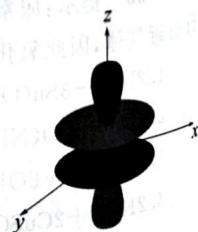
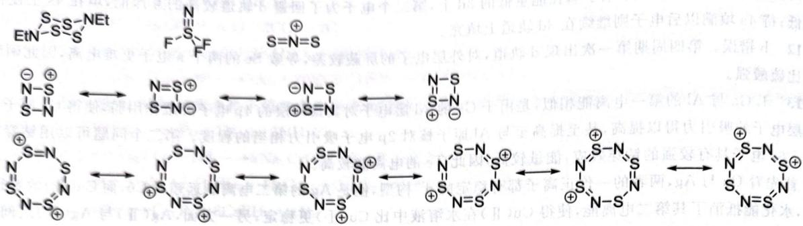
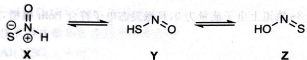
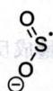
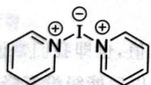
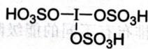
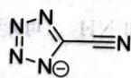
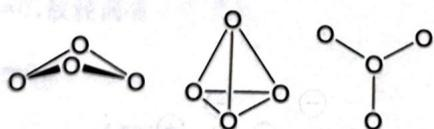

# 第2讲 原子结构 — 答案与提示

## 2.2
略

## 2.9
单质键能。第二周期的氟由于其半径小, 相互排斥作用大, 导致 $\mathrm{F}_{2}$ 的键能反而比 $\mathrm{Cl}_{2}$ 要小

## 2.10
f轨道主量子数为 4, l=3, m=0，故径向有 0 个节面。

角向节面则只需求解 $\frac{z(5z^{3}-3r^{2})}{r^{3}}=0,$

通常认为原点不算在节面内，因此可得解 $0, \sqrt[3]{\frac{3r^2}{5}}$

所以共有 3 个节面, 轨道简图如右图所示:

## 3.6
共振式如下图所示：

$S_{4}(NEt)_{2}$ 键级为 $1, S_{2}N_{2}$ 键级为 1.25, $S_{4}N_{4}^{2+}$ 键级为 1.5, $NSF_{3}$ 键级为 3, $NS_{2}^{+}$ 键级为 2。键长排序取键级之逆序。

## 3.11
1. 方程式如下：

$$
\mathrm{S} _ {8} + 8 \mathrm{I} _ {2} + 1 2 \mathrm{AsF} _ {5} \longrightarrow 4 \left[ \begin{array}{c c} \mathrm{I} & \mathrm{S} - \mathrm{I} \\ \mathrm{I} & \mathrm{S} - \mathrm{I} \end{array} \right] ^ {2 +} \left[ \begin{array}{c c} \mathrm{F}, & \mathrm{F} \\ \mathrm{F} & \mathrm{As} \\ \mathrm{F} & \mathrm{F} \end{array} \right] _ {2} ^ {-} + 4 \mathrm{AsF} _ {3}
$$

2. X 中的 I—I 键长更短。

## 3.12
1. 如下图所示。 2. 稳定性顺序为 $\mathbf{Z} > \mathbf{Y} > \mathbf{X}$ 。

## 3.18
1. 如下图所示：

2. $S_{2}O_{4}^{2-}\longrightarrow2SO_{2}^{-}\cdot;CF_{3}Br+SO_{2}^{-}\cdot\longrightarrow CF_{3}\cdot+BrSO_{2}^{-};CF_{3}\cdot+SO_{2}^{-}\cdot\longrightarrow F_{3}CSO_{2}^{-}$

## 3.19
1. 结构为 V 型, 如图所示。

3.19 第 1 小题图

3.19 第 2 小题图

2. $4\mathrm{I}(\mathrm{py})_2^+ +8\mathrm{H}_2\mathrm{SO}_4\longrightarrow \mathrm{I}_3^+ +8\mathrm{pyH}^+ +5\mathrm{HSO}_4^- +\mathrm{I}(\mathrm{HSO}_4)_3$。A的结构如图所示。

## 3.25
1. 阴离子化学式为 $C_{2}N_{5}$ ，结构如下图所示：

2. 环上的原子为 $sp^{2}$ 杂化，氰基的 C 为 sp 杂化。键的类型除常规键型以外，还有一个 $\pi_{7}^{8}$ 键。

## 3.28
1. $\mathrm{NCl}_3 < \mathrm{NF}_3 < \mathrm{NH}_3; \mathrm{H}_2\mathrm{Se} < \mathrm{H}_2\mathrm{S} < \mathrm{H}_2\mathrm{O}$

2. 结论与简单按照电子效应的结果相反,因此键角实际上是由电子效应与空间效应共同决定的。

## 3.29
需要重新测量的是 $\mathrm{Sb}(\mathrm{CF}_{3})_{3}$ 的键角，因为其应当比 $\mathrm{As}(\mathrm{CF}_{3})_{3}$ 的键角更小。

## 3.30
161.3pm

## 3.34
1. 凝聚温度最低的是 $NF_{3}$

2. 136pm、140pm 和 142pm 分别对应 $NF_{3}$ 、 $NHF_{2}$ 、 $NH_{2}F$

## 3.40
如下图所示。

第一个结构最稳定,是因为其中的 O 均满足八隅律,且不存在电荷累积。

## 2.11
对于基态的电中性原子, 其 4s 轨道的电子能量最高, 因此优先电离; 而对于电子的填充顺序, 可以想象电子的一个 [Ar] 原子实开始, 第一个电子填在能量低的 3d 上, 第二个电子为了回避 d 轨道较高的互斥能, 填在 4s 上使得总能量最低; 待 4s 填满以后电子则继续在 3d 轨道上填充。

## 2.12
b 错误。第四周期第一次出现 d 轨道, 对外层电子的屏蔽较差, 导致 Se 的两个 s 电子更难电离, 因此硒酸的氧化性比硫酸强。

## 2.13
1. Ga 与 Al 的第一电离能相似, 是由于 Ga 的 3d 层电子对其最外层的 4p 电子屏蔽作用弱, 使得 Ga 原子核对酸外层电子的吸引力得以提高, 甚至提高至与 Al 原子核对 2p 电子吸引力相当的程度。第二个问题可以用钻穿效应来解释。

2. 首先看 Cu 与 Ag, 两者的一价正离子都有稳定的 $d^{10}$ 构型, 但是 Ag 的第二电离能远超过 Cu, 而 Cu(Ⅱ) 的半径小, 电荷高, 水化能抵消了其第二电离能, 使得 Cu(Ⅱ) 在水溶液中比 Cu(I) 更稳定; 另一方面, Ag(Ⅱ) 与 Ag(I) 之间的半径差距不如 Cu(Ⅱ) 与 Cu(I), 其水和能之差较小, 不足以稳定其二价离子。再来讨论 Au 的情况。Au 的第一电离能较高 (受到镧系收缩的影响), 但是其离子半径更大, 第二、三电离能较低, 相对于 Cu 和 Ag 更易形成 +3 氧化态; 此外, Au(Ⅲ) 的平面四方构型有较高的配位场稳定化能 (LFSE), 这也有利于 +3 氧化态在溶液中的稳定 (而 Cu 半径较小, 大多形成四面体配合物, LFSE 较低, 不利于形成 +3 氧化态)。

3. IA 族元素从 Ca 以后, 出现了 d 电子, d 电子对于最外层电子的屏蔽作用较弱, 使得原子核对电子的束缚变强, 减缓了同族从上到下第一电离能下降的过程; 而 Li 到 Ca 外层没有 d 电子, 屏蔽较强, 因此第一电离能下降更快。

## 2.14
1. 外层电子排布: $1s^{2}2s^{2}2p^{6}3s^{1}$ ; 价电子 $3s^{1}$

2. 203.2kJ/mol。

3. 496.6kJ/mol。提示: 假定 3s 轨道上电子能量为 0 ,且激发态电子符合 Bohr 模型, 则 nd 轨道上电子的能量可以写成 $E_{ad}=E_{0}+\frac{k}{n^{2}}$

据此用表格数据做线性回归。

## 2.15
723.6kJ/mol。

## 2.16
提示:一个化学反应方程式:

1. $\mathrm{ND}_{3}\mathrm{H}^{+}$ 的 $\mathrm{pK}_{\mathrm{a}}$ 更大。

2. $\mathrm{CO}_{2}$ 在 $\mathrm{D}_{2}\mathrm{O}$ 中 $\mathrm{pK}_{\mathrm{a}}$ 更大。

## 2.17
1. $\mathrm{Sc}^{2+}$ 到 $\mathrm{Zn}^{2+}$ ，电荷数不变，而原子序数变大，3d轨道上的电子受核吸引作用变大，因此离子的水和热会单独增。

2. 形成水合离子时，不同的 d 电子排布有不同的能级降低总值，也即我们常说的配位场稳定化能(LFSE)。 $\mathrm{Mn}^{2+}$ 的 $\mathrm{d}^{10}$ 电子构型在弱场中的 LFSE 为 0，即其 d 电子分裂以后能级没有降低，因此其水和热反而比其之前的元素小。这一现象是元素周期律与 LFSE 共同作用的结果，因为其峰值并不出现在 LFSE 最高的 $\mathrm{d}^{3}$ 和 $\mathrm{d}^{8}$ 组态。（使用晶体理论，言之有理亦可。）

## 2.18
1. 应产生 $\mathrm{NH}_{2}\mathrm{OH} \cdot \mathrm{HCl}$

2. 分别为 3.34 和 2.85，所以水解产物是 HOCl 和 $\mathrm{NH}_{3}$。可能是因为 AR 电离，大小，更符合实际。

## 2.19
$^{96}_{42}\mathrm{Mo} + _{1}^{2}\mathrm{H} \longrightarrow _{43}^{97}\mathrm{Tc} + _{0}^{1}\mathrm{n}$

## 2.20
1. $^{226}_{88}\mathrm{Ra} \longrightarrow _{86}^{222}\mathrm{Rn} + _{2}^{4}\mathrm{He}$

2. 210g/mol。

3. 2014 年 2 月。

4. Po, 针。

5. 4.95MeV。
