# 第3讲 分子结构 — 答案与提示

## 3.2
如下图所示：

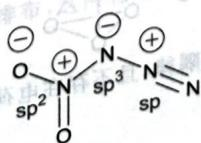

如下图所示，点群为 $D_{3d}$ ，对称元素按照点群去写即可。

## 3.41

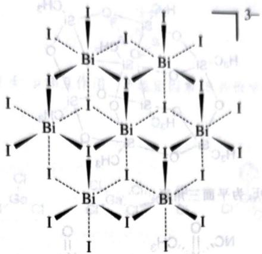

电负性较强,导致另一侧的 O 能够将其孤对电子填入 O—F 键反键轨道,削弱了 O—F 键,增强了 O—O

## 3.44
F 的电负性较大, 也可以用价键理论解释: F 电负性大, 造成电子偏向自身, 氧原子周围电子的排斥力下降, 因此只用 $\mathrm{N}$ 和 $\mathrm{NH}_{3}$ 都是不等性的 $\mathrm{sp}^{3}$ 杂化, 由于孤对电子与键合电子的斥力大于键和电子之间, N 上的孤对电子会

## 3.45
$NF_{3}$ 和 $NH_{3}$ 和 $N_{2}$ 的电负性。挤推键合电子，使得键角变小。在 $NF_{3}$ 中，由于 F 的电负性较大，导致 N 的弧对电子偶极差小于 $\angle FNF$ 小于 $\angle HNH$ 。

## 3.46
$r_{d}<r_{3}<r_{1}$ 是第三周期元素，与过渡金属轨道能量更近，而且 P 有空的 5d 轨道，所以碱性更弱。

## 3.47
P 是第三周期元素, 因此它与过渡金属配位能力强; 因为 P 的电负性比 N 小, 所以碱性变强。因为 P 的电负性比 N 小则为不等性 $sp^{3}$ 杂化和等性 $sp^{2}$ 杂化。

## 3.48
分别为不等性 s

## 3.49
1. 如下图所示。

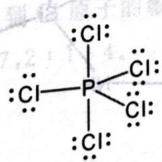

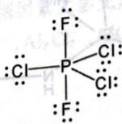

2. 三角双锥。

3. 均为非极性分子。

4. 轴向更长。

5. 采用 $sp^{3}d$ 杂化, 其中赤道面上包括 $sp^{2}$ 混杂的轨道, 而轴向正交线段。

## 3.50
两个结构如下图所示：

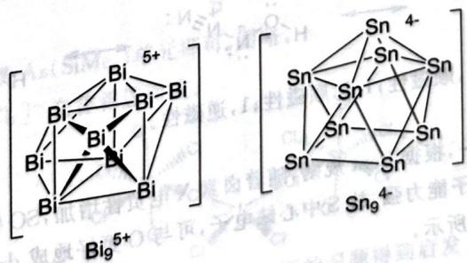

## 3.51
1. 两物质一种是 $\mathrm{IBr}$ , 其中, 阴离子的化学式是 $\mathrm{I}_{3} \mathrm{Br}_{4}^{-}$ , 结构呈三角锥形。

## 3.52
激发态的 He 可以形成 $1s^{4}Zs^{3}$ 的成双原子分子。

## 3.53
化学式为 $Si_{8}C_{8}O_{12}H_{24}$ ，结构如下图所示。

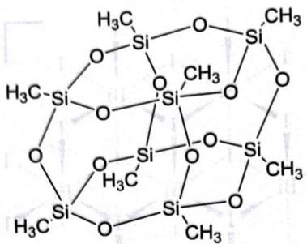

## 3.54
$\mathrm{XeH_3NC_2OF_2}$ 为四方锥， $\mathrm{XeOF_2}$ 为平面三角形。

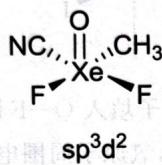

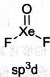

## 3.55
$\mathrm{sp}^3\mathrm{d}$ 杂化，直线型。

## 3.56
1. $\mathrm{sp}^3\mathrm{d}^3$ 杂化，平面五边形。

2. 如下图所示(Si 构成三棱柱,NH 插在棱上,甲基为端基)。

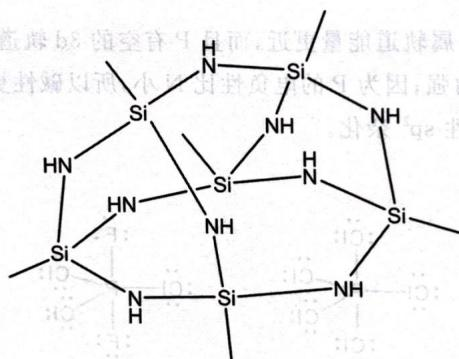

## 3.57
1. F 体积小,电负性大,因此∠FSF 更小,∠OSO 更大。

2. 若有 $SOCl_{4}$ ，其结构应为三角双锥，这一排布导致 Cl 彼此之间过于拥挤，因此不稳定。

## 3.58
1. $sp^{3}d$ 杂化, 直线型。

2. 如下图所示。

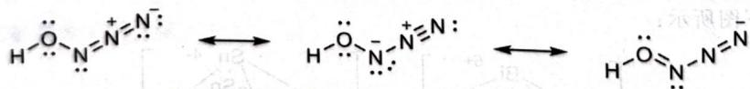

## 3.59
1. 依次为:2.5,顺磁性;2,顺磁性;1.5,顺磁性;1,逆磁性。

2. 和 C 最接近。

3. $\mathrm{SOF}_2$ 最强, $\mathrm{SOBr}_2$ 最弱。第一, 根据 Bent 规则, 随着卤素 X 电负性增加, SO 键的杂化中 s 的成分增加, 因此成键变强; 第二, 由于 F 无 3d 轨道且吸电子能力强, 故 S 中心缺电子, 可与 O 更好地成 d—pπ 键, 因此成键变强。

## 3.60
Y 是 $ClOF_{3}$ 。结构如下图所示。

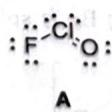

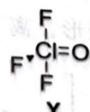

## 3.61
1. $2\mathrm{WF}_6 + 3\mathrm{SiO}_2 \longrightarrow 2\mathrm{WO}_3 + 3\mathrm{SiF}_4$

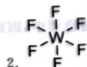

2. F F ; $d^{2}sp^{3}$ ; 偶极矩为 0, 分子间作用力小。3. $4C_{3}$ , $3C_{4}$ , $6C_{2}$ , $9\sigma$

## 3.62
1. $\mathfrak{sp}^2$ 杂化。结构如下图所示，非键S一F距离为 $255.3\mathrm{pm}$

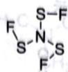

2. 稳定因素: N、F 与 S 之间存在着 d—p 相互作用。不稳定因素: S 共价半径为 102pm, F 为 72pm, 不相邻的 S—F 间孤对电子的斥力较大。

## 3.63
三种结构如下图所示。

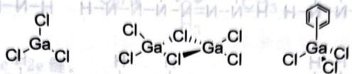

## 3.64
1. 稳定共振式：

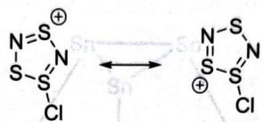

2. 考虑次稳定的共振式(注意有同号形式电荷相连的应当排除), 共可画出四种。

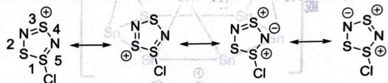

注意到次稳定的共振式权重通常稍小于稳定共振式,而且由于原子半径关系,S—S单键比S—N单键更长,即可比较出结论5>3>2>4>1。解答没有考虑到Cl原子的影响,否则因素太多无法得解。

## 3.65
1. $\mathrm{Te}[\mathrm{AlCl}_4]_4$

2. $2:2:7,2:1:4$

3. $\mathrm{Te}_{4}^{2+},\mathrm{Al}_{2}\mathrm{Cl}_{7}^{-},\mathrm{AlCl}_{4}^{-}$

4. Te为 $\mathfrak{sp}^2$ ，Al为 $\mathfrak{sp}^3$

## 3.66
1. 如下图所示。

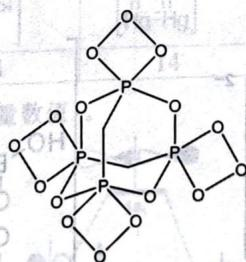

2. 把 $P_{4}S_{2}$ 笼状结构中的 S 换成 $\mathrm{As(SiMe_{3})}$ 单元即可，图略。

3. 如下图所示， $[ICl_{2}]^{+}$ 和 $[SbCl_{6}]^{-}$ 交替相连而成。

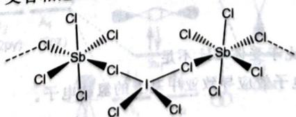

4. $\left(\mathrm{Bi}_{9}^{5+}\right)_{2}\left(\mathrm{BiCl}_{5}^{2-}\right)_{4}\left(\mathrm{Bi}_{2}\mathrm{Cl}_{6}^{2-}\right)$ 。提示：阳离子的化学式由前面的习题得到启发。

## 3.67
1. 共振式如图所示, 6 个 $\pi$ 电子, 因此该环系有方音性。 $\oplus S = N - N - S \longleftrightarrow \begin{array}{c} \oplus \\ S - N \\ N - S \end{array} \longleftrightarrow \begin{array}{c} \oplus \\ S - N \\ N - S \end{array} \longleftrightarrow \begin{array}{c} S - N \\ N - S \\ \oplus \end{array}$

2. 结构的不稳定性主要来源于平面四元环较大的张力。

3. 如下图所示。

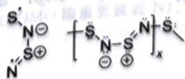

## 3.74
1. 最简式为 $AlC_{4}H_{11}$ ，结构简式如下图所示。

$$
\begin{array}{c} \mathrm{H} _ {3} \mathrm{C} \\ \mathrm{Al} \\ \mathrm{CH} _ {3} \end{array} \mathrm{C} _ {2} \mathrm{H} _ {5}
$$

2. 化学式略, 可能的结构如下图所示。

$$
\begin{array}{c} \mathrm{H} _ {3} \\ \mathrm{C} _ {2} \mathrm{H} _ {5} \end{array} \text {Al} \begin{array}{c} \mathrm{C} \\ \mathrm{C} \\ \mathrm{H} _ {3} \end{array} \text {Al} \begin{array}{c} \mathrm{C} _ {2} \mathrm{H} _ {5} \\ \mathrm{CH} _ {3} \end{array}
$$

3. 铝为 $sp^{3}$ 杂化, 分子中心有 3c-2e 键。

## 3.75
结构如下图所示,该结构相当于一个四面体被平行于每个面地削去四角,然后每一个三角形削面的三个顶点安放一个 Sn 原子,Ca 则位于结构的中心。

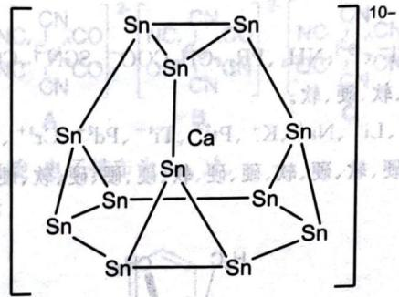

## 3.76
$\mathrm{O}_2 + \mathrm{PdF}_4 + \mathrm{KrF}_2 = \mathrm{O}_2\mathrm{PdF}_6 + \mathrm{Kr}$

## 3.77
如下表所示：

<table><tr><td>A</td><td>B</td><td>C</td><td>D</td><td>E</td></tr><tr><td></td><td></td><td></td><td></td><td></td></tr><tr><td>2</td><td>14</td><td>14</td><td>14</td><td>6</td></tr></table>

## 3.78
1. 如下图所示(不要求对称性和能量数值)。

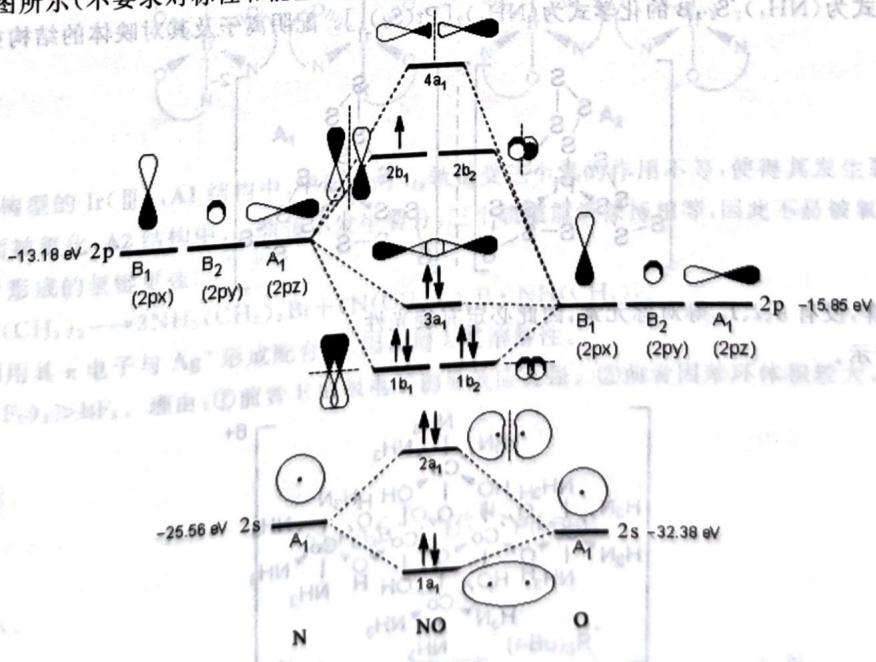

2. 键级为 2.5, 未成对电子数为 1。

3. HNO, 因为 SOMO 的系数在 N 处更大

## 3.68
1. $\pi_4^6$

2. 中间的 $NO_{3}$ 单元所在平面垂直于纸面, 如下图所示。

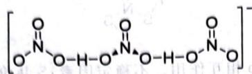

## 3.69
1. 如下图所示。

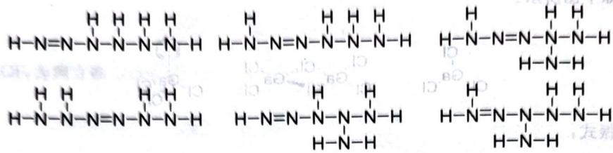

2. 如下图所示。

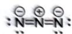

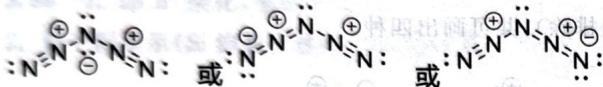

## 3.70
如下图所示。

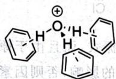

## 3.71
1. $\left[\mathrm{NH}_{3} \mathrm{CH}_{2} \mathrm{CH}_{2} \mathrm{NH}_{3}\right]_{2} \left[\mathrm{B}_{4} \mathrm{O}_{5} (\mathrm{OH})_{4}\right] \left[\mathrm{B}_{7} \mathrm{O}_{9} (\mathrm{OH})_{5}\right] \cdot 3 \mathrm{H}_{2} \mathrm{O}$

2. 如下图所示。

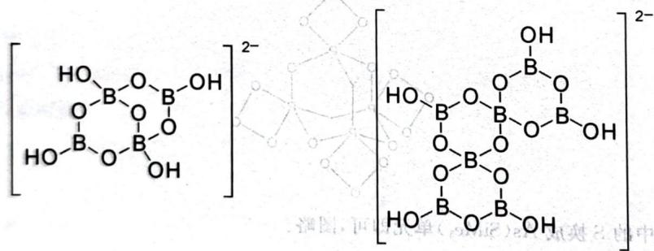

3. 通过氢键形成骨架。

4. $B_{2}O_{3}$

## 3.72
1. 2mol, 注意氢键给体 N 相比于受体 CH 不足。

2. C周围有4个N,因为较强的吸电子效应导致亚甲基上的氢缺电子。

## 3.73
如下图所示。

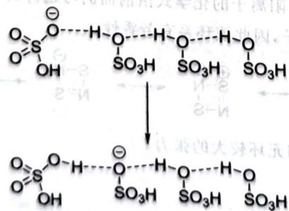
