# 第5讲 金属有机化学 — 答案与提示

## 5.2
16 电子稳定。平面四方配体 8 电子, 剩下中心金属的配体尽量填满成键轨道, 而不填能量太高的反键轨道, 得到的稳定构型为 16 电子。

## 5.5
如下图所示。

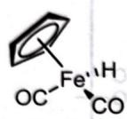 A

H—H  
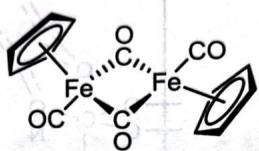 B C

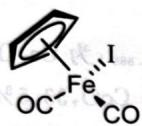 D

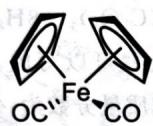 E

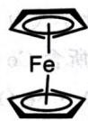 F

## 5.10
$\mathrm{Tc_2Cl_8^{2-}}$ 的键级与 $\mathrm{Re}_2\mathrm{Cl}_8^{3-}$ 相同，均为 4; $\mathrm{Tc_2Cl_8^{3-}}$ 多金属键的键级为3.5。主要原因是Tc电荷变高有静电排斥，而d-d多重键不足以抵消这部分排斥。（此解释属于F.A.Cotton。）

## 5.11
1. $\left[\mathrm{Mo}_{2}(\mathrm{DTolF})_{3}\right]_{2}(\mu-\mathrm{OH})_{2}$ 中，Mo取 $\mathrm{dsp}^2$ 杂化与配体成键，其余d轨道参与多重键，键级为4，结构如下图所示。

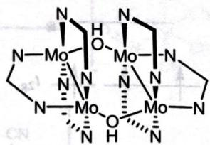

2. $\left[\mathrm{Mo}_{2}(\mathrm{DTolF})_{3}\right]_{2}(\mu-\mathrm{O})_{2}$ 的结构与 $\left[\mathrm{Mo}_{2}(\mathrm{DTolF})_{3}\right]_{2}(\mu-\mathrm{OH})_{2}$ 完全相同，只需要把桥基换成氧原子即可。Mo为 $+2.5$ 价，金属键的键级为3.5。结构如下图所示。

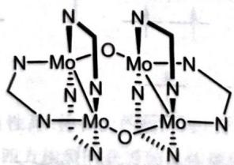

## 5.12
1. 如下左图所示,实际上应当取下右图结构。

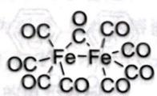

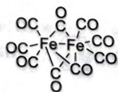

2. 体系中不存在金属—金属键，又要符合 EAN 规则，则 CO 不可能简单地分配电子给两个 Fe。CO 必须形成 3c-2e 键，才能使得两个 Fe 都满足 EAN 规则。体系的成键形式包括 6 个 σ 配键，2 个 CO 边桥基和一个 Fe—C—Fe 的 3c-2e 体系。

## 5.17
对于氧化加成,为使得参与加成的分子与金属的 d 轨道能够对称性匹配,两者必须采取顺式加成。在还原消除反应中,只有处于邻位的两个配体的轨道能够发生有效重叠而消除,对位配体间隔太远,不能形成消除产物。

## 5.18
1. PNP 可以作为三齿配体, 结构不难画出, 如下图所示。

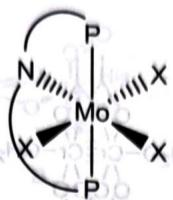

2. 如下图所示。

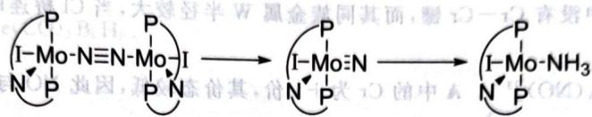

A B C

## 5.19
$(\mathrm{PhC})_{4}\mathrm{O} + \mathrm{Ph}_{3}\mathrm{SnMn}(\mathrm{CO})_{5} \longrightarrow \mathrm{SnOPh}_{2} + \mathrm{Mn}[(\mathrm{PhC})_{5}](\mathrm{CO})_{3} + 2\mathrm{CO}$

## 5.20
如下图所示。

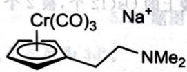 A

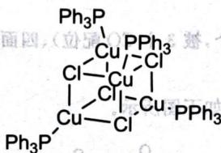

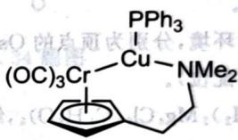

B

结构中 Cr 符合 18 电子规则, Cu 不符合。

## 5.21
$W_{2}Cl_{9}^{3-}$，根据价态和抗磁性推测存在 W—W 键，为三重键。

## 5.22
分别为 Co、Ti、W、Ni、Ru、Sc、Au、Mn、Zn、Ta。

## 5.23
依次为 $\mathrm{Cr}(\mathrm{C}_6\mathrm{H}_6)_2$、$\mathrm{C}_6\mathrm{H}_6$、$\mathrm{Cr}(\mathrm{C}_6\mathrm{H}_6)_2(\mathrm{OH})$、$\mathrm{H}_2\mathrm{O}_2$。二苯铬的结构如图所示。

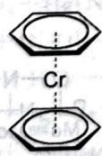

## 5.24
1. 如图所示。
2. 如图所示, 两侧为环戊二烯负离子, 中间为环辛四烯双负离子。

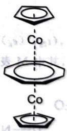

## 5.25
1. 分别如下图所示。

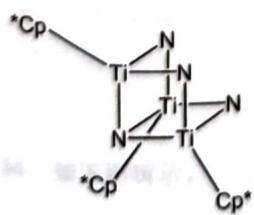

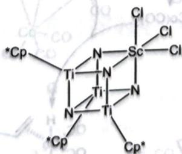

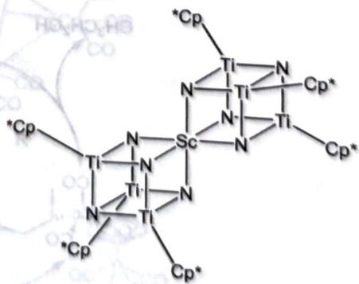

$$
2. + 4, 6, 12
$$

## 5.26
1. 根据电荷守恒和含有桥连配体的信息，B为 $\mathrm{Cr_2(CH_3COO)_4\cdot 2H_2O}$，由EAN规则与反磁性可以验算得到含有Cr—Cr四重键。结构如下图所示。

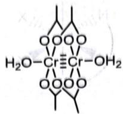

2. Cr 半径较小, $Cr_{2}Cl_{9}^{3-}$ 中没有 Cr-Cr 键, 而其同族金属 W 半径较大, 当 Cl 桥连时, 更易形成 W-W 键, 导致 $W_{2}Cl_{9}^{3-}$ 为反磁性化合物。

3. A 的化学式为 $\left[\mathrm{Cr}(\mathrm{CN})_{5}(\mathrm{NO})\right]^{3-}$。A 中的 Cr 为 +1 价，其价态较低，因此 NO 与 Cr 的成键较弱，导致其磁矩偏大。

## 5.27
1. 4重键, 1 个 σ 键, 2 个 π 键, 1 个 δ 键。

2. 顺磁性。

3. 更小。虽然 Mo 价态的降低导致 δ 键的键级降低为 0.5，但是 δ 键很弱，而 Mo 价态的降低有助于降低核间静电排斥，因此成键更好。

## 5.28
3种化学环境,分别为顶点的Os(4个,被3个CO配位)、四面体棱上的Os(12个,被2个CO配位)和面上的Os(4个,被1个CO配位)。

## 5.29
$\left(\mathrm{CH}_{3}\mathrm{CH}_{2}\right)_{2}\mathrm{Mg}_{4}\mathrm{Cl}_{6}\left(\mathrm{C}_{4}\mathrm{H}_{8}\mathrm{O}\right)_{6}$，结构如下图所示。

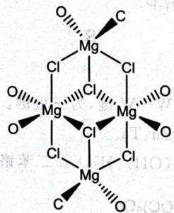

## 5.30
1. $\mathrm{Mo(CO)_6,(t_{2g})^6(e_g)^4}$

2. 依次如下图所示, 其中 M 表示 Pd。注意金属—金属多重键的键级。

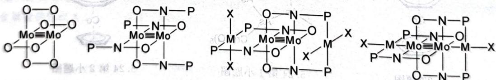

## 5.31
E 的化学式为 $\mathrm{HCo(CO)_{4}}$。循环中 $\left[\mathrm{HCo(CO)_{3}(CH_{2}=CHCH_{2}OH)}\right]$ 具体几何结构不做要求。催化循环如下图所示。

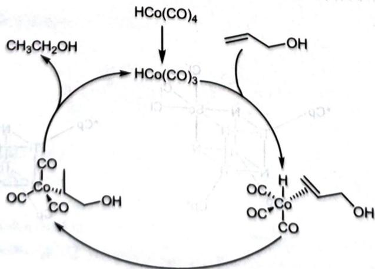

## 5.32
1. 如下图所示。

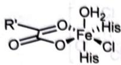 A

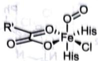 B

 C

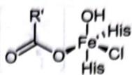 D

2. 中间体 1 为 +2 价, 2 为 +2 价, 3 为 +4 价, 4 为 +4 价。

3. 4 中 Fe—His 键更长。

## 5.33
1. X 的化学式为 $\mathrm{Fe(CO)_{3}B_{4}H_{8}}$。

2. 如图所示。

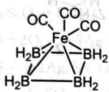

## 5.34
1. $\mathrm{FeC}_{5}\mathrm{H}_{5}\mathrm{NO}$。

2. 如图所示,有二重金属—金属键。

## 5.35
1. A 为 Ni(CO)$_4$，B 为 Fe(CO)$_5$，C 为 Co$_2$(CO)$_8$，X 为 CO，V 是 MnCl$_2$，D 为 Mn$_2$(CO)$_{10}$，W 为 Re$_2$O$_7$，E 为 Re$_2$(CO)$_{10}$。

2. 所有的化学方程式如下：

$$
\mathrm{Ni}(\mathrm{CO})_{4} + \mathrm{PH}_{3} \longrightarrow \mathrm{Ni}(\mathrm{CO})_{3}\mathrm{PH}_{3} + \mathrm{CO}
$$

$$
\mathrm{Fe(CO)}_{5} + 2\mathrm{Na} \longrightarrow \mathrm{Na}_{2}\mathrm{Fe(CO)}_{4} + \mathrm{CO}
$$

$$
\mathrm{Mn}_{2}(\mathrm{CO})_{10} + 2\mathrm{Na} \longrightarrow 2\mathrm{NaMn}(\mathrm{CO})_{5}
$$

$$
\mathrm{Na}_{2}\mathrm{Fe}(\mathrm{CO})_{4} + 2\mathrm{H}^{+} \longrightarrow \mathrm{H}_{2}\mathrm{Fe}(\mathrm{CO})_{4} + 2\mathrm{Na}^{+}
$$

$$
\mathrm{Na}_{2}\mathrm{Fe}(\mathrm{CO})_{4} + \mathrm{Hg}(\mathrm{NO}_{3})_{2} \longrightarrow \mathrm{HgFe}(\mathrm{CO})_{4} + 2\mathrm{NaNO}_{3}
$$

$$
3\mathrm{Fe}(\mathrm{CO})_{5} + 4\mathrm{NaOH} \longrightarrow \mathrm{Na}_{2}[\mathrm{Fe}_{3}(\mathrm{CO})_{11}] + \mathrm{Na}_{2}\mathrm{CO}_{3} + 2\mathrm{H}_{2}\mathrm{O} + 3\mathrm{CO}
$$

$$
3\mathrm{Co}_{2}(\mathrm{CO})_{8} + 12\mathrm{py} \longrightarrow 2[\mathrm{Co}(\mathrm{py})_{6}][\mathrm{Co}(\mathrm{CO})_{4}]_{2} + 8\mathrm{CO}
$$

$$
\mathrm{Re}_{2}(\mathrm{CO})_{10} + \mathrm{Br}_{2} \longrightarrow 2\mathrm{Re}(\mathrm{CO})_{5}\mathrm{Br}
$$

$$
\mathrm{Re}_{2}(\mathrm{CO})_{8}\mathrm{Br}_{3} + \mathrm{NaMn}(\mathrm{CO})_{5} \longrightarrow \mathrm{ReMn}(\mathrm{CO})_{10} + \mathrm{NaBr}
$$

$$
\mathrm{Re}(\mathrm{CO})_{5}\mathrm{Br} + \mathrm{NaMn}(\mathrm{CO})_{5} \longrightarrow K_{2}\{\mathrm{Ph}[\mathrm{Fe}(\mathrm{CO})_{4}]_{3}\} + \mathrm{CO} + 2\mathrm{K}_{2}\mathrm{CO}_{3} + 4\mathrm{H}_{2}\mathrm{O} + 2\mathrm{KCl}
$$

$3\mathrm{Fe}(\mathrm{CO})_{5} + \mathrm{PbCl}_{2} + 8\mathrm{KOH}$ 与 $\mathrm{Co}(\mathrm{CO})_{3}$ 互为等瓣

3. Q 的化学式为 $\mathrm{Co}_{3}(\mathrm{CO})_{9}\mathrm{CH}$，R 的化学式为 $\mathrm{Co}_{4}(\mathrm{CO})_{12}$。两者的结构是极相似的，因为 CH 与 $\mathrm{Co}(\mathrm{CO})_{3}$ 互为等瓣（下图中 CO 进行桥连也可），如下图所示。

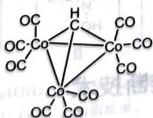 Q

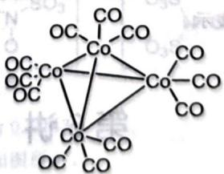 R

## 5.36
如下图所示。

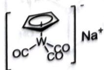 A

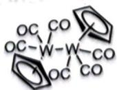 B

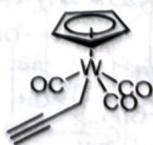 C
