# 第6讲 推断技术 — 答案与提示

## 6.19
1. B 为 $\mathrm{TlO_{2}}$，A 为硫酸铊 $\mathrm{Tl_{2}SO_{4}}$，F 为 $\mathrm{Tl_{4}O_{3}}$，写成复合氧化物为 $3\mathrm{Tl_{2}O} \cdot \mathrm{Tl_{2}O_{3}}$；C 是 TlI，D 是 $\mathrm{TlI_{3}}$。

2. 化学式为 $\mathrm{TlN_{6}}$，存在形式为 $\mathrm{TlN_{3} \cdot TlN_{9}}$，实际上为 $\mathrm{Tl}\left[\mathrm{Tl}\left(\mathrm{N}_{3}\right)_{4}\right]$。

3. 化学式为 $\mathrm{TiCl}_5$ 和 $\mathrm{Ti}_2\mathrm{Cl}_9$，前者是两个八面体共棱的结构，后者是两个八面体共有一面的结构（联想 $[\mathbf{W}_2\mathbf{Cl}_9]^{3-}$ 的结构）。

$$
\left[ \begin{array}{c} \mathrm{Cl} \\ \mathrm{Cl} \end{array} \right] ^ {4 -} \left[ \begin{array}{c} \mathrm{Cl} \\ \mathrm{Cl} - \mathrm{Ti} \\ \mathrm{Cl} \end{array} \right] ^ {3 -}
$$

## 6.20
分别为 KSCN、Cu、KCN、$Cu_{2}S$、$KFe_{2}(CN)_{6}$、$NO_{2}$、$N_{2}O_{4}$。

## 6.21
1. 分别为 $\mathrm{Sc}$、$\mathrm{Sc}_2(\mathrm{C}_2\mathrm{O}_4)_3 \cdot 5\mathrm{H}_2\mathrm{O}$、$\mathrm{Sc}_2(\mathrm{C}_2\mathrm{O}_4)_3$、$\mathrm{Sc}_2\mathrm{O}_3$、$\mathrm{ScF}_3$、$\mathrm{Na}_3\mathrm{ScF}_6$。

2. 分别为 $Sc_{7}Cl_{12}$、$Sc_{5}Cl_{8}$、$Sc_{7}Cl_{10}$、ScCl。$Sc_{7}Cl_{12}$ 的结构如下图所示，其中黑球为 Sc。

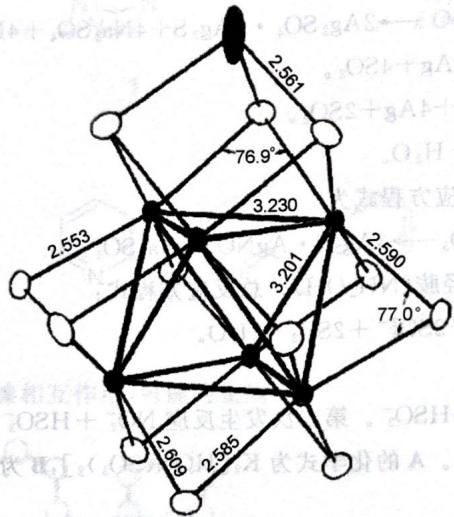

## 6.22
A 为 $Sb_{2}S_{3}$，B 为 $SbCl_{3}$，C 为 SbOCl，D 为 $Sb_{2}O_{3}$，E 为 $Ph_{2}SbCl$，F 为 $(\mathrm{Ph}_{2}\mathrm{Sb})_{2}\mathrm{O}$。

## 6.23
1. 如下图所示。

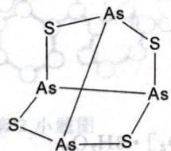

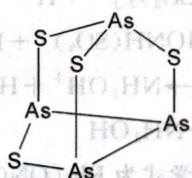

2. 雌黄可以溶解, 反应为 $As_{2}S_{3} + 6NH_{4}HCO_{3} \longrightarrow (NH_{4})_{3}AsS_{3} + (NH_{4})_{3}AsO_{3} + 6CO_{2} + 3H_{2}O$。

3. 四个方程式分别为

$$
\mathrm{As}_{2}\mathrm{O}_{3} + 6\mathrm{Zn} + 12\mathrm{HCl} \longrightarrow 2\mathrm{AsH}_{3} + 6\mathrm{ZnCl}_{2} + 3\mathrm{H}_{2}\mathrm{O}
$$

$$
2\mathrm{AsH}_{3} \longrightarrow 2\mathrm{As} + 3\mathrm{H}_{2}
$$

$$
2\mathrm{As} + 5\mathrm{NaClO} + 3\mathrm{H}_{2}\mathrm{O} \longrightarrow 2\mathrm{H}_{3}\mathrm{AsO}_{4} + 5\mathrm{NaCl}
$$

$$
2\mathrm{AsH}_{3} + 12\mathrm{AgNO}_{3} + 3\mathrm{H}_{2}\mathrm{O} \longrightarrow 12\mathrm{Ag} + \mathrm{As}_{2}\mathrm{O}_{3} + 12\mathrm{HNO}_{3}
$$

4. (答案不唯一) $Me_{3}As$。

## 6.24
1. 依次为 Ru、Os、RuO$_4$、OsO$_4$、K$_4$Ru$_2$OCl$_{10}$、K$_2$OsCl$_6$、OsS$_2$、[OsO$_3$N]$^-$、[OsNCl$_5$]$^{2-}$。

2. 顺磁性。

3. 如下图所示。

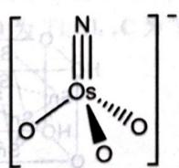

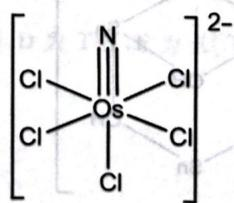

4. +4。

## 6.25
1. 分别为 $\mathrm{TlF}$、$\mathrm{BaF}_2$、$2\mathrm{TlNO}_3 \longrightarrow \mathrm{Tl}_2\mathrm{O}_3 + \mathrm{N}_2\mathrm{O} + \mathrm{O}_2$。

2. $Tl_{2}O_{3}$、$TlO_{2}$，$4TlO_{2} + 4HCl \longrightarrow 4TlCl + 3O_{2} + 2H_{2}O$

分别为 TlI、TlI$_3$、NaTlI$_4$。

## 6.26
1. 分别为 $SF_{5}Cl$、$CH_{2}=C=O$、$SF_{5}CH_{2}COCl$、AgCl、$SF_{5}CH_{2}COOAg$。

分别为 $SF_{5}$、$Cl_{2}$、$SF_{4}$、$SF_{6}$。

## 6.27
1. 依次为 $\mathrm{Pb}$、$\mathrm{Pb}(\mathrm{NO}_{3})_{2}$、$\mathrm{Pb}(\mathrm{OH})_{2}$、$\mathrm{NaPb}(\mathrm{OH})_{3}$、$\mathrm{PbO}_{2}$、$\mathrm{PbO}$，"胡粉"是 $\mathrm{Pb}_{2}(\mathrm{OH})_{2}\mathrm{CO}_{3}$。

$\text{Pb(OH)}_3^- + \text{ClO}^- \longrightarrow \text{Cl}^- + \text{PbO}_2 + \text{OH}^- + \text{H}_2\text{O}$

盐可使蛋白质变性，通过食用蛋白质减缓其对人体本身的毒性。

## 6.28
1. 依次为 $\mathrm{CoO}$、$\mathrm{Co}_{3}\mathrm{O}_{4}$、$\mathrm{Na}_{4}\mathrm{CoO}_{3}$、$\mathrm{Na}_{10}\mathrm{Co}_{4}\mathrm{O}_{9}$、$\mathrm{CoCl}_{2}$、$\left[\left(\mathrm{H}_{3}\mathrm{N}\right)_{5}\mathrm{CoO}_{2}\mathrm{Co}\left(\mathrm{NH}_{3}\right)_{5}\right]^{4+}$

$[(H_{3}N)_{5}CoO_{2}Co(NH_{3})_{5}]^{5+}$，Co.

2. 共面。

分别为 $\mathrm{Co}$、$\mathrm{Co}(\mathrm{NO}_{3})_{2} \cdot 2\mathrm{N}_{2}\mathrm{O}_{4}$、$\mathrm{Co}(\mathrm{NO}_{3})_{2} \cdot \mathrm{N}_{2}\mathrm{O}_{4}$、$\mathrm{Co}(\mathrm{NO}_{3})_{2}$、$\mathrm{Co}_{3}\mathrm{O}_{4}$、$\mathrm{CoO}$

方程式如下：

$$
\mathrm{Co} + 4\mathrm{N}_{2}\mathrm{O}_{4} \longrightarrow \mathrm{Co}(\mathrm{NO}_{3})_{2} \cdot 2\mathrm{N}_{2}\mathrm{O}_{4} + 2\mathrm{NO}
$$

$$
\mathrm{Co}(\mathrm{NO}_{3})_{2} \cdot 2\mathrm{N}_{2}\mathrm{O}_{4} \longrightarrow \mathrm{Co}(\mathrm{NO}_{3})_{2} \cdot \mathrm{N}_{2}\mathrm{O}_{4} + 2\mathrm{NO}_{2}
$$

$$
\mathrm{Co}(\mathrm{NO}_{3})_{2} \cdot \mathrm{N}_{2}\mathrm{O}_{4} \longrightarrow \mathrm{Co}(\mathrm{NO}_{3})_{2} + 2\mathrm{NO}_{2}
$$

$$
3\mathrm{Co}(\mathrm{NO}_{3})_{2} \longrightarrow \mathrm{Co}_{3}\mathrm{O}_{4} + 6\mathrm{NO}_{2} + \mathrm{O}_{2}
$$

$$
2\mathrm{Co}_{3}\mathrm{O}_{4} \longrightarrow 6\mathrm{CoO} + \mathrm{O}_{2}
$$

## 6.29
分别为 $CuSO_{4}\cdot 5H_{2}O$、$H_{3}PO_{2}$、$ZnI_{2}$、$Zn(CH_{3})_{2}$、$Mg$、$H_{2}$、$Li_{3}N$、Zn。

## 6.30
A、B、C、D、E、F、G、H、I、J。方程式略。$H_{CuCl_{2}}$、Cu、LiH、CuH、$ZnH_{2}$、$MgH_{2}$。方程式略。$D_{n}N_{n}Z=AgN_{2}$、$Y=NH_{3}$、$M=Mn$、$K=Mn(N_{3})_{2}\cdot 2NH_{3}$。所有的方程式如下：

## 6.31
1. $\mathbf{Q} = \mathrm{Mn(N_3)_2}$，$\mathbf{P} = \mathrm{NaN}_3$，$\mathbf{Z} = \mathrm{AgN_3}$

$$
\mathrm{AgNO}_{3} + \mathrm{NaN}_{3} \longrightarrow \mathrm{AgN}_{3} + \mathrm{NaNO}_{3}
$$

$$
\mathrm{Mn} + 2\mathrm{AgN}_{3} + 2\mathrm{NH}_{3} \longrightarrow \mathrm{Mn(N}_{3})_{2} \cdot 2\mathrm{NH}_{3}
$$

$$
\mathrm{Mn(N}_{3})_{2} \cdot 2\mathrm{NH}_{3} \longrightarrow \mathrm{Mn(N}_{3})_{2} + 2\mathrm{NH}_{3}
$$

$$
\mathrm{Mn(N}_{3})_{2} \cdot \mathrm{NH}_{3} \longrightarrow \mathrm{Mn(N}_{3})_{2} + \mathrm{NH}_{3}
$$

$$
\mathrm{Mn}(\mathrm{N}_{3})_{2} \longrightarrow \mathrm{Mn} + 3\mathrm{N}_{2}
$$

2. $NaN_{3}$ 为直线型, sp 杂化; $NH_{3}$ 为三角锥型, sp 杂化。

3. 爆炸反应生成 $N_{2}$ 在焓变上有利，且放出大量气体，含有安全气囊，叠氮酸铅用作雷管等，合理即可。

4. 用途很多,如叠氮化钠用于汽车安全气囊。

## 6.32
1. A、B、E 分别为 $\mathrm{K}_{4}\mathrm{Fe}(\mathrm{CN})_{6}$、$\mathrm{R}_{3}\mathrm{Fe}$ 分别为 $\mathrm{VO}(\mathrm{NO}_{3})_{3}$、$\mathrm{VO}(\mathrm{NO}_{3})_{2}$

## 6.33
1. A1～A3、B、C1～C3、D、E、F、G、VOCl$_3$、VOF$_3$、Si(CH$_3$)$_3$N$_3$。结构如下图所示。

2. 8个方程式分别为：

$$
3\mathrm{N}_{2}\mathrm{O}_{5} + \mathrm{V}_{2}\mathrm{O}_{5} \longrightarrow 2\mathrm{VO}(\mathrm{NO}_{3})_{3}
$$

$$
\mathrm{V}_{2}\mathrm{O}_{5} + 4\mathrm{HNO}_{3} + \mathrm{H}_{2}\mathrm{C}_{2}\mathrm{O}_{4} \longrightarrow 2\mathrm{VO}(\mathrm{NO}_{3})_{2} + \mathrm{BaSO}_{4}
$$

$$
\mathrm{VOSO}_{4} + \mathrm{Ba}(\mathrm{NO}_{3})_{2}
$$

$$
\mathrm{V} + 2\mathrm{N}_{2}\mathrm{O}_{4} \longrightarrow \mathrm{VO}_{2}\mathrm{NO}_{3} + 3\mathrm{NO}
$$

$$
2\mathrm{VO}_{2}\mathrm{NO}_{3} \longrightarrow \mathrm{V}_{2}\mathrm{O}_{5} + \mathrm{N}_{2}\mathrm{O}_{5}
$$

$$
\mathrm{V}_{2}\mathrm{O}_{5} + 3\mathrm{SOCl}_{2} \longrightarrow 2\mathrm{VOCl}_{3} + 3\mathrm{SO}_{2}
$$

$$
\mathrm{VOCl}_{3} + 3\mathrm{HF} \longrightarrow \mathrm{VOF}_{3} + 3\mathrm{HCl}
$$

$$
\mathrm{VOF}_{3} + 3\mathrm{Si}(\mathrm{CH}_{3})_{3}\mathrm{N}_{3} \longrightarrow \mathrm{VO}(\mathrm{N}_{3})_{3}
$$

## 6.34
由于在合成路线的后续所示, 但是先从简单情况考虑)。于是 X 是 $\mathrm{AF}_{n}$，然后尝试 $n = 1,2$，出下表。

表中唯有197的数值对应合理元素以及合理价态的化合物 $\mathrm{AuF_3}$。这进一步说明该路线试图合成Au的高价态化合物，利用一样的方法可做出Z为 $\mathrm{CsAuF_6}$。Y的推理是简单的，因各元素质量分数均已经给出，故直接计算就可给出原子比 $\mathrm{Xe:Au:F = 9:8:102}$，这恰好可以写为 $8\mathrm{AuF_6\cdot 9XeF_6}$。此可以视为原题Y的正确答案（但 $\mathrm{AuF_6}$ 是未知的化合物，由此可以断定题目条件不正确）。不过事实上原题数据有误。原题干误将Xe的质量分数标注为A的，按 $\omega(\mathrm{Xe}) = 0.3355$ 即可给出原子比 $\mathrm{Xe:Au:F = 2:1:17}$，故真实的Y是 $2\mathrm{XeF_6\cdot AuF_5}$，即 $[\mathrm{Xe}_2\mathrm{F}_{11}][\mathrm{AuF}_6]$。方程式请读者自己补全。

本题是基于当年 Bartlett 研究稀有气体化学的贡献。

## 6.35
未知物分别为 $\mathrm{Cu(SCN)_2}$、HCN、$(\mathrm{SCN})_2$，F 的结构如下图所示。

水解反应式为：

$$
(\mathrm{SCN})_{2} + \mathrm{H}_{2}\mathrm{O} \longrightarrow \mathrm{HSCN} + \mathrm{HOSCN}
$$

$$
3\mathrm{HOSCN} + \mathrm{H}_{2}\mathrm{O} \longrightarrow \mathrm{HCN} + \mathrm{H}_{2}\mathrm{SO}_{4} + 2\mathrm{HSCN}
$$

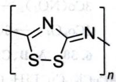

## 6.36
1. $[S = N = S][AsF_6]$，$12AsF_5 + 2S_4N_4 + S_8 \longrightarrow 8[NS_2][AsF_6] + 4AsF_3$。

2. $(\mathrm{SN})_n$，$n\mathrm{NS}_2^+ + n\mathrm{N}_3^- \longrightarrow n\mathrm{N}_2 + 2(\mathrm{SN})_n$。

## 6.37
1. 无机物 C～G 分别为 Se、$Na_{2}Se_{2}$、$H_{2}Se$、$H_{2}$、$B(OC_{2}H_{5})_{3}$。有机物 A、B、H 分别为：

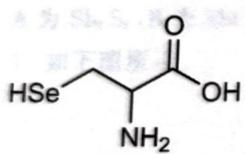

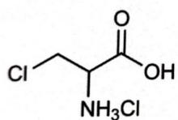

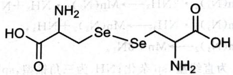

2. $2\mathrm{NaBH}_{4} + 3\mathrm{Se} + 6\mathrm{C}_{2}\mathrm{H}_{5}\mathrm{OH} \longrightarrow \mathrm{Na}_{2}\mathrm{Se}_{2} + \mathrm{H}_{2}\mathrm{Se} + 6\mathrm{H}_{2} + 2\mathrm{B}(\mathrm{OC}_{2}\mathrm{H}_{5})_{3}$

## 6.38
分别为 $CH_{3}SCH_{2}SCH_{3}$、$\mathrm{Hg(SCH_{3})_{2}}$、HCHO。沉淀的质量为 0.295g。

## 6.39
1. A 为 $I_{2}$，B 为 $HIO_{3}$，C 为 $I_{2}O_{5} \cdot HIO_{3}$，D 为 $I_{2}O_{5}$，X 为 $HNO_{3}$，Y 为 $HClO_{3}$，Z 是 $H_{2}O_{2}$。

2. $\mathrm{I}_2 + 10\mathrm{HNO}_3 \longrightarrow 2\mathrm{HIO}_3 + 4\mathrm{H}_2\mathrm{O} + 10\mathrm{NO}_2$; $\mathrm{I}_2 + 2\mathrm{HClO}_3 \longrightarrow 2\mathrm{HIO}_3 + \mathrm{Cl}_2$

$$
\mathrm{I}_{2} + 5\mathrm{H}_{2}\mathrm{O}_{2} \longrightarrow 2\mathrm{HIO}_{3} + 4\mathrm{H}_{2}\mathrm{O}; 2\mathrm{H}_{2}\mathrm{O}_{2} \longrightarrow 2\mathrm{H}_{2}\mathrm{O} + 2\mathrm{O}_{2}
$$

3. E 为 $\mathrm{Ba}_{5}(\mathrm{IO}_{6})_{2}$，生成 E 的反应式为 $5\mathrm{Ba}(\mathrm{IO}_{3})_{2} \longrightarrow \mathrm{Ba}_{5}(\mathrm{IO}_{6})_{2} + 4\mathrm{I}_{2} + 9\mathrm{O}_{2}$;

F 为 $(\mathrm{IO})_{2}\mathrm{SO}_{4}$，生成 F 的反应式为 $2\mathrm{HIO}_{3} + \mathrm{H}_{2}\mathrm{SO}_{4} \longrightarrow (\mathrm{IO})_{2}\mathrm{SO}_{4} + \mathrm{O}_{2}^{-} + 2\mathrm{H}_{2}\mathrm{O}$;

G 为 $I_{2}O_{4}(IO(IO_{3}))$，生成 G 的反应式为

$$
5(\mathrm{IO})_{2}\mathrm{SO}_{4} + 8\mathrm{H}_{2}\mathrm{O} \longrightarrow 6\mathrm{HIO}_{3} + 2\mathrm{I}_{2} + 5\mathrm{H}_{2}\mathrm{SO}_{4}
$$

$$
2\mathrm{HIO}_{3} + (\mathrm{IO})_{2}\mathrm{SO}_{4} \longrightarrow \mathrm{IO}(\mathrm{IO}_{3}) + \mathrm{H}_{2}\mathrm{SO}_{4}
$$

4. $HIO_{3} + 3H_{2}SO_{3} \rightarrow HI + 3H_{2}SO_{4}$

## 6.40
1. 如下图所示。

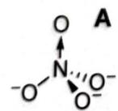

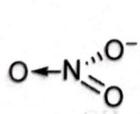 B

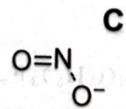

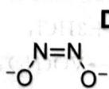

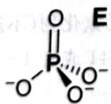

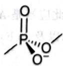 F

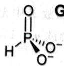

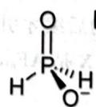

2. 分别为 $H_{2}N_{2}O_{2}$、$H_{3}PO_{2}$、$N_{2}O$、$H_{3}PO_{3}$、$H_{3}PO_{4}$、$PH_{3}$。

## 6.41
79.8%, $Al_{4}C_{3}$, $CCl_{4}$, $AlCl_{3}$

## 6.42
1. $\mathrm{KrF_2}$

3KrF$_2$ + 8NH$_3$ → 6NH$_4$F + 3Kr + N$_2$, 2KrF$_2$ + 2H$_2$O → 2Kr + 4HF + O$_2$.

3. 分别为 $\left[\mathrm{KrF}\right]\left[\mathrm{AuF}_{6}\right]$、$\mathrm{AuF}_{5}$、$\left[\mathrm{KrF}\right]\left[\mathrm{AuF}_{6}\right] \longrightarrow \mathrm{AuF}_{5} + \mathrm{Kr} + \mathrm{F}_{2}$。

## 6.43
1. 分别为 $\mathrm{Zn(OH)_{2}}$、$CH_{4}$、$CO_{2}$。

$Zn(CH_{3})_{2}$，汽油抗爆剂或者有机合成。

$Zn(CH_{3})_{2} + 2SO_{2} \longrightarrow (CH_{3})_{2}SO + ZnSO_{3}$

$Zn^{2+} + 2OH^{-} \longrightarrow Zn(OH)_{2}$

## 6.44
分别为 $\mathrm{H}_{2}\mathrm{Pt}(\mathrm{SO}_{3})_{2}\cdot\mathrm{H}_{2}\mathrm{O}$、$\mathrm{PtO}_{2}$，方程式为

$H_{2}PtCl_{6} + 3NaHSO_{3} + 2H_{2}O \longrightarrow H_{2}Pt(SO_{3})_{2} \cdot H_{2}O + Na_{2}SO_{4} + NaCl + 5HCl$

$H_{2}Pt(SO_{3})_{2}\cdot H_{2}O + 3H_{2}O_{2} \longrightarrow PtO_{2} + 3H_{2}O + H_{2}SO_{4}$

$PtO_{2} \rightarrow Pt + O_{2}$

## 6.45
1. $LiO_{3} \cdot 4NH_{3}$，$2LiO_{3} \cdot 4NH_{3} \longrightarrow Li_{2}O_{2} + 8NH_{3} + 2O_{2}$

2Li + 2D₂O → 2LiOD + D₂, 2LiOD + CO₂ → Li₂CO₃ + D₂O。

## 6.46
1. X 为 S 元素。

2. D 为 $Li_{3}PS_{4}$，A 为 $Li_{2}S$，B 为 $P_{2}S_{5}$，C 为 $Li_{3}PS_{4} \cdot 3C_{4}H_{8}O$。

3. $3\mathrm{Li}_2\mathrm{S} + \mathrm{P}_2\mathrm{S}_5 + 6\mathrm{C}_4\mathrm{H}_8\mathrm{O} \longrightarrow 2\mathrm{Li}_3\mathrm{PS}_4\cdot 3\mathrm{C}_4\mathrm{H}_8\mathrm{O}$;

$Li_{3}PS_{4}\cdot 3C_{4}H_{8}O \longrightarrow Li_{3}PS_{4} + 3C_{4}H_{8}O$;

$3Li_{2}S + P_{2}S_{5} \longrightarrow 2Li_{3}PS_{4}$

4. 注意干燥。

## 6.47
1. A 的化学式为 $CaCl_{2} \cdot 6H_{2}O$，B 是 $NH_{3}$，C 是 $CO_{2}$，故 D 是 $CaCO_{3}$。

2. E 是尿素, 所有化学方程式如下:

$$
\mathrm{CaCl}_{2} + 2\mathrm{NH}_{3} + \mathrm{CO}_{2} + \mathrm{H}_{2}\mathrm{O} \longrightarrow \mathrm{CaCO}_{3} + 2\mathrm{NH}_{4}\mathrm{Cl}
$$

$$
\mathrm{AgNO}_{3} + 2\mathrm{NH}_{3} \longrightarrow [\mathrm{Ag}(\mathrm{NH}_{3})_{2}]\mathrm{NO}_{3}
$$

$$
\mathrm{CaCl}_{2} + 2\mathrm{H}_{2}\mathrm{O} + \mathrm{CO}(\mathrm{NH}_{2})_{2} \longrightarrow \mathrm{CaCO}_{3} + 2\mathrm{NH}_{4}\mathrm{Cl}
$$

$$
\mathrm{AgNO}_{3} + \mathrm{NH}_{4}\mathrm{Cl} \longrightarrow \mathrm{AgCl} + \mathrm{NH}_{4}\mathrm{NO}_{3}
$$

## 6.48
1. $\mathrm{KH}_2\mathrm{PO}_4$、$\mathbf{K}_3\mathbf{H}_2\mathbf{P}_3\mathbf{O}_{10}$。

2. 分别为

$2KH_{2}PO_{4} \longrightarrow H_{2}O + K_{2}H_{2}P_{2}O_{7}$

$$
\mathrm{KH}_{2}\mathrm{PO}_{4} + \mathrm{K}_{2}\mathrm{H}_{2}\mathrm{P}_{2}\mathrm{O}_{7} \longrightarrow \mathrm{H}_{2}\mathrm{O} + \mathrm{K}_{3}\mathrm{H}_{2}\mathrm{P}_{3}\mathrm{O}_{10}
$$

$K_{3}H_{2}P_{3}O_{10} \rightarrow 3KPO_{3} + H_{2}O$

## 6.49
80.00% $NH_{4}Cl$、20.00% $NiCl_{2}$。（提示：加入硫化钠得沉淀说明有金属离子，加入氢氧化钠不沉淀却变色说明形成了络合物。）

## 6.50
1. E为 $\mathrm{U}_{3}\mathrm{O}_{8}$，D为 $\mathrm{SeO}_{2}$，A为元素Se。$\mathrm{SeUO}_{5}$（$\mathrm{UO}_{2} \cdot \mathrm{SeO}_{3}$ 或 $\mathrm{UO}_{3} \cdot \mathrm{SeO}_{2}$）。

2. $\mathrm{Se}_2\mathrm{UO}_7\cdot 2\mathrm{H}_2\mathrm{O} \longrightarrow \mathrm{Se}_2\mathrm{UO}_7 + 2\mathrm{H}_2\mathrm{O}$

## 6.51
1. 分别为 $\mathrm{KNO}_3$ 和 $\mathrm{Ca(NO_3)_2}$。

2. 74.5%的 $\mathrm{KNO}_3$ 和 $25.5\%$ 的 $\mathrm{Ca(NO_3)_2}$。

3. 分别为 $K_{2}CO_{3}$、$CaCO_{3}$，$\mathrm{Ca(NO_{3})_{2}} + \mathrm{K_{2}CO_{3}} \longrightarrow 2\mathrm{KNO_{3}} + \mathrm{CaCO_{3}}$

## 6.52
X 是 $3CaO \cdot SiO_2$，Y 是 $2CaO \cdot SiO_2$。

## 6.53
1. X 为 Mn, D 的化学式为 $Na_{3}MnO_{4} \cdot 48H_{2}O$。

2. 如下：

$$
4\mathrm{KMnO}_{4} + 4\mathrm{Na}_{2}\mathrm{SO}_{3} + 13\mathrm{NaOH} + 4\mathrm{NaOH}
$$

$$
2\mathrm{Na}_{3}\mathrm{MnO}_{4} + 2\mathrm{H}_{2}\mathrm{O} \longrightarrow \mathrm{Na}_{2}\mathrm{MnO}_{4}
$$

$$
12\mathrm{NaOH} + 4\mathrm{MnO}_{2} + \mathrm{O}_{2} \longrightarrow 4\mathrm{Na}_{3}\mathrm{MnO}_{4}
$$

$$
4\mathrm{KMnO}_{4} + 4\mathrm{KOH} \longrightarrow 4\mathrm{K}_{2}\mathrm{MnO}_{4} + \mathrm{O}_{2}
$$

## 6.54
1. A 的化学式为 $\mathrm{K}_{4}\mathrm{Mo}(\mathrm{CN})_{8} \cdot 2\mathrm{H}_{2}\mathrm{O}$，B 为 $\mathrm{K}_{3}\mathrm{Mo}(\mathrm{CN})_{8}$。

$\left[\mathrm{Mo}(\mathrm{CN})_{8}\right]^{q-}$ 阴离子属 $D_{2d}$ 点群，结构如右图所示。

2. $2MoO_{3} + 16KCN + N_{2}H_{4} + 8HCl$

$2K_{4}Mo(CN)_{8}\cdot 2H_{2}O + N_{2} + 8KCl + 2H_{2}O$

## 6.55
1. 生成的气体为 0.045mol H₂O 和 0.136mol CO₂。

2. B 的化学式为 $CaCO_{3}$。

3. A为 $\mathrm{Cu_2(OH)_2CO_3}$。制备埃及蓝过程的方程式：

$\mathrm{Cu}_{2}(\mathrm{OH})_{2}\mathrm{CO}_{3} + 2\mathrm{CaCO}_{3} + 8\mathrm{SiO}_{2} \longrightarrow \mathrm{Cu}_{2}\mathrm{Ca}_{2}\mathrm{Si}_{8}\mathrm{O}_{20} + 3\mathrm{CO}_{2} + \mathrm{H}_{2}\mathrm{O}$。埃及蓝的化学式为 $Cu_{2}Ca_{2}Si_{8}O_{20}$，写成最简比则是 $CuCaSi_{4}O_{10}$；中国蓝的化学式为 $BaCaSi_{4}O_{10}$。

4. D 为 $BaSO_{4}$（重晶石）。

5. 温度上升, 因为硫酸钡的热稳定性强于碳酸钡。

6. E 的化学式为 CuO。

## 6.56
1. 分别为 $S_{8}$、$Na_{2}S_{4}$、$Na_{2}S_{2}O_{3}$、$CO_{2}$，$12Na_{2}CO_{3} + 5S_{8} \longrightarrow 8Na_{2}S_{4} + 4Na_{2}S_{2}O_{3} + 12CO_{2}$。

2. 如下图所示。

