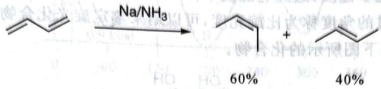

# 初赛讲义 第10讲 有机化学基本原理 习题 10.15

【习题 10.15 {*}$ 】以下反应中，顺式产物占主导，"与预期不符"。

chemical

Chemical reaction equation showing conversion of a ketone to an alkene using Na/NH3 catalyst, yielding 60% and 40% products

1. 简要说明为何"与预期不符"。
2. 解释顺式产物占主导的原因。提示: 注意主产物优势并不明显, 可能存在其他因素和"预期因素"竞争。

**来源**：化学竞赛初赛讲义 第10讲 习题

## 答案

1. 顺式产物一般不如反式产物稳定,应该反式更多。

2. 得到顺式产物的中间体有如图所示的电子效应,使得动力学上比反式产物略微有利。

> 答案见 [[04-题库/教材习题/化学竞赛初赛讲义/答案/第10讲-有机化学基本原理-答案]]