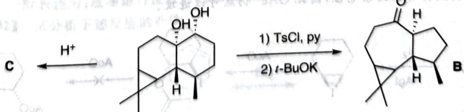

---
title: 题-007-初赛讲义-有机化学基本原理-习题10.28
type: 题目
source: 化学竞赛初赛讲义
chapter: 第10讲 有机化学基本原理
exercise_number: "10.28"
submodule: 有机化学基本原理
tags: [初赛, 有机化学, 讲义习题]
created: 2026-07-13
subject: 有机化学
module: 有机化学
question_type: 填空题
difficulty: 3
teaching_level: 拓展
exam_stage: 初赛
syllabus_codes: ["1"]
knowledge_points: ["[[有机化学基础]]", "[[反应机理]]", "[[官能团]]"]
status: 已填充
updated: 2026-07-18
---

# 初赛讲义 第10讲 有机化学基本原理 习题 10.28

【习题10.28】下列化合物在右侧的给定条件下发生重排得到化合物B，而在左侧酸性条件下得到B的同分异构体C。

chemical

Chemical reaction pathway showing transformation from compound C to B via intermediate 1 (TsCl, py) and 2 (t-BuOK)

1. 画出酮类化合物 C 的结构简式, 要求立体化学。
2. 解释为什么在不同条件下重排结果不同。

**来源**：化学竞赛初赛讲义 第10讲 习题