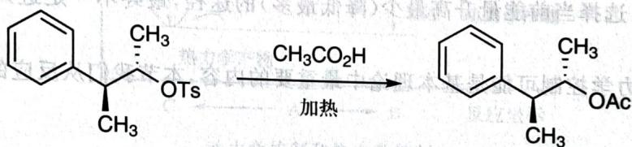
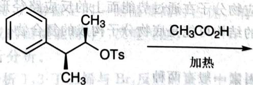

# 初赛讲义 第10讲 有机化学基本原理 习题 10.31

【习题 10.31】下列反应中手性碳原子构型保持。

chemical

Organic reaction showing acetylation of a benzene derivative with OTs and CH3CO2H under heating conditions

1. 标注产物中手性碳原子的绝对构型。
2. 画出重要的反应中间体。
3. 给出下列反应的产物, 注意立体化学。

chemical

Chemical reaction equation showing aldehyde derivative reacting with ethyl acetic acid under heating conditions

**来源**：化学竞赛初赛讲义 第10讲 习题

## 答案

1. 均为 S。

2. (图略)

3. (图略)，产物为外消旋体。

> 答案见 [[04-题库/教材习题/化学竞赛初赛讲义/答案/第10讲-有机化学基本原理-答案]]