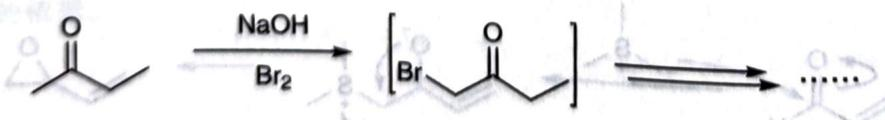

# 初赛讲义 第10讲 有机化学基本原理 习题 10.37

【习题10.37】按照我们在例10.36中的论断，"弱碱作用下应该在多取代的一侧反应"，为什么仿反应在少取代的一侧反应？

chemical

Chemical reaction equation showing bromination of an enone using NaOH and Br2 catalyst

**来源**：化学竞赛初赛讲义 第10讲 习题