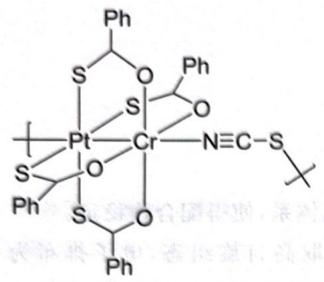

# 题-012：据文献报道,配位化合物 $\left[\mathrm{PtCr}(\mathrm{PhCOS})_{...

> **来源**：化学竞赛初赛讲义 习题4.39
> **难度**：⭐⭐⭐
> **教学层级**：拓展

---

## 题目

据文献报道,配位化合物 $\left[\mathrm{PtCr}(\mathrm{PhCOS})_{4}(\mathrm{NCS})\right]_{\infty}$ 是呈曲折(zig-zag)状的准一维链式聚合物,含桥连配体。测得有一类 Pt—S 键显著地长于其余的 Pt—S 键。画出该聚合物的结构,要求明确示出键连关系以及空间构型。

(Inorganic Chemistry 55, No. 16 (2016): 8099-8109)

---

## 答案

如图所示,结构中存在金属—金属键,在图中一并示出。

## 解题思路

详见同目录下答案文件

---

## 知识点

- [[配合物]]

---

## 相关题目

- [[题-001-初赛讲义-反应方程式-习题1.2]]
