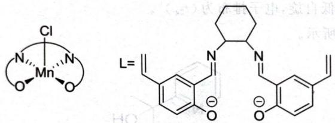

# 题-013：Mn 的盐与下面两种物质在含 NaCl 的弱碱中反应,得到了一种电中性的单核配合物。

![[df7193a46740c4bcf08e7de89b5f4623e1d05d40f222629fd769587611e3e408.jpg]]

chemical

Chemical structure of a substituted benzene ring with CHO and OH groups, alongside a cyclohexane ring containing NH2 groups

其中 Mn 的质量分数为 11.87%, H 的质量分数为 5.23%。画出该物质的结构, 讨论其是否可能有旋光异构体。

---

## 答案

如下左图所示。

如上右图所示,若环己二胺为顺式,没有旋光异构体;但倘若环己二胺为反式,则配合物就不具有对称面了,因而存在旋光异构。

## 解题思路

详见同目录下答案文件

---

## 知识点

- [[配合物]]

---

## 相关题目

- [[题-001-初赛讲义-反应方程式-习题1.2]]
