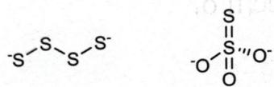

# 题-030：将 $6.360\mathrm{g}$ 碳酸钠和 $6.414\mathrm{g}$ 固体单质A混合...

> **来源**：化学竞赛初赛讲义·第6讲 习题6.56
> **难度**：⭐⭐⭐
> **教学层级**：拓展

---

## 题目

将 $6.360\mathrm{g}$ 碳酸钠和 $6.414\mathrm{g}$ 固体单质A混合，于 $280^{\circ}\mathrm{C}$ 恒温 $2\mathrm{h}$ 可得到极易溶于水的橙黄色盐X，同时放出 $1.967\mathrm{L}(128^{\circ}\mathrm{C}, 101.7\mathrm{kPa}$ ，视为理想气体）气体B。固体残余物含盐X和另一种盐Y, Na的总质量分数为 $27.25\%$ 。鉴于其中一种可溶于乙醇而另一种不溶，因此可用乙醇溶解分离X和Y。最后理论上可得到 $6.968\mathrm{g}$ X。

1. 通过计算确定 A、B、X、Y 的化学式并写出合成反应的方程式。

2. 画出 X 和 Y 中阴离子的结构。

---

## 答案

1. 分别为 $S_{8}$、$Na_{2}S_{4}$、$Na_{2}S_{2}O_{3}$、$CO_{2}$，$12Na_{2}CO_{3} + 5S_{8} \longrightarrow 8Na_{2}S_{4} + 4Na_{2}S_{2}O_{3} + 12CO_{2}$。

2. 如下图所示。

## 解题思路

详见同目录下答案文件

---

## 知识点

- [[推断技术]]

---

## 相关题目

- [[题-001-初赛讲义-反应方程式-习题1.2]]

> 答案见 [[04-题库/教材习题/化学竞赛初赛讲义/答案/第6讲-推断技术-答案]]