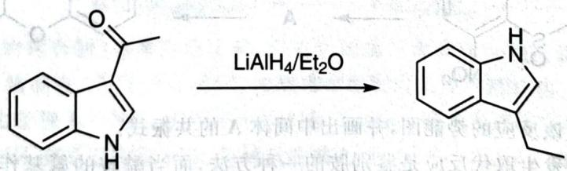

# 初赛讲义 第10讲 有机化学基本原理 习题 10.102

【习题10.102】画出下述反应的机理。

chemical

Chemical reaction showing conversion of a naphthoquinone derivative to a substituted benzene ring using LiAlH4/Et2O catalyst

**来源**：化学竞赛初赛讲义 第10讲 习题

## 答案

(图略)

> 答案见 [[04-题库/教材习题/化学竞赛初赛讲义/答案/第10讲-有机化学基本原理-答案]]