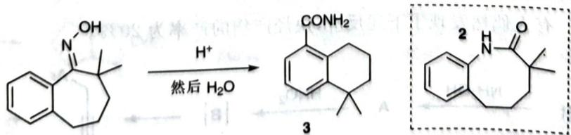

# 初赛讲义 第10讲 有机化学基本原理 习题 10.104

【习题 10.104】芳香肟 1 在酸性条件下加热反应,未得到预期的内酰胺 2 而得到酰胺 3。

chemical

Chemical reaction scheme showing conversion of a naphthoquinone derivative to a fused bicyclic compound under acidic conditions, followed by a detailed 2D structure.

写出1转化为3的前3个中间体(均带电荷)并解释为什么得到的产物是3而不是2。

(Synthesis, No. 12 (1978): 932-933)

**来源**：化学竞赛初赛讲义 第10讲 习题

> 答案见 [[04-题库/教材习题/化学竞赛初赛讲义/答案/第10讲-有机化学基本原理-答案]]