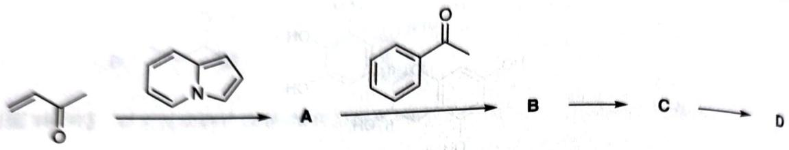

# 初赛讲义 第10讲 有机化学基本原理 习题 10.105

【习题10.105】下列体系中得到一种与共轭加成产物互为同分异构体的物质D，且其中不含N中间体A、B、C均不带净电荷。试补全该反应历程。

chemical

Chemical reaction pathway showing conversion of an enone to ketone via intermediate A, followed by cyclization to product D

**来源**：化学竞赛初赛讲义 第10讲 习题

## 答案

(图略) 依次如下。

> 答案见 [[04-题库/教材习题/化学竞赛初赛讲义/答案/第10讲-有机化学基本原理-答案]]