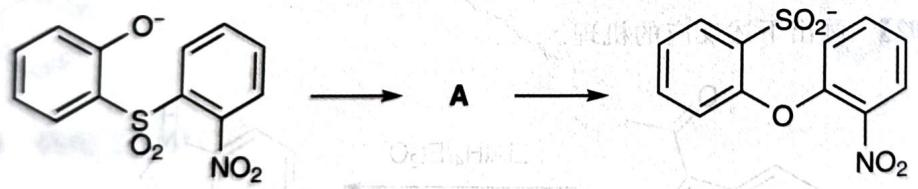
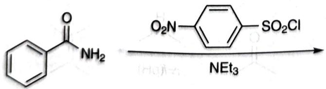

# 初赛讲义 第10讲 有机化学基本原理 习题 10.107

【习题 10.107】下述反应中,底物通过一个中间体 A 在碱性条件下得到产物。

chemical

Chemical reaction pathway showing sulfonation of a nitroso compound to form a sulfonated benzene derivative

1. 在相应区域画出该反应的势能图, 并画出中间体 A 的共振式。
2. 芳基磺酰氯与胺发生取代反应是鉴别胺的一种方法,而当酰胺的氨基作为亲核试剂时,将发生多步反应,请完成以下反应,写出所有产物。

chemical

Chemical reaction showing a benzoyl compound reacting with aniline under nitric acid conditions to form a sulfonamide product.

(Tetrahedron 54, No. 32 (1998): 9281-9288)

**来源**：化学竞赛初赛讲义 第10讲 习题