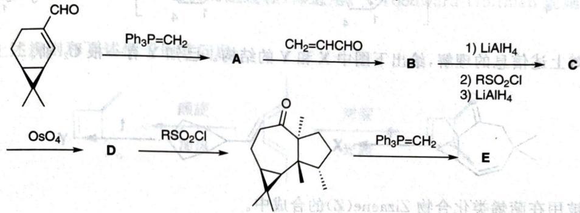

# 初赛讲义 第10讲 有机化学基本原理 习题 10.109

【习题 10.109】确定下述反应序列中,各未知物的结构简式。

chemical

Multi-step organic synthesis pathway showing intermediates A, B, C, D, E with reagents and conditions labeled

**来源**：化学竞赛初赛讲义 第10讲 习题