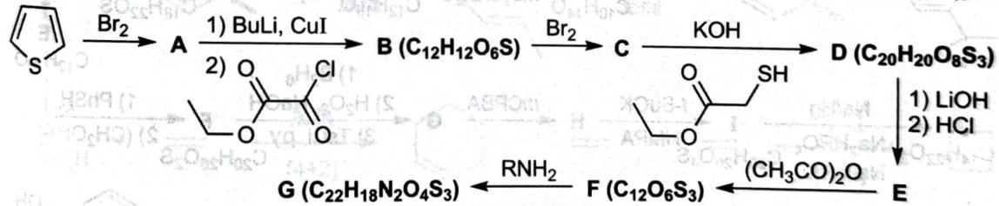

# 初赛讲义 第10讲 有机化学基本原理 习题 10.110

【习题 10.110】噻吩分子具有骨架不易改变,但易被修饰等特点,因而被广泛用于有机电晶体的制造。科学家合成了一种噻吩衍生物,其有望为有机电晶体的合成做出重要贡献。合成路线如下:

chemical

Organic synthesis reaction pathway showing bromination, chlorination, and subsequent functionalization steps with reagents labeled

1. 噻吩(即图中起始化合物)和苯有所不同,但它们同属芳香族化合物。试分析:哪一种有机物的亲电取代活性更高?并给出在 ^{\circ}C$ 下用 {2}-CCl_{4}$ 处理噻吩得到的主要产物结构。
2. 已知图中胺类化合物 $\mathrm{R}-\mathrm{NH}_{2}$ 的 {13}\mathrm{CNMR}$ 上有三个峰。请画出该胺类化合物的结构简式。
3. 已知 D 的 {1}$ HNMR 谱图上有四个峰, 且峰的高度比例为 2:2:3:3。请画出图中所有相关物质的结构简式。

**来源**：化学竞赛初赛讲义 第10讲 习题

## 答案

1. 噻吩为五元环六电子,而苯环为六元环六电子,故噻吩活性更强。产物为 $\alpha$-碘噻吩。

2. (图略)

3. (图略) 依次如下图所示。(R 为环戊基)

> 答案见 [[04-题库/教材习题/化学竞赛初赛讲义/答案/第10讲-有机化学基本原理-答案]]