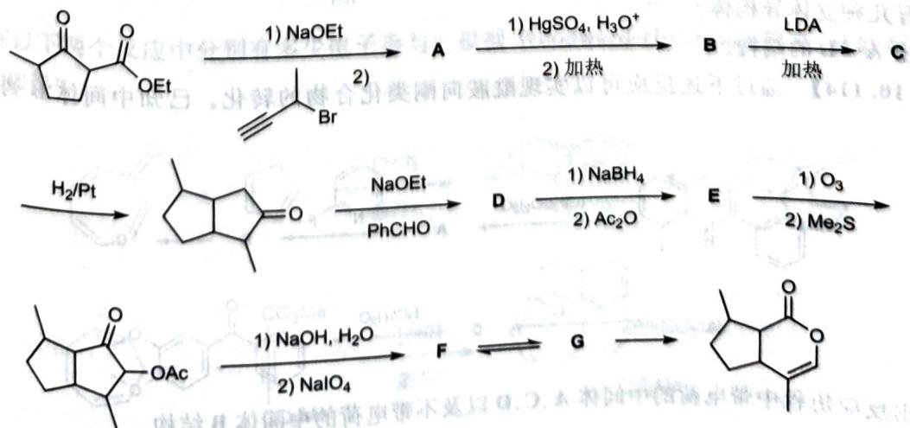

# 初赛讲义 第10讲 有机化学基本原理 习题 10.111

【习题10.111】猫薄荷中的重要成分荆芥内酯的一种合成路线如下图所示。确定合成过程中各未知物的结构简式(已知B的碳数比A少)。

chemical

Multi-step organic synthesis pathway showing transformations from ketone to lactone via intermediates A-G, with reagents and conditions labeled

**来源**：化学竞赛初赛讲义 第10讲 习题