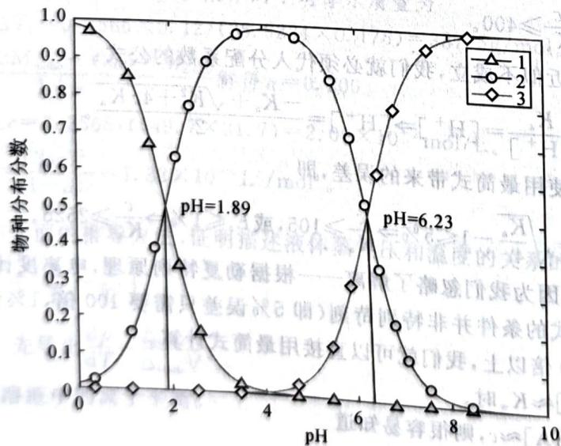

# 题-064：化合物X的鉴定与酸碱滴定...

> **来源**：化学竞赛初赛讲义·第9讲 习题9.7
> **难度**：⭐⭐⭐
> **教学层级**：拓展

---

## 题目

化合物 X 仅含有 C、H、O 三种元素, 具有顺反异构, 经高锰酸钾氧化则生成内消旋酒石酸。经元素分析测得 C、H 质量百分比分别为 41.39%、3.474%。称取 0.2900g 该化合物于锥形瓶中, 加入 25.0mL 蒸馏水, 用 0.1000mol/L 的氢氧化钠标准溶液滴定。该化合物的物种分布分数曲线如下图所示。

未知物 $\mathbf{X}$ 的物种分布曲线

给出该化合物的结构式;确定滴定时两个化学计量点的 pH 并分别选定能使误差最小的常用指示剂。

---

## 答案

X 是顺丁烯二酸。

第二化学计量点 pH=9.38，指示剂为酚酞；第一化学计量点 pH=4.11，指示剂为甲基橙。提示：第一化学计量点计算。

第二化学计量点 pH=0.16 mol/L 出 4.06 是错误的。

## 解题思路

详见同目录下答案文件

---

## 知识点

- [[酸碱滴定]], [[分布分数]], [[有机酸]]

---

## 相关题目

- [[题-001-初赛讲义-反应方程式-习题1.2]]

> 答案见 [[04-题库/教材习题/化学竞赛初赛讲义/答案/第9讲-溶液与化学分析-答案]]