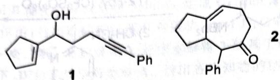

# 初赛讲义 第10讲 有机化学基本原理 习题 10.116

【习题 10.116】如下图所示, 将溶于苯乙醚中的化合物 1 和甲基锂的混合物用微波炉加热到 210C, 结果得化合物 2。请给出该转换合理的、分步的反应机理。

chemical

Two organic molecular structures labeled 1 and 2, showing cyclohexanol, phenyl, and cyclopentenone functional groups.

**来源**：化学竞赛初赛讲义 第10讲 习题