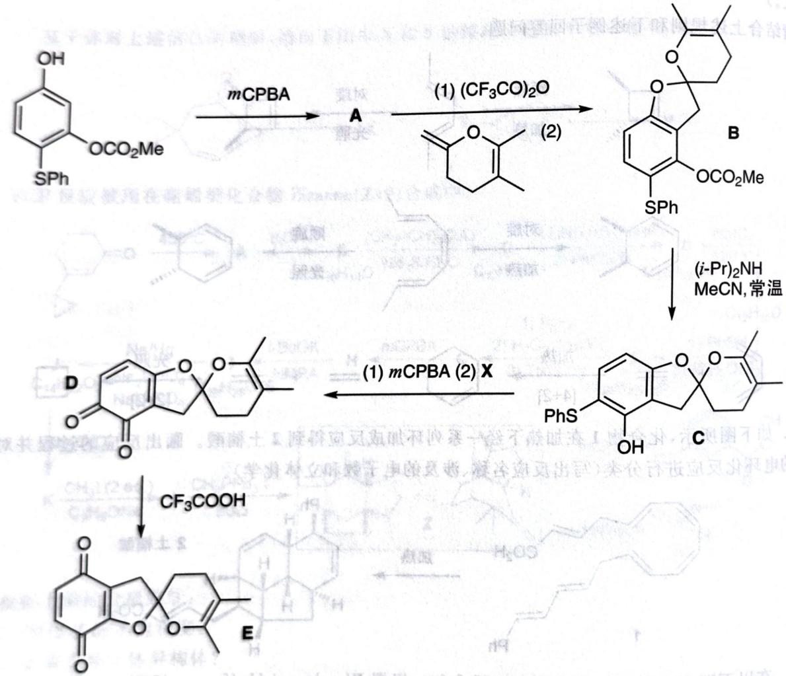

# 初赛讲义 第10讲 有机化学基本原理 习题 10.118

【习题 10.118】 考虑如下反应序列。

chemical

Multi-step organic synthesis pathway showing transformations from compound A to products B, C, D, and E via intermediates A, B, C, D, with reagents labeled.

1. 给出 A 的结构和条件 X。
2. 写出 D 到 E, A 到 B 反应的机理。

**来源**：化学竞赛初赛讲义 第10讲 习题