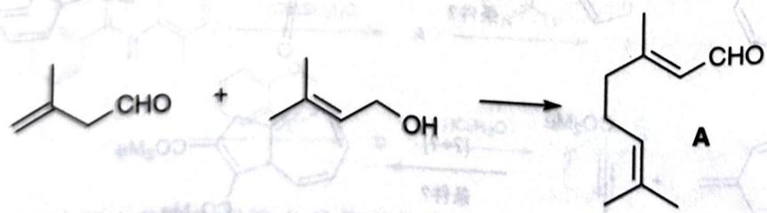

# 初赛讲义 第10讲 有机化学基本原理 习题 10.119

【习题10.119】加热下述底物可得香料柠檬醛A。画出反应的3个电中性关键中间体。

chemical

Chemical reaction equation showing acetaldehyde reacting with a diol to form a cyclic alcohol product labeled A

**来源**：化学竞赛初赛讲义 第10讲 习题