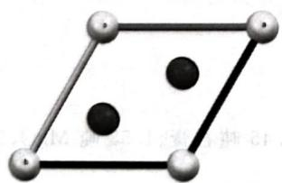
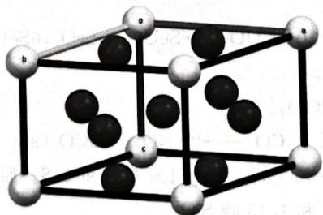

# 题-072：稀土永磁体 SmₓCoᵧ 晶体结构...

> **来源**：化学竞赛初赛讲义·第7讲 习题7.23
> **难度**：⭐⭐⭐⭐
> **教学层级**：拓展

---

## 题目

第一代稀土永磁体 $\mathrm{Sm}_x\mathrm{Co}_y$ 晶体为六方晶系，晶胞参数 $a = 498.9\mathrm{pm}, c = 398.1\mathrm{pm}$ ， $c$ 轴方向投影无重叠。Sm的相对原子质量为150.4。

1. 求 x, y。
2. 画出 Sm、Co 层的二维晶胞。
3. 简明清楚地画出其晶胞。

---

## 答案

1. x=1, y=5。2. 如图所示，浅色球为 Sm，深色球为 Co。

3. 如图所示(图例同上)。

## 解题思路

详见同目录下答案文件

---

## 知识点

- [[稀土永磁体]]

---

## 相关题目

- [[题-070-初赛讲义-晶体结构-习题7.4]]

> 答案见 [[04-题库/教材习题/化学竞赛初赛讲义/答案/第7讲-晶体结构-答案]]