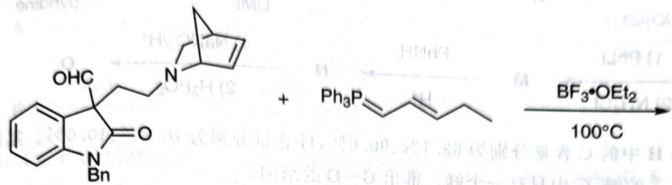

---
title: 题-072-初赛讲义-有机化学基本原理-习题10.120
type: 题目
source: 化学竞赛初赛讲义
chapter: 第10讲 有机化学基本原理
exercise_number: "10.120"
submodule: 有机化学基本原理
tags: [初赛, 有机化学, 讲义习题]
created: 2026-07-13
subject: 有机化学
module: 有机化学
question_type: 填空题
difficulty: 3
teaching_level: 拓展
exam_stage: 初赛
syllabus_codes: ["1"]
knowledge_points: ["[[有机化学基础]]", "[[反应机理]]", "[[官能团]]"]
status: 已填充
updated: 2026-07-18
---

# 初赛讲义 第10讲 有机化学基本原理 习题 10.120

【习题10.120】在假柳叶水仙草碱的合成中，利用以下步骤一锅构筑了5环环系。画出反应的2个电中性的关键中间体和所有产物。

chemical

Chemical reaction equation showing synthesis of a benzyl ether derivative using BF3-OEt2 catalyst at 100C

**来源**：化学竞赛初赛讲义 第10讲 习题