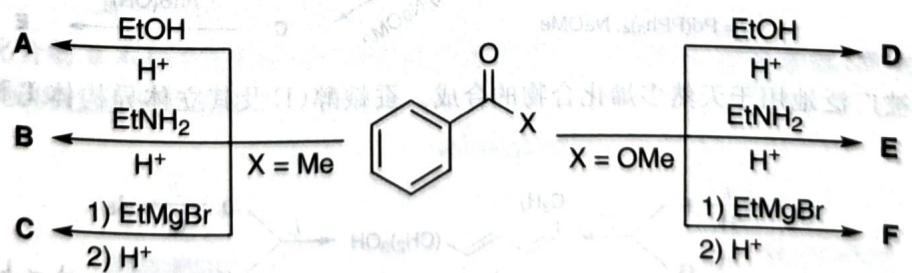
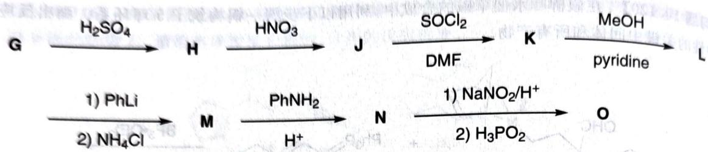

# 初赛讲义 第10讲 有机化学基本原理 习题 10.122

**题目**：
【习题10.122】氧和碳元素电负性极大的差异使得 $\mathrm{C} = \mathrm{O}$ 键明显极化。这一性质令羰基的C原子具有被多种亲核试剂进攻的性质(亲电性)。

chemical

Chemical reaction scheme showing conversion of compound A to D via intermediate C, with reagents and conditions labeled

1. 写出化合物 A～F 的结构。已知 A、B、C 含 C 的质量分数分别为 74.2%、81.6%、80.0%。
2. 今有三种对烷基卤化物有较强亲核性的化合物：NaI、NaHSO3、NaCN，及三种亲电试剂：苯甲醛、苯乙酮、苯甲酸乙酯。三种亲核试剂分别恰能与 1、2、3 个上述亲电试剂反应。推断上述对应关系，说明理由。
某多孔材料的制造需要使用化合物 O(omega(C)=94.0%)。后者的合成正是基于对羰基的亲核进攻。该合成方法使用浓 H2SO4 处理 G 得到 H，再氧化得到 J(omega(C)=51.4%)。用稀酸处理 G 得到 P 而不是 H。

flowchart

3. 若 G 和 H 中的 C 含量分别为 62.1%、90.0%，H 含量分别为 10.3%、10.0%。氢谱表明 H 和 L 中均含两个 3:1 的峰，G 中只有一个峰。推出 G～O 的结构。
4. 给出 P 的结构。

**来源**：化学竞赛初赛讲义 第10讲 习题

## 答案

1. (图略)

2. 1、2、3 分别对应于 NaI、$\mathrm{NaHSO}_{3}$ 和 NaCN。

3. (图略)

4. (图略)

> 答案见 [[04-题库/教材习题/化学竞赛初赛讲义/答案/第10讲-有机化学基本原理-答案]]