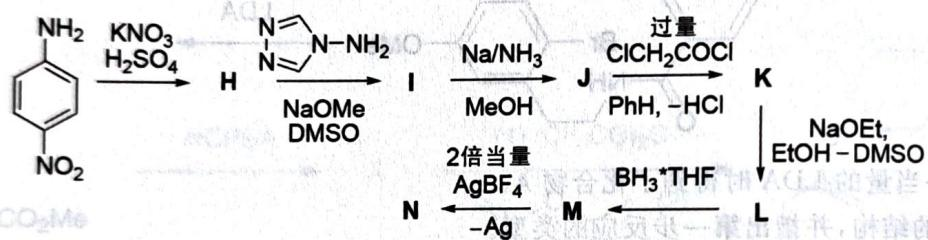

# 初赛讲义 第10讲 有机化学基本原理 习题 10.123

【习题 10.123】以下路线合成了一种有趣的二价阳离子 N，它被怀疑有六重对称轴而且具有双重芳香性，不过后来证实并非如此。具有已知 I 有三重对称轴，J、L 都有六重对称轴。

chemical

Chemical reaction pathway showing nitroalkynylamine conversion to ketone via diazotization, followed by acid-catalyzed cyclization and subsequent reduction with NaOEt and EtOH.

1. 给出 H~N 的结构。
2. 与预期不同, N 只有二重轴的对称性, 解释原因。

(Science 240, No. 4856 (1988): 1185-1188)

**来源**：化学竞赛初赛讲义 第10讲 习题

## 答案

1. (图略) 如下图所示。

2. 烯基造成的环张力导致系统无法完全共平面。

> 答案见 [[04-题库/教材习题/化学竞赛初赛讲义/答案/第10讲-有机化学基本原理-答案]]