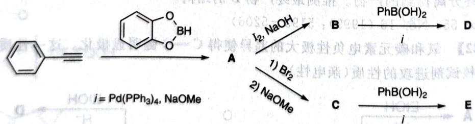
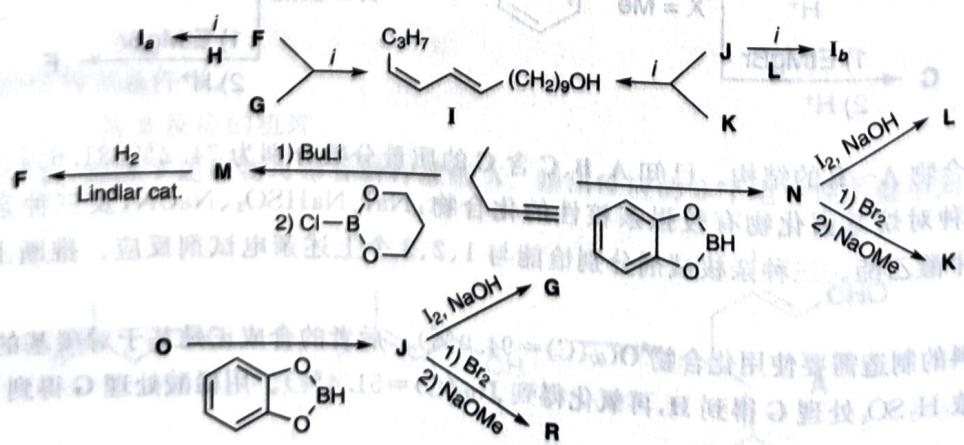

# 初赛讲义 第10讲 有机化学基本原理 习题 10.124

【习题 10.124】烯基硼酸及其衍生物在有机合成中是极有价值的试剂。它们可以和芳基或烯基卤化物在 ^{0}$ 的催化下发生偶联反应 (Suzuki 反应)，此反应的特点是使烯基的 C=C 键构型保持。不仅如此，烯基硼酸衍生物还可直接用于合成烯基卤化物。此时可通过调整反应条件使 C=C 键的构型保持或发生转换。

1. 已知 D 和 E 均含 93.3% 的 C 元素, E 比 D 多一个镜面。推出 A~E 的结构。

chemical

Organic synthesis reaction scheme showing conversion of benzene to boronic acid via intermediates A, B, C, D, E with reagents and conditions labeled

Suzuki 反应被广泛地用于天然多烯化合物的合成。蚕蛾醇(I)及其立体异构体 {a}$ 和 {b}$ 的合成路线如下。

chemical

Multi-step organic synthesis reaction scheme involving intermediates and reagents like Li, BuLi, Br2, NaOMe, and bromide

2. 推出 $\mathbf{F} \sim \mathbf{O}, \mathbf{I}_a$ 和 $\mathbf{I}_b$ 的结构。

**来源**：化学竞赛初赛讲义 第10讲 习题

## 答案

1. (图略)

2. (图略)

> 答案见 [[04-题库/教材习题/化学竞赛初赛讲义/答案/第10讲-有机化学基本原理-答案]]