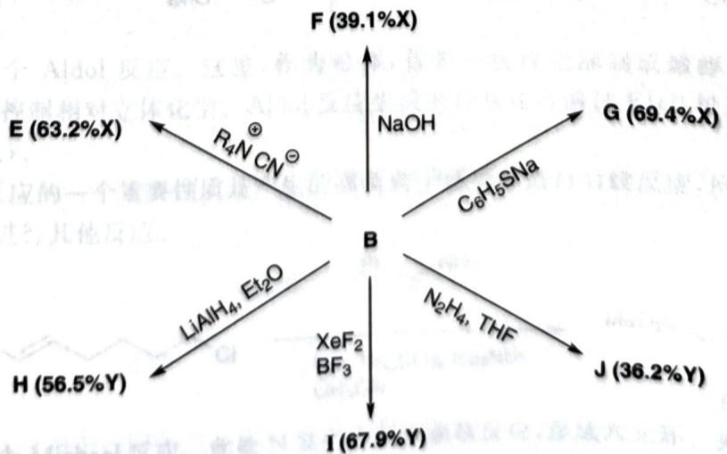
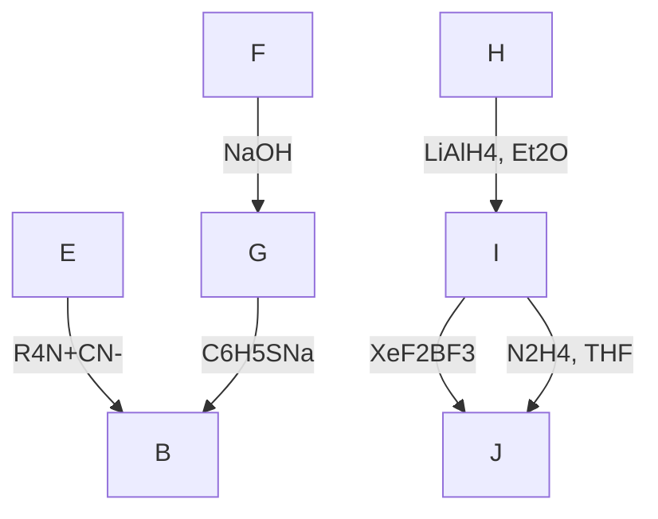

---
title: 题-078-初赛讲义-有机化学基本原理-习题10.126
type: 题目
source: 化学竞赛初赛讲义
chapter: 第10讲 有机化学基本原理
exercise_number: "10.126"
submodule: 有机化学基本原理
tags: [初赛, 有机化学, 讲义习题]
created: 2026-07-13
subject: 有机化学
module: 有机化学
question_type: 填空题
difficulty: 3
teaching_level: 拓展
exam_stage: 初赛
syllabus_codes: ["1"]
knowledge_points: ["[[有机化学基础]]", "[[反应机理]]", "[[官能团]]"]
status: 已填充
updated: 2026-07-18
---

# 初赛讲义 第10讲 有机化学基本原理 习题 10.126

**题目**：
【习题 10.126】二元化合物 A(熔点 5.5C, 含 92.3% 的元素 X) 和二元化合物 B(熔点 3.9C, 含 38.7% 的元素 X) 的"混合物"在比纯物质高得多的温度 (23.7C) 下熔化。化合物 B 可由 A 根据下列步骤得到(试剂均过量), 其中试剂 D 也是二元化合物, 含 32.8% 的元素 Y。

$$
\mathbf {A} \xrightarrow {\mathrm{FeCl} _ {3} , \mathrm{Cl} _ {2}} \mathbf {C} \xrightarrow {\mathbf {D}} \mathbf {B}
$$

室温下化合物 B 不和 Na 反应, 即使加热它也对 NaH 显惰性。尽管如此, B 也有一系列其他的化学转化, 部分反应已经示于下图中。

flowchart

1. 推出化合物 A~C, E~J 的结构或化学式。已知：
(a) A、B、E 具有相同的对称性。
(b)C、E、I是二元化合物。
(c) I 中有两种 Y 原子, 而所有的 Y 在 J 中都是等价的。
2. 为什么 A 和 B 混合后熔点上升?
3. 化合物 C 是否和 A 具有相同的对称性？已知：在 C 中 X-X 键长为 139pm，X-Cl 键长为 175pm，Cl 的范德华半径为 175pm。请通过计算确认你的结论。
4. $\mathbf{C} \rightarrow \mathbf{B}$ 的转换是分步进行的, 依次经历 $\mathbf{K}_1$ 至 $\mathbf{K}_5$ 中间体。请画出 $\mathbf{K}_1 \sim \mathbf{K}_5$ 的结构, 已知在 $\mathbf{K}_3$ 中有两种 $\mathbf{X}$ 原子和一种 $\mathbf{Y}$ 原子。

**来源**：化学竞赛初赛讲义 第10讲 习题