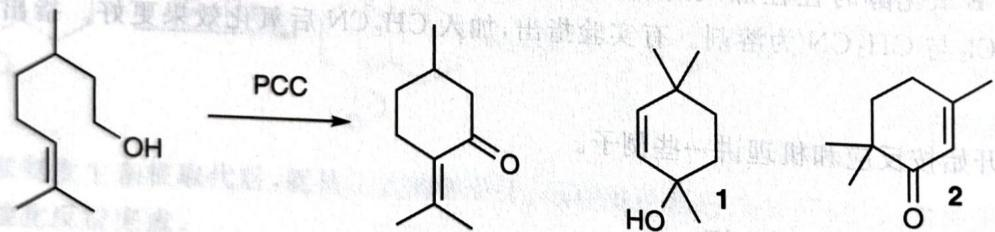

---
title: 题-120-初赛讲义-人名反应与机理推断-习题11.72
type: 题目
source: 化学竞赛初赛讲义·第11讲·人名反应与机理推断
subject: 化学原理
module: 化学原理
submodule: 人名反应与机理推断
question_type: 计算题
difficulty: 3
teaching_level: 拓展
exam_stage: 初赛
syllabus_codes: ["1"]
knowledge_points: ["[[有机反应机理]]", "[[反应机理]]"]
tags: [化竞, 初赛讲义, 人名反应与机理推断, 化学原理]
aliases: [初赛讲义-人名反应与机理推断-习题11.72]
status: 已填充
updated: 2026-07-18
---

# 题-120：PCC氧化反应中的关键中间体

> **来源**：化学竞赛初赛讲义·第11讲 习题11.72
> **难度**：⭐⭐⭐
> **教学层级**：拓展

---

## 题目

考虑两个与PCC有关的氧化反应。

1. 在用 PCC 氧化香茅醇时, 得到了胡薄荷酮(如下图左侧所示)。画出反应的 2 个关键中间体的结构。

chemical

Organic reaction scheme showing conversion of a hydroxy ketone to two cyclohexanol derivatives via PCC reagent

2. 用 PCC 氧化上图右侧底物 1 时, 得到了非预期产物 2。画出反应的 3 个关键中间体的结构。

---

## 答案

答案待补充

---

## 解题思路

详见同目录下答案文件

---

## 知识点

- [[有机反应机理]]
- [[反应机理]]

---

## 相关题目

- [[题-070-初赛讲义-人名反应与机理推断-习题11.108]]
