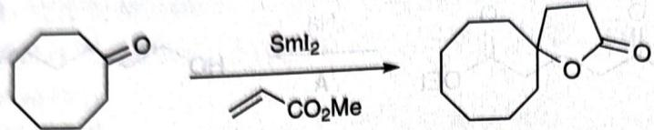

---
title: 题-125-初赛讲义-人名反应与机理推断-习题11.93
type: 题目
source: 化学竞赛初赛讲义·第11讲·人名反应与机理推断
subject: 化学原理
module: 化学原理
submodule: 人名反应与机理推断
question_type: 计算题
difficulty: 3
teaching_level: 拓展
exam_stage: 初赛
syllabus_codes: ["1"]
knowledge_points: ["[[有机反应机理]]", "[[反应机理]]"]
tags: [化竞, 初赛讲义, 人名反应与机理推断, 化学原理]
aliases: [初赛讲义-人名反应与机理推断-习题11.93]
status: 已填充
updated: 2026-07-18
---

# 题-125：SmI₂介导的还原偶联反应机理

> **来源**：化学竞赛初赛讲义·第11讲 习题11.93
> **难度**：⭐⭐⭐
> **教学层级**：拓展

---

## 题目

Sm是常见的稀土金属之一，有Ⅱ、Ⅲ等价态。

chemical

Organic reaction scheme showing SmI2-mediated cyclization of a cyclohexanone to form a bicyclic ketone

确定上述还原偶联反应的机理。

---

## 答案

答案待补充

---

## 解题思路

详见同目录下答案文件

---

## 知识点

- [[有机反应机理]]
- [[反应机理]]

---

## 相关题目

- [[题-070-初赛讲义-人名反应与机理推断-习题11.108]]
